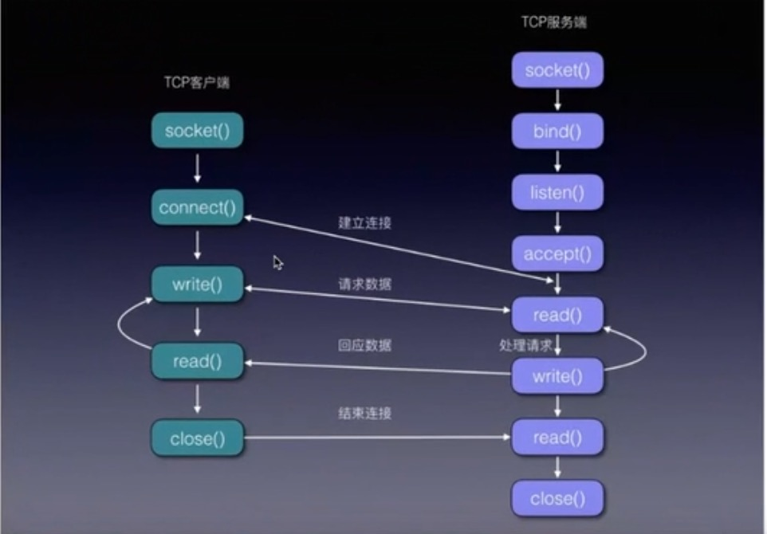

Socket

[TOC]

##Socket

###网络通讯三要素
IP地址：主机名，网络设备标识，本地回环地址127.0.0.1，主机名localhost
端口号：用于标识进程的逻辑地址，不同进程的标示
传输协议：通讯规则，TCP、UDP

###连接流程

TCP服务端：
socket()
bind():绑定IP地址和端口号
listen():
accept():
write():
read():
close():

TCP客户端：
socket():
connect():
write():
read():
close():

##BSD Socket

##自定义数据封装
缓冲区导致数据黏连。

数据结构：
|数据总长度|类型|二进制内容|结束标识|
###GCDAsyncSocket
####socket:didAcceptNewSocket:
####readDataToData:withTimeout:tag:读取到指定数据
####socket:didReadData:withTag:进行数据解析

###数据链路层MTU
MTU（Maximum Transmission Unit，MTU），最大传输单元

（1）以太网和802.3对数据帧的长度都有一个限制，其最大 值分别是1500和1492个字节。链路层的这个特性称作MTU。不同类型的网络大多数都有一个上限。如果IP层有一个数据要传，且数据的长度比链路层的 MTU还大，那么IP层就要进行分片（fragmentation），把数据报分成若干片，这样每一个分片都小于MTU。

 

（2）把一份IP数据报进行分片以后，由到达目的端的IP层来进行重新组装，其目的是使分片和重新组装过程对运输层（TCP/UDP）是透明的。由于每一分片都是一个独立的包，当这些数据报的片到达目的端时有可能会失序，但是在IP首部中有足够的信息让接收端能正确组装这些数据报片。

 

（3）尽管IP分片过程看起来透明的，但有一点让人不想使用它：即使只丢失一片数据也要重新传整个数据报。why？因为IP层本身没有超时重传机制------由更高层（比如TCP）来负责超时和重传。当来自TCP报文段的某一片丢失后，TCP在超时后会重发整个TCP报文段，该报文段对应于一份IP数据报（而不是一个分片），没有办法只重传数据报中的一个数据分片。

 

（4）使用UDP很容易导致IP分片，TCP试图避免IP分片。 那么TCP是如何试图避免IP分片的呢？其实说白了，采用TCP协议进行数据传输是不会造成IP分片的，因为一旦TCP数据过大，超过了MSS，则在传输 层会对TCP包进行分段（如何分，见下文！），自然到了IP层的数据报肯定不会超过MTU，当然也就不用分片了。而对于UDP数据报，如果UDP组成的 IP数据报长度超过了1500，那么IP数据报显然就要进行分片，因为UDP不能像TCP一样自己进行分段。总结：UDP不会分段，就由我IP来分。TCP会分段，当然也就不用我IP来分了！

###MSS&&TCP报文分段
MSS（Maxitum Segment Size）最大分段大小的缩写，是TCP协议里面的一个概念。

MTU是链路层中的网络对数据帧的一个限制。
链路层：最大传输单元MTU<=1460
传输层进行TCP分段，最大分段大小MSS<MTU。

（1）MSS就是TCP数据包每次能够传输的最大数据分段。为了达到最佳的传输效能TCP协议在建立连接的时候通常要协商双方的MSS值，这个值TCP协议在实现的时候往往用MTU值代替（需要减去IP数据包包头的大小20Bytes和TCP数据段的包头20Bytes）所以往往MSS为1460。通讯双方会根据双方提供的MSS值得最小值确定为这次连接的最大MSS值。

（2）相信看到这里，还有最后一个问题：TCP是如何实现分段的呢？其实TCP无所谓分段，因为每个TCP数据报在组成前其大小就已经被MSS限制了，所以TCP数据报的长度是不可能大于MSS的，当然由它形成的IP包的长度也就不会大于MTU，自然也就不用IP分片了。
 

###IP分片（fragment）
TCP分段不需要分片，UDP需要由IP进行分片。

IP数据报分片后，只有第一片带有UDP首部或ICMP首部，其余的分片只有IP头部，到了端点后根据IP头部中的信息再网络层进行重组。而TCP报文段的每个分段中都有TCP首部，到了端点后根据TCP首部的信息在传输层进行重组。IP数据报分片后，只有到达目的地后才进行重组，而不是像其他网络协议，在下一站就要进行重组。

最后一点，对IP分片的数据报来说，即使只丢失一片数据也要重新传整个数据报（既然有重传，说明运输层使用的是具有重传功能的协议，如TCP协议）。这是因为IP层本身没有超时重传机制------由更高层（比如TCP）来负责超时和重传。当来自TCP报文段的某一段（在IP数据报的某一片中）丢失后，TCP在超时后会重发整个TCP报文段，该报文段对应于一份IP数据报（可能有多个IP分片），没有办法只重传数据报中的一个数据分片。
 
###简而言之：

        1.IP分片产生的原因是网络层的MTU；TCP分段产生原因是MSS.

        2.IP分片由网络层完成，也在网络层进行重组；TCP分段是在传输层完成，并在传输层进行重组.   //透明性

        3.对于以太网，MSS为1460字节，而MUT往往会大于MSS.    

        故采用TCP协议进行数据传输，是不会造成IP分片的。若数据过大，只会在传输层进行数据分段，到了IP层就不用分片。

        所以可以看成是这种情况：传输层协议想发送一个超过了MTI的数据报，这个时候网络层就需要对其进行分片，一般UDP和ICMP会出现分片情况，但是TCP不会出现这种情况！因为TCP使用了MSS来避免分片！

        IP分片只有第一个带有传输层或ICMP首部，其余的分片只有IP头。至于怎么重组就是到对端以后IP层的事情了。

若TCP报文非常长那么在IP层传输时就有可能要分解成多个短数据报片。（计算机网络谢希仁）

TCP分段每个都有完整首部。

PS:所以我觉得是这样的，TCP的分段是针对应用层的数据来说的，比如使用TCP发送70KB的数据，这个时候就需要将70KB分成若干个MSS，到了网络层就不需要分片了。MSS的存在就避免了网络层分片的发生，

IP层的分片是针对传输层中使用UDP协议来说的，如果使用UDP发送数据，UDP并不知道如何分段，那么到了IP层就需要进行分片，分片的原则根据MTU，那么分UDP最大的数据负载就是1500-8=1492

 

##WebSocket
###格式
连接：
Upgrade：webSocket
Connection:Upgrade
Sec-WebSocket-Key:
Sec-WebSocket-Protocol:
Sec-WebSocket-Version:

响应:

##SRWebSocket源码分析
https://www.jianshu.com/p/cdb7a886789a

##参考
TCP层的分段和IP层的分片之间的关系 MTU和MSS存在的关系
>https://blog.csdn.net/yusiguyuan/article/details/22782943

TCP分段与IP分片
https://www.jianshu.com/p/f9a5b07d99a2

即时通讯下数据粘包、断包处理实例（基于CocoaAsyncSocket）
https://www.jianshu.com/p/2e16572c9ddc

iOS即时通讯，从入门到“放弃”？
https://www.jianshu.com/p/2dbb360886a8

