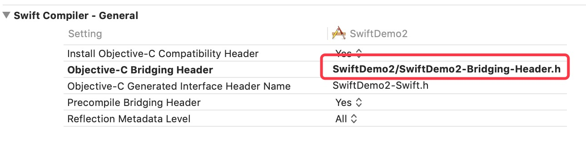

OC和Swift混编

[TOC]

##相同的App Target中
###OC混编Swift

1.在oc项目中第一次创建swift文件的时候，会弹框提示是否要创建桥接文件。当然要创建了，否则还要自己动手创建和配置。会产生一个swift文件，一个桥接文件xxx-Bridging-Header.h，并且在Build setting中设置了Objective-C Generated Interface Header Name和Objective-C bridging header。

2.如果点了取消，后续可以去设置项目target下的Build setting -> Swift Compiler-General -> Objective-C Generated Interface Header Name。双击键入$(SWIFT_MODULE_NAME)-Swift.h。并设置Objective-C bridging header为xxx/xxx-Bridging-Header.h

3.oc的代码中需要调用swift的文件，需要导入隐式头文件：xxx-Swift.h，xxx-Swift.h在项目中是看不到的，但是确实是可以import的。xxx是模块名。只有标记为public和Open的声明会出现在这个产生的头文件里，或者被“@IBAction, @IBOutlet, or @objc”标记的private声明。


实践：
1.在Swift类实现一个实例方法
```
import UIKit

class XLLSwiftView: UIView {

    @objc func getSwiftConstCount() -> NSString? {
        
        return "5"
    }
}
```

2.在OC类中声明OC-Swift桥接文件，并调用Swift类的实例方法。
```
#import "XLLOCView.h"
#import "XLLSwiftOCMaxTest-Swift.h"

@implementation XLLOCView

- (instancetype)init
{
    if (self = [super init])
    {
        XLLSwiftView *swiftView = [[XLLSwiftView alloc] init];
        NSString *count = [swiftView getSwiftConstCount];
        NSLog(@"%@", count);
    }
    return self;
}
```
相关配置信息：
手动配置的话，需要配置Objective-C Generated Interface Header Name和Objective-C Generated Interface Header Name。


###Swift混编OC
1.在Swift工程主目录下新建一个OC类，如果是项目第一次创建OC类的话，会弹出如图的提示窗。这个提示窗就是是否建立Swift-OC的桥接文件的弹窗提示。

2.点击Create Bridging Header，Xcode会自动创建一个头文件。这个头文件，就是Swift-OC的桥接文件，如下图所示:

3.在弹出建立桥接文件提示的时候，误点了cancel。就新建一个header文件，如果点击next设置header文件名为SwiftOC-Header。在项目target下的build setting -> Swift Compiler-General ->Objective-C Bridging Header将上面建立文件的路径设置上去，这是一个相对于工程目录的路径。我的Demo头文件目录为XLLSwiftOCMaxTest/SwiftOC-Header.h。如图

4.在Swift-OC桥接文件里import用到的oc文件，不需要在swift类中引用桥接文件。swift引用swift类也不需要导入头文件，因为编译器帮我们处理了，直接用就可以了。（声明的时候不会任何系统提示，需要全手写）如图:


相关配置信息：
下图中，swift工程创建的时候Objective-C Generated Interface Header Name就已经设置了，只需设置Objective-C Bridging Header。


##相同的framework Target中
###OC混编Swift
1.确保将框架 target 的 Build Settings > Packaging > Defines Module 设置为 Yes。
2.oc的代码中需要调用swift的文件，用下面的语法将 Swift 代码导入到同个framework target 下的 Objective-C .m 源文件 去。```“#import <ProductName/ProductModuleName-Swift.h>”```

只有标记为public或者Open的声明才会出现在这个生成的头文件里。

相关配置信息：


###Swift混编OC
1.确保将框架 target 的 Build Settings > Packaging > Defines Module 设置为 Yes。
2.在Swift-OC桥接文件里import用到的oc文件，不需要在swift类中引用桥接文件。


相关配置信息：


##导入外部framework
你可以导入外部框架，不管这个框架是纯 Objective-C，纯 Swift，还是混合语言 的。import 外部框架的流程都是一样的，不管这个框架是用一种语言写的，还是包含两种语言。

1.当你导入外部框架时，确保Build setting>Packaging>Defines Module 设置为 Yes。

2.使用不同的语法在swift和OC文件中导入framework：
* 用下面的语法将framework导入到不同 target 的 Swift 文件中:
```
import FrameworkName
```
* 用下面的语法将框架导入到不同 target 的 Objective-C .m 文件中:
```
@import FrameworkName;
```


##OC运行时
Objective-C 对象是基于运行时的，方法或属性使用动态派发 ，在运行调用时再决定实际调用的具体实现。而 Swift 为了追求性能，如果没有特殊需要的话，是不会在运行时再来决定这些的。也就是说，Swift 类型的成员或者方法在编译时就已经决定，而运行时便不再需要经过一次查找，而可以直接使用。
Objective-C 中所有类都继承自NSObject，Swift 中的类如果要供 Objective-C 调用，必须也继承自NSObject。

Objective-C 是一门动态语言，有自己的 Runtime System；而 Swift 是一门静态类型语言，借助 Objective-C 的 Runtime System 实现了动态语言的部分特性。所以我们在借助 Swift 的动态特性时，就需要其对于 Objective-C 是可交互的，也就是说将 Swift 中需要动态化的内容必须暴露给 Objective-C。

接下来，我们会通过实例来说明如何将 Swift 需要动态化的东西暴露给 Objective-C。

###纯 Swift 类
定义一个打印类中的属性的函数：
```
func printPropertyName(of cls: AnyClass) {
    /** 记录属性个数 */
    var propertyCount: UInt32 = 0
    /** 获取所有属性 */
    guard let propertyList = class_copyPropertyList(cls, &propertyCount) else {
        return
    }
    /** 遍历所有属性 */
    for index in 0..<numericCast(propertyCount) {
        let property: objc_property_t = propertyList[index]
        /** 获取属性名 */
        if let propertyName = String(utf8String: property_getName(property)) {
            print(propertyName)
        }
    }
}
```
定义一个 Objective-C 类
```
@interface ObjectiveCPerson : NSObject
@property (nonatomic, copy) NSString* name;
@property (nonatomic, assign) NSInteger age;
@end
```
调用 printPropertyName(ObjectiveCPerson.self)，打印结果：
```
property:name
property:age
```

定义一个 Swift 类
```
class SwiftPerson {
    var name: String = ""
    var age: Int = 0
}
```
调用 printPropertyName(SwiftPerson.self)，没有打印任何东西。

>结论：
默认情况下 Swift 中的 类对于 Objective-C 来说是隐藏的，Objective-C 的 Runtime System 是无法获取到的。

###继承自 NSObject 的 Swift 类
我们把 间接继承自 NSObject 的 Swift 类 也视为 继承自 NSObject 的 Swift 类。

定义一个 ObjectiveCPerson 的子类 SwiftStudent。

```
class SwiftStudent: ObjectiveCPerson {}
```
调用 printPropertyName(ObjectiveCPerson.self)，没有打印任何东西。

>默认情况下，swift 类的父类的属性是不暴露给 Objective-C，而不管父类是 Objective-C 类还是 Siwft 类。

**重写 name 属性**
```
class SwiftStudent: ObjectiveCPerson {
    override var name: String! {
        set {
            super.name = newValue
        }
        get {
            return super.name
        }
    }
}
```
调用 printPropertyName(SwiftStudent.self)，打印结果：
```
property:name
```
>在 Swift 类中重写父类的属性，会继承父类属性对于 Runtime System 的可见性。也就是说，该属性在父类中若对于 Objective-C 是可见的，Swift 子类中的重写属性也是可见的。


**在 SwiftStudent 中添加属性 no**
```
class SwiftStudent: ObjectiveCPerson {
    override var name: String! {
        set {
            super.name = newValue
        }
        get {
            return super.name
        }
    }
    var no = "001"
}
```
调用 printPropertyName(ObjectiveCPerson.self)，结果并没有打印属性 no。
>默认情况下，Swift 类对于 Objective-C 是不可见的。

###暴露 Swift 类给 Objective-C
####@objc
@objc的作用：
1.@objc修饰符的根本目的是用来暴露接口给 Objective-C 的运行时（类、协议、属性和方法等）
>需要注意的是：暴露给 Objective-C 的类必须是 NSObject 的子类，且该类、属性或方法必须使用 @objc 修饰，这样才能在 Objective-C 访问该类、属性或方法。

2.可以修改 Swift 接口暴露到 Objective-C 后的名字。
```
@objc(Squirrel)
class Белка: NSObject {
    @objc(color)
    var цвет: Цвет = .Красный

    @objc(hideNuts:inTree:)
    func прячьОрехи(количество: Int, вДереве дерево: Дерево) { }
}
```
注意：添加@objc修饰符并不意味着这个方法或者属性会采用 Objective-C 的方式变成动态派发，Swift 依然可能会将其优化为静态调用。

@objc 修饰符的隐式添加：
* Swift 3 中继承自NSObject的类，不需要手动添加@objc，编译器会给所有的非private的类和成员加上@objc，private接口想要暴露给 Objective-C 需要@objc的修饰。
```
button.addTarget(self, action: #selector(backButtonTapped), for: .touchUpInside)
@objc private func backButtonTapped() { }
func backButtonTapped() { }
```
* Swift 4 中继承自NSObject的类的隐式@objc自动添加，只会发生在以下四种情况：
 * 重写了父类的 Objective-C 方法
 * 实现了一个 Objective-C 的协议
 * @IBAction或@IBOutlet关键字的修饰
 * @NSManaged关键字的修饰
* Swift4 后继承自NSObject的类不再隐式添加@objc关键字

####@objcMembers

Swift4 后继承自NSObject的类不再隐式添加@objc关键字，但在某些情况下非常依赖 Objective-C 的运行时（如 XCTest），所以在 Swift4 中提供了@objcMembers关键字，对类和子类、扩展和子类扩展重新启用@objc推断。
```
@objcMembers
class MyClass : NSObject {
  func foo() { }             // implicitly @objc

  func bar() -> (Int, Int)   // not @objc, because tuple returns
      // aren't representable in Objective-C
}

extension MyClass {
  func baz() { }   // implicitly @objc
}

class MySubClass : MyClass {
  func wibble() { }   // implicitly @objc
}

extension MySubClass {
  func wobble() { }   // implicitly @objc
}
```
使用@objc和@nonobjc可以指定开启或关闭某一extension中的所有方法的@objc推断。
```
class SwiftClass { }

@objc extension SwiftClass {
  func foo() { }            // implicitly @objc
  func bar() -> (Int, Int)  // error: tuple type (Int, Int) not
      // expressible in @objc. add @nonobjc or move this method to fix the issue
}

@objcMembers
class MyClass : NSObject {
  func wibble() { }    // implicitly @objc
}

@nonobjc extension MyClass {
  func wobble() { }    // not @objc, despite @objcMembers
}
```
>但是，我们要尽量避免使用 @objcMembers，因为过多的 @objc 修饰，会增加 App 包的尺寸并影响性能。

####dynamic
从功能上讲：
通过 @objc 或 @objcMembers，我们可以将 Swift 类暴露给 Objective-C，但是这样不能保证 Swift 类中的 API 是运行时调用的，因为 Swift 会做静态优化。

@objc dynamic 可以保证被修饰的 Swift API 是运行时被调用的，这样一来，我们就可以使用 Objective-C 的 KVO 或 Runtime System 的 method_exchangeImplementations 方法。
```
// 使用 KVO 监听 no 的变化
class SwiftStudent: ObjectiveCPerson {
    override var name: String! {
        set {
            super.name = newValue
        }
        get {
            return super.name
        }
    }
    @objc dynamic var no = "001"
}
override func observeValue(forKeyPath keyPath: String?, of object: Any?, change: [NSKeyValueChangeKey : Any]?, context: UnsafeMutableRawPointer?) {
    guard let newValue = change?[.newKey], let oldValue = change?[.oldKey] else {
        return
    }
    print("\n     New value: \(newValue)")
    print("     Old value: \(oldValue)")
}
```
打印结果：
```
New value:002
Old value:001
```

从语义上讲：
当前 Swift 的动态性依赖于 Objective-C，Swift3 中dynamic就隐式包含了@objc的意思，但考虑到以后版本的 Swift 语言和运行时将会自支持dynamic而不再依赖于 Objective-C，所以在 Swift4 中将dynamic和@objc含义进行了抽离。
```
class MyClass {
  dynamic func foo() { }       // error: 'dynamic' method must be '@objc'
  @objc dynamic func bar() { } // okay
}
```

##混编的一些坑
（1）我们的项目是多target管理的，有多个pch文件，pch文件有一些宏定义，管理上架版本和企业版本，代码中有一些根据宏定义的判断。

oc代码中直接if（DY_APPSTORE）就可以做相应的逻辑处理了，然而swift中却不行，必须if（DY_APPSTORE == 0）这种形式进行判断。
```
if (0 == DY_APPSTORE) {
    //代码
}
```
（2）oc中引用swifit时需要导入隐式头文件：xxx-Swift.h，但是如果项目是多个target的话，会生成多个xxx-Swift.h隐式文件。所以需要进行判断区分，否则会提示某个xxx-Swift.h找不到。处理方式如下：
新建一个Swift.h文件，代码如下。只需要在需要引入swift的代码中导入Swift.h文件即可。


（3）oc中经常用#pragma mark - 来添加注解，swift中需要用：//MARK:-lazy这种形式。

(4)swift中的宏定义和oc的有区别。oc中可以宏定义一个方法，方便直接调用，swift不能这么写，如：
```
//oc
#define DYGetColorFromHex(rgbValue) [UIColor colorWithRed:((float)((rgbValue & 0xFF0000) >> 16))/255.0 green:((float)((rgbValue & 0xFF00) >> 8))/255.0 blue:((float)(rgbValue & 0xFF))/255.0 alpha:1.0]
```
在swift如何定义宏定义呢，可以新建一个DYSwiftDefine.swift的文件，直接写相应的函数方法就可以了，代码如下：
```
import Foundation
//颜色值
func UIColorFromRGB(rgbValue: UInt) -> UIColor {
    return UIColor(
        red: CGFloat((rgbValue & 0xFF0000) >> 16) / 255.0,
        green: CGFloat((rgbValue & 0x00FF00) >> 8) / 255.0,
        blue: CGFloat(rgbValue & 0x0000FF) / 255.0,
        alpha: CGFloat(1.0)
    )
}
```
因为新建的DYSwiftDefine.swift文件不需要在swift文件中导入的，是可以直接在代码中调用的：
```
self.view.backgroundColor = UIColorFromRGB(rgbValue: 0xffffff);
```
(5)oc中调用swift方法和传值时遇到的坑：
上面讲到在oc中调用swift，只需要导入隐式头文件：xxx-Swift.h即可。这种方式是可以创建controller然后进行push操作，但是如果想调用swift类中的方法或者给block赋值就会报错。处理方式如下：
```
import UIKit
typealias DYMusicModelBlock = (_ model:DYMusicListModelSwift)->Void
@objcMembers class DYMusicListVCSwift: BaseViewController,UITableViewDelegate,UITableViewDataSource,DevPulldownRefreshDelegate,LSLoadMoreViewDelegate,DYInputOfSearchViewDelegate {
    //MARK:全局变量
    public var musicModelBlock:DYMusicModelBlock?
}
```
是不是注意到了“@objcMembers”
>@objcMembers 在Swift 4中继承 NSObject 的 swift class 不再默认全部 bridge 到 OC，如果我们想要使用的话我们就需要在class前面加上@objcMembers 这么一个关键字。
然后就可以复制和使用相关的方法了

```
DYMusicListVCSwift *music = [[DYMusicListVCSwift alloc] init];
 music.musicModelBlock = ^(DYMusicListModelSwift * model) {
weakSelf.musicArray = [NSMutableArray arrayWithObjects:DevNSStringFilterEmptyString(model.musicIcon), DevNSStringFilterEmptyString(model.musicName), DevNSStringFilterEmptyString(model.musicUrl), DevNSStringFilterEmptyString(model.musicTime), DevNSStringFilterEmptyString(model.musicAuthor), DevNSStringFilterEmptyString(model.musicId), nil];
 weakSelf.actualValueTextField.text = model.musicName;
};
[self.navigationController pushViewController:music animated:YES];
```

(6) swift中的代码强转：有时候我们需要对一些id类型的对象进行强转成我们需要的对象。
```
//假设需要解析一个请求回调的block的数据
self.musicListSearchRequest.successBlock = {(response) in
if let resultCode = responseDic["resultCode"] as? String{
  //是string类型
}else{
  //不是string类型，可能是服务器返回的数据类型和约定的不一样，或者你不能用String强转，因为返回的是Int类型。
}
```
主要就是 if let xxxx = xxxx["xxx"] as? xxxx{
}else{
}
做一个类型转换的判断。如果不判断，直接强转后直接用的话有可能crash，比如你认为强转后是String类型，其实是个Int类型。你调用string的方法isEmpty()的时候就crash。


##拓展及参考
OC和Swift混编
https://www.jianshu.com/p/3e32bacb8da2

OC与Swift混编之桥接文件
https://www.jianshu.com/p/7711a1ecc89d?from=timeline&isappinstalled=0

应用 Swift 静态库的各种坑
https://cloud.tencent.com/developer/news/252403

Swift3、4中的@objc、@objcMembers和dynamic
https://juejin.im/post/5cb6dccde51d456e5a0728db

运行时：@objc、@objc dynamic 和 @objcMembers
http://www.iddev.cn/2018/01/08/%E8%BF%90%E8%A1%8C%E6%97%B6%EF%BC%9A-objc%E3%80%81-objc-dynamic-%E5%92%8C-objcMembers/

using swift with cocoa and objective-c(swift4.0)