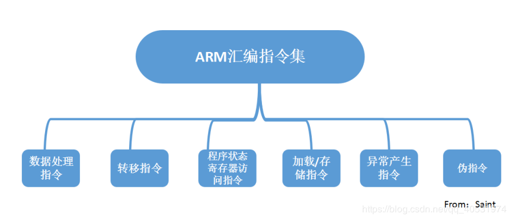
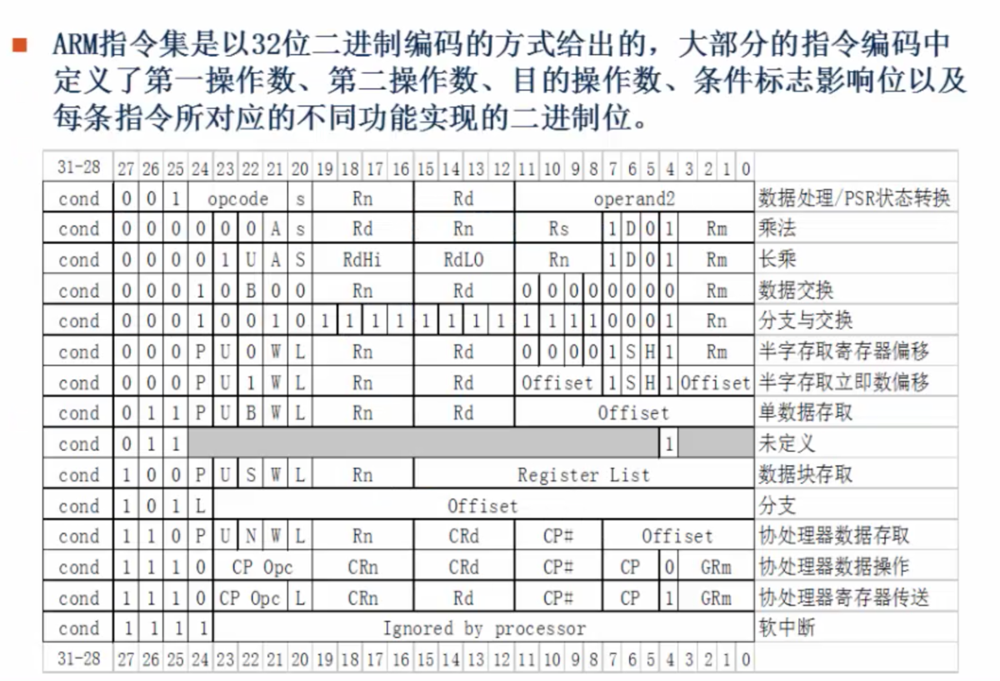
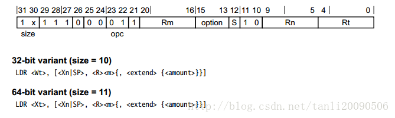

ARM汇编（二）基本指令

[TOC]


##arm汇编指令
###指令分类

ARM处理器的指令集可以分为跳转指令、数据处理指令、程序状态寄存器（PSR）处理指令、加载/存储指令、协处理器指令和异常产生指令6大指令。

A64特点
1. 移除了批量加载寄存器指令 LDM/STM, PUSH/POP, 使用STP/LDP 一对加载寄存器指令代替；
2. 没有提供访问CPSR的单一寄存器，但是提供访问PSTATE的状态域寄存器；
3. A64没有协处理器的概念，没有协处理器指令MCR,MRC；
4. 相比A32少了很多条件执行指令，只有条件跳转和少数数据处理这类指令才有条件执行.附件为条件指令码；
5. 32位neon指令都是以V开头，而64位neon指令没有V;
6. 32位寄存器需要保存的是r4~r11，q4~q7，而64位寄存器需要保存的是x19~x29 , v8~v15；
7. 64位下NEON寄存器与32位下NEON寄存器之间的关系不同，32位下d寄存器和q寄存器是重叠映射的，而64下的d寄存器和v寄存器是一一对应的
8. 向64位或者更低位的矢量寄存器中写数据时，会将高位置零；
9. 在AArch64中，没有通用寄存器的SIMD和饱和算法指令。只有neon寄存器才有SIMD或饱和算法指令；
10. ARM64下没有swap指令和条件执行指令。
11. 关于指令中立即数取值范围的说明：
不同指令中的#<imm>或者#<const>具有不同的取值范围，这个取决于所使用的指令，比如：
```
mov		<wd>, #<imm>  //该指令中立即数范围为-65536~65535。
cmp	    <wn>, #<imm>  //该指令中#<imm>为无符号立即数，取值范围为0~4095（12 bit）。
```

指令基本格式：
<Opcode>{<Cond>}<\S>  <Rd>, <Rn> {,<Opcode2>}
* Opcode：操作码，也就是助记符，说明指令需要执行的操作类型
* Cond：指令执行条件码，查看附件图；
* S：条件码设置项,决定本次指令执行是否影响PSTATE寄存器响应状态位值
* Rd/Xt：目标寄存器，A32指令可以选择R0-R14,T32指令大部分只能选择RO-R7，A64指令可以选择X0-X30；
* Rn/Xn：第一个操作数的寄存器，和Rd一样，不同指令有不同要求；
* Opcode2：第二个操作数，可以是立即数，寄存器Rm和寄存器移位方式（Rm，#shit）；
 
###指令和伪指令
（汇编）指令：是机器码的助记符，经过汇编器编译后，由CPU执行。 

（汇编）伪指令：用来指导指令执行，是汇编器的产物，最终不会生成机器码。

###指令结构
ARM处理器用到的指令集分为ARM 和 THUMB 两种。ARM指令长度固定为32bit，THUMB指令长度固定为16bit。所以 ARM64指令集的指令长度为32bit。

ARM指令的结构：


上图列出了不同种类ARM指令的编码格式，ARM指令长度固定为 32bit即图中的0-31位。其中28-31位是条件码，21-24为操作码，12-19为寄存器编号。例如跳转条件eq实际就是28-31位对应的条件码，但是28-31位都是二进制数据不好记，所以就对二进制的条件码取了好记的助记符，例如 eq。

arm64上虽然指令也是32位的，但是各部分划分有所差异。以LDR指令为例：

###指令读取
在 arm64 架构中，每个指令读取都是 64 位，即 8字节空间。

arm64 约定（一般来说）,x0 ~ x7(w0-w7) 分别会存放方法的前 8 个参数；如果参数个数超过了8个，多余的参数会存在栈上，新方法会通过栈来读取。
方法的返回值一般都在 x0 上；如果方法返回值是一个较大的数据结构时，结果会存在 x8 执行的地址上。

ARM64开始取消32位的LDM, STM, PUSH, POP指令. 与之替代的是 ldr/ ldp, str/ stp。

ARM64里面 对栈的操作都是16进制对齐的!!!
函数的局部变量都是保存在栈里面.

栈就是指令执行时存放临时变量的内存空间，具有特殊的访问方式：后进先出， Last In Out Firt。
* 栈是从高地址到低地址存储数据的，栈底是高地址，栈顶是高地址。
* FP指向栈底
* SP指向栈顶

##数据传送
###mov
```assembly
mov X1，X0 ; 将寄存器X0的值传送到寄存器X1
```
>只能用于寄存器与寄存器或者寄存器与常量之间传值，不能用于内存地址

###mvn
```assembly
MVN R0，＃0   ；将立即数0取反传送到寄存器R0中，完成后R0=-1（有符号位取反）
```
数据取反传送指令MVN
MVN指令的格式为：
MVN{条件}{S} 目的寄存器，源操作数

>MVN指令可完成从另一个寄存器、被移位的寄存器、或将一个立即数加载到目的寄存器。与MOV指令不同之处是在传送之前按位被取反了，即把一个被取反的值传送到目的寄存器中。其中S决定指令的操作是否影响CPSR中条件标志位的值，当没有S时指令不更新CPSR中条件标志位的值。

##访存指令
###str
(store register)写入指令
将数据从寄存器中读出来, 写入到内存中
```
str w9, [sp, #0x8]    ; 将寄存器 w9 中的值保存到栈内存 [sp + 0x8] 处 
```
###stur
stur： 同 str 将寄存器中的值写入到内存中（一般用于 负 地址运算中），如：
```
stur w10, [x29, #-0x4]    ; 将寄存器 w10 中的值保存到栈内存 [x29 - 0x04] 处 
```

###strb
(store register byte) 将寄存器中的值写入到内存中（只存储一个字节），如：
```
strb w8, [sp, #7]     ; 将寄存器 w8 中的低 1 字节的值保存到栈内存 [sp + 7] 处 
```
###strh
STRH指令的格式为：
STR{条件}H 源寄存器，<存储器地址>

STRH指令用于从源寄存器中将一个16位的半字数据传送到存储器中。该半字数据为源寄存器中的低16位。

指令示例：
```
STRH RO, [R1]
@将寄存器R0中的半字数据写入以R1为地址的存储器中.
STRH RO,[R1, #8]
@将寄存器R0中的半字数据写入以R1+8为地址的存储器中。
```
###ldr

(load register)读取指令
将数据从内存中读取出来, 存到寄存器中，LDR:通常都是作加载指令的，但是它也可以作伪指令
```
ldr x0, [x1]          ; 将寄存器 x1 的值作为地址，取该内存地址的值放入寄存器 x0 中 
ldr w8, [sp, #0x8]    ; 将栈内存 [sp + 0x8] 处的值读取到 w8 寄存器中 
ldr x0, [x1, #4]!     ; 将寄存器 x1 的值加上 4 作为内存地址, 取该内存地址的值放入寄存器 x0 中, 然后将寄存器 x1 的值加上 4 放入寄存器 x1 中 
ldr x0, [x1], #4      ; 将寄存器 x1 的值作为内存地址，取内该存地址的值放入寄存器 x0 中, 再将寄存器 x1 的值加上 4 放入寄存器 x1 中 
ldr x0, [x1, x2]      ; 将寄存器 x1 和寄存器 x2 的值相加作为地址，取该内存地址的值放入寄存器 x0 中 
```
>LDR指令用于从存储器中将一个32位的字数据传送到目的寄存器中。该指令通常用于从存储器中读取32位的字数据到通用寄存器，然后对数据进行处理。
当程序计数器PC作为目的寄存器时，指令从存储器中读取的字数据被当作目的地址，从而可以实现程序流程的跳转。

###ldur
ldur： 同 ldr 将内存中的值读取到寄存器中（一般用于 负 地址运算中），如：
```
ldur w8, [x29, #-0x4]     ; 将栈内存 [x29 - 0x04] 处的值读取到 w8 寄存器中
```
###ldrb
```
LDRB  R0，[R1]      ；将存储器地址为R1的字节数据读入寄存器R0，并将R0的高24位清零。
LDRB  R0，[R1，＃8]     ；将存储器地址为R1＋8的字节数据读入寄存器R0，并将R0的高24位清零。
```

>LDRB指令用于从存储器中将一个8位的字节数据传送到目的寄存器中，同时将寄存器的高24位清零。
该指令通常用于从存储器中读取8位的字节数据到通用寄存器，然后对数据进行处理。

###ldrh
LDRH指令的格式为：
LDR{条件}H 目的寄存器，<存储器地址>

LDRH指令用于从存储器中将一个16位的半字数据传送到目的寄存器中，同时将寄存器的高16位清零。

该指令通常用于从存储器中读取16位的半字数据到通用寄存器，然后对数据进行处理。

当程序计数器PC作为目的寄存器时，指令从存储器中读取的字数据被当作目的地址，从而可以实现程序流程的跳转。

指令示例：
```
LDRH R0,[R1]
@将存储器地址为R1的半个字节数据读入寄存器R0,并将R0的高16位清零
LDRH R0,[R1, #8]
@将存储器地址为R1+8的半个字节数据读入寄存器R0,并将R0的高16位清零
LDRH R0, [R1,R2]
@将存储器地址为R1+R2的半个字节数据读入寄存器R0,并将R0的高16位清零.
```

###ldp
出栈指令（ldr 的变种指令，可以同时操作两个寄存器），如：
```
ldp x29, x30, [sp, #0x10] 	; 将 sp 偏移 16 个字节的值取出来，存入寄存器 x29 和寄存器 x30 
```

###stp
stp： 入栈指令（str 的变种指令，可以同时操作两个寄存器），如：
```
stp x29, x30, [sp, #0x10] 	; 将 x29, x30 的值存入 sp 偏移 16 个字节的位置 
```

##批量数据加载/存储指令
ARM微处理器所支持批量数据加载/存储指令可以一次在一片连续的存储器单元和多个寄存器之间传送数据

批量加载指令用于将一片连续的存储器中的数据传送到多个寄存器，批量数据存储指令则完成相反的操作。

###LDM&STM
常用的加载存储指令如下：

LDM（或STM）指令

LDM（或STM）{条件}{类型} 基址寄存器{！}，寄存器列表{∧}

LDM（或STM）指令用于从由基址寄存器所指示的一片连续存储器到寄存器列表所指示的多个寄存器之间传送数据，

该指令的常见用途是将多个寄存器的内容入栈或出栈。

其中，{类型}为 以下几种情况：

IA  每次传送后地址加1；

IB  每次传送前地址加1；

DA   每次传送后地址减1；

DB   每次传送前地址减1；

FD   满递减堆栈；

ED   空递减堆栈；

FA   满递增堆栈；

EA   空递增堆栈；

{！}为可选后缀，若选用该后缀，则当数据 传送完毕之后，将最后的地址写入基址寄存器，

否则基址寄存器的内容不改变。基址寄存器不允许为R15，寄存器列表可以为R0～R15的任意组合。

{∧}为可选后缀，当指令为LDM且寄存器列表中包含R15，选用该后缀时表示：除了正常的数据传送之外，

还将SPSR复制到CPSR。同时，该后缀还表 示传入或传出的是用户模式下的寄存器，而不是当前模式下的寄存器。

##算术运算
###add
add： 将某一寄存器的值和另一寄存器的值 相加 并将结果保存在另一寄存器中，如：
```
add x0, x0, #1    ; 将寄存器 x0 的值和常量 1 相加后保存在寄存器 x0 中 
add x0, x1, x2    ; 将寄存器 x1 和 x2 的值相加后保存到寄存器 x0 中 
add x0, x1, [x2]  ; 将寄存器 x1 的值加上寄存器 x2 的值作为地址，再取该内存地址的内容放入寄存器 x0 中 
```
###adc
ADC指令的格式为：
ADC{条件}{S} 目的寄存器，操作数1，操作数2

ADC指令用于把两个操作数相加，再加上CPSR中的C条件标志位的值，并将结果存放到目的寄存器中。

它使用一个进位标志位，这样就可以做比32位大的数的加法，注意不要忘记设置S后缀来更改进位标志。

操作数1应是一个寄存器，操作数2可以是一个寄存器，被移位的寄存器，或一个立即数。

以下指令序列完成两个128位数的加法，第一个数由高到低存放在寄存器R7～R4，

第二个数由高到低存放在寄存器R11～R8，运算结果由高到低存放在寄存器R3～R0：
```
adds r0,r4,r8 @加低端的字
adcs r1,r5,r9 @加第二个字，带进位
adcs r2,r6,r10@加第三个字，带进位
adc r3,r7,r11 @加第四个字，带进位
```
###sub
sub： 将某一寄存器的值和另一寄存器的值 相减 并将结果保存在另一寄存器中，如：
```
sub x0, x1, x2        ; 将寄存器 x1 和 x2 的值相减后保存到寄存器 x0 中 
```
###sbc 
SBC指令的格式为：
SBC{条件}{S} 目的寄存器，操作数1，操作数2

SBC指令用于把操作数1减去操作数2，再减去CPSR中的C条件标志位的反码，并将结果存放到目的寄存器中。

操作数1应是一个寄存器，操作数2可以 是一个寄存器，被移位的寄存器，或一个立即数。

该指令使用进位标志来表示借位，这样就可以做大于32位的减法，

注意不要忘记设置S后缀来更改进位标志。该指令可用于有符号数或无符号数的减法运算。
```
sbc r0, r1, r2;r0=r1-r2-!c并根据结果设置cpsr
```
###rsb
RSB指令的格式为：
```
rsb x0, x1, x2        ; x0=x2-x1 
```

RSB指令称为逆向减法指令，用于把操作数2减去操作数1，并将结果存放到目的寄存器中。

操作数1应是一个寄存器，操作数2可以是一个寄存器，被移位的寄存器，或一个立即数。该指令可用于有符号数或无符号数的减法运算。

###rsc 
RSC指令（反向带进位减）

RSC指令的格式为：
RSC{条件}{S} 目的寄存器，操作数1，操作数2


RSC指令用于把 操作数2减去操作数1，再减去CPSR中的C条件标志位的反码，并将结果存放到目的寄存器中。

操作数1应是一个寄存器，操作数2可以是一个寄存器，被移位的寄存器，或一个立即数。

该指令使用进位标志来表示借位，这样就可以做大于32位的减法，注意不要忘记设置S后缀来更改进位标志。

该指令可用于有符号数或 无符号数的减法运算。
```
rsc r0, r1, r2;r0=r2-r1-!c
```

###乘法指令
####mul
mul： 将某一寄存器的值和另一个寄存器的值 相乘 并将结果保存在另一寄存器中，如：
```
mul x0, x1, x2        ; 将寄存器 x1 和 x2 的值相乘后结果保存到寄存器 x0 中
```

####mla
MLA指令（带累加的相乘）

MLA指令的格式为：
MLA{条件}{S} 目的寄存器，操作数1，操作数2，操作数3


MLA指令完成将操作数1与操作数2的乘法运算，再将乘积加上操作数3，并把结果放置到目的寄存器中，

同时可以根据运算结果设置CPSR中相应的条件标志位。其中，操作数1和操作数2均为32位的有符号数或无符号数.

指令示例：
```
MLA RO, R1, R2, R3
@RO=R1xR2+R3
MLAS R0,R1, R2, R3
@RO=R1xR2+R3,同时设置cpsr相关标志位
```
####smull
SMULL指令的格式为：

SMULL{条件}{S}   目的寄存器Low，目的寄存器High，操作数1，操作数2


SMULL指令完成将操作数1与操作数2的乘法运算，并把结果的低32位放置到目的寄存器Low中，

结果的高32位放置到目的寄存器High中，同时可以 根据运算结果设置CPSR中相应的条件标志位。

其中，操作数1和操作数2均为32位的有符号数
```
SMULL RO, R1, R2, R3
@RO=(R2 x R3) 的低32位
@R1=(R2 x R3) 的高32位
```

####smlal
SMLAL指令的格式为：
SMLAL{条件}{S}   目的寄存器Low，目的寄存器High，操作数1，操作数2


SMLAL指令完成将操作数1与操作数2的乘法运算，并把结果的低32位同目的寄存器Low中的值相加后又放置到目的寄存器Low中

结果的高32位同目的寄存器High中的值相加后又放置到目的寄存器High中，同时可以根据运算结果设置CPSR中相应的条件标志位。

其中，操作数1和操作数2均为32位的有符号数。


对于目的寄存器Low，在指令执行前存放64位加数的低32位，指令执行后存放结果的低32位；

对于目的寄存器High，在指令执行前存放64位加数的高32位，指令执行后存放结果的高32位。

指令示例：
```
SMLAL RO, R1, R2, R3
@R0=(R2xR3)的低32位+R0
@R1=(R2xR3)的高32位 + R1
```
####umull
UMULL指令的格式为：

    UMULL{条件}{S}   目的寄存器Low，目的寄存器High，操作数1，操作数2


UMULL指令完成将操作数1与操作数2的乘法运算，并把结果的低32位放置到目的寄存器Low中，

结果的高32位放置到目的寄存器High中，同时可以 根据运算结果设置CPSR中相应的条件标志位。

其中，操作数1和操作数2均为32位的无符号数


指令示例：
```
UMULL RO, R1, R2, R3
@RO = (R2 x R3) 的低32位
@R1 = (R2 x R3) 的高32位
```

####umlal
UMLAL指令的格式为：

    UMLAL{条件}{S}   目的寄存器Low，目的寄存器High，操作数1，操作数2


UMLAL指令完成将操作数1与操作数2的乘法运算，并把结果的低32位同目的寄存器Low中的值相加后又放置到目的寄存器Low中，

结果的高32位同目的寄存器High中的值相加后又放置到目的寄存器High中，

同时可以根据运算结果设置CPSR中相应的条件标志位。其中，操作数1和操作数2均为32位的无符号数。

对于目的寄存器Low，在指令执行前存放64位加数的低32位，指令执行后存放结果的低32位；

对于目的寄存器High，在指令执行前存放64位加数的高32位，指令执行后存放结果的高32位。

指令示例：
```
UMLAL RO, R1, R2, R3
@R0=(R2xR3)的低32位+R0
@R1=(R2xR3)的高32位+R1
```

###sdiv&udiv
sdiv：（有符号数，对应 udiv: 无符号数）将某一寄存器的值和另一个寄存器的值 相除 并将结果保存在另一寄存器中，如：
```
sdiv x0, x1, x2       ; 将寄存器 x1 和 x2 的值相除后结果保存到寄存器 x0 中
```

###scvtf
scvtf： (Signed Convert To Float)带符号 定点数 转换为 浮点数，如：
```
scvtf	d1, w0      ; 将寄存器 w0 的值(顶点数，转化成 浮点数) 保存到 向量寄存器/浮点寄存器 d1 中
```

###fcvtzs
fcvtzs： (Float Convert To Zero Signed)浮点数 转化为 定点数 （舍入为0），如：
```
fcvtzs w0, s0	    ; 将向量寄存器 s0 的值(浮点数，转换成 定点数)保存到寄存器 w0 中
```

##数据交换指令
###swp
SWP指令的格式为：
SWP{条件} 目的寄存器，源寄存器1，[源寄存器2]

SWP指令用于将源寄存器2所指向的存储器中的字数据传送到目的寄存器中，同时将源寄存器1中的字数据传送到源寄存器2所指向的存储器中。

显然，当源寄存 器1和目的寄存器为同一个寄存器时，指令交换该寄存器和存储器的内容

指令示例：
```
SWP RO, R1， [R2]
@将R2所指句的存储器中的字数据传送到RO,同时将R1 中的字数据传送到R2所指向的存储单元
SWP RO, RO, [R1 ]
@该指令完成将R1所指向的存储器中的字数据与RO中的数据交换
```

###swpb
SWPB指令的格式为：
SWP{条件}B 目的寄存器，源寄存器1，[源寄存器2]

SWPB指令用于将源寄存器2所指向的存储器中的字节数据传送到目的寄存器中，目的寄存器的高24清零，

同时将源寄存 器1中的字节数据传送到源寄存器2所指向的存储器中。显然，当源寄存器1和目的寄存器为同一个寄存器时，

指令交换该寄存器和存储器的内容。
指令示例:
```
SWPB RO, R1, [R2]
@将R2所指向的存储器中的字节数据传送到RO, RO的高24位清 零，
@同时将R1中的低8位数据传送到R2所指向的存储单元.
SWPB RO, RO, [R1]
@该指令完成将R1所指向的存储器中的字节数据与RB中的低8位数据交换
```

##移位指令
###LSL/ASL
LSL（Logical Shift Left）：逻辑左移，移位后寄存器空出的低位补0；
###LSR
LSR（Logical Shift Right）：逻辑右移，移位后寄存器空出的高位补0；
###ASR
ASR（Arithmetic Shift Right）：算数右移，移位过程中符号位保持不变，如果源操作数是正数，则移位后空出的高位补0，否则补1；
###ROR
ROR（Rotate Right）：循环右移，移位后移出的低位填入移位空出的高位；
###RRX
RRX（Rotate Right with extend）：带扩展的循环右移，操作数右移一位，移位空出的高位用处理器的进位标志（C标志）的值填充。

##逻辑运算
###and
and： 将某一寄存器的值和另一寄存器的值 按位与 并将结果保存到另一寄存器中，如：
```
and x0, x0, #0xf      ; 将寄存器 x0 的值和常量 0xf 按位与后保存到寄存器 x0 中 
```
###orr
orr： 将某一寄存器的值和另一寄存器的值 按位或 并将结果保存到另一寄存器中，如：
```
orr x0, x0, #9        ; 将寄存器 x0 的值和常量 9 按位或后保存到寄存器 x0 中
```
###eor
eor： 将某一寄存器的值和另一寄存器的值 按位异或 并将结果保存到另一寄存器中，如：
```
eor x0, x0, #0xf      ; 将寄存器 x0 的值和常量 0xf 按位异或后保存到寄存器 x0 中 
```

###biz
BIC指令的格式为：

     BIC{条件}{S} 目的寄存器，操作数1，操作数2


BIC指令用于清除操作数1的某些位，并把结果放置到目的寄存器中。

操作数1应是一个寄存器，操作数2可以是一个寄存器，被移位的寄存器，或一个立即数。 

操作数2为32位的掩码，如果在掩码中设置了某一位，则清除这一位。未设置的掩码位保持不变

指令示例：
```
BIC RO, RO, #%1011
@该指令清除R0中的位0、1、和3,其余的位保持不变
```

###cmp

cmp是比较指令,cmp的功能相当于减法指令subs。它不保存结果，只是影响程序状态寄存器 CPSR 相应的标志位.

cmp指令格式:   cmp   操作对象1, 操作对象2
mov al, 05h
mov bl, 08h
cmp al, bl   (al - bl = -3h)
###cmn
CMN指令的格式为：
CMN{条件} 操作数1，操作数2

CMN指令用于把一个寄存器的内容和另一个寄存器的内容或立即数取反后进行比较，

同时更新CPSR中条件标志位的值。该指令实际完成操作数1和操作数2相加，并根据结果更改条件标志位

指令示例：
```
CMN R1，RO
@将寄存器R1的值与寄存器R0的值相加，并根据结果设置CPSR的标志位
CMN R1 ,#100
@将寄存器R1的值与立即数100相加，并根据结果设置CPSR的标志位
```
###tst
TST指令的格式为：
TST{条件} 操作数1，操作数2


TST指令用于把一个寄存器的内容和另一个寄存器的内容或立即数进行按位的与运算

并根据运算结果更新CPSR中条件标志位的值。操作数1是要测试的数据，而操作数2是一个位掩码，该指令一般用来检测是否设置了特定的位。

指令示例：
```
TST R1, #%1 
@用于测试在寄存器R1中是否设置了最低位(%表示二进制数) 
TST R1, #0xffe
@将寄存器R1的值与立即数Bxffe按位与，并根据结果设置CPSR
```

###teq
TEQ指令的格式为：

    TEQ{条件} 操作数1，操作数2


TEQ指令用于把一个寄存器的内容和另一个寄存器的内容或立即数进行按位的异或运算

并根据运算结果更新CPSR中条件标志位的值。该指令通常用于比较操作数1和操作数2是否相等

指令示例：
```
TEQ R1， R2
@将寄存器R1的值与寄存器R2的值按位异或，并根据结果设置CPSR
```

###cbz
和 0 比较（Compare），如果结果为零（Zero）就转移（只能跳到后面的指令）;

###cbnz
cbnz： 和非 0 比较（Compare），如果结果非零（Non Zero）就转移（只能跳到后面的指令）;

###cset
cset： 比较指令，满足条件，则并置 1，否则置 0 ，如：
```
cmp w8, #2        ; 将寄存器 w8 的值和常量 2 进行比较
cset w8, gt       ; 如果是大于(grater than)，则将寄存器 w8 的值设置为 1，否则设置为 0
```

##cpsr访问指令
mrs用来读cpsr，msr用来写cpsr
CPSR寄存器比较特殊，需要专门的指令访问，这就是mrs和msr。
###mrs
MRS指令的格式为：
MRS{条件}    通用寄存器 程序状态寄存器（CPSR或SPSR）


MRS指令用于将程序状态寄存器的内容传送到通用寄存器中。该指令一般用在以下两种情况：

Ⅰ.当需要改变程序状态寄存器的内容时，可用MRS将程序状态寄存器的内容读入通用寄存器，修改后再写回程序状态寄存器。

Ⅱ.当在异常处理或进程切换时，需要保存程序状态寄存器的值，可先用该指令读出程序状态寄存器的值，然后保存
```
MRS RO ,CPSR
MRS RO,SPSR
```
###msr
MSR指令的格式为：
MSR{条件}    程序状态寄存器（CPSR或SPSR）_<域>，操作数

MSR指令用于将操作数的内容传送到程序状态寄存器的特定域中。其中，操作数可以为通用寄存器或立即数。

<域>用于设置程序状态寄存器中需要操作的位，32位的程序状态寄存器可分为4个域：

位[31：24]为条件位域，用f表示；

位[23：16]为状态位域，用s表示；

位[15：8] 为扩展位域，用x表示；

位[7：0]  为控制位域，用c表示；

该指令通常用于恢复或改变程序状态寄存器的内容，在使用时，一般要在MSR指令中指明将要操作的域。

指令示例：
```
MSR CPSR, RO
@传送R0内容到CPSR .
MSR SPSR, R0 .
@传送R0内容到SPSR
MSR CPSR_c, RO
@传送R0内容到CPSR, 但仅仅修改CPSR的控制位域
```

##跳转(分支)指令
###adrp
adrp： 用来定位数据段中的数据用, 因为 aslr 会导致代码及数据的地址随机化, 用 adrp 来根据 pc 做辅助定位
###brk
brk： 可以理解为跳转指令特殊的一种

###b
b： （branch）跳转到某地址（无返回）, 不会改变 lr (x30) 寄存器的值；一般是本方法内的跳转，如 while 循环，if else 等 ，如：
```
b： （branch）跳转到某地址（无返回）, 不会改变 lr (x30) 寄存器的值；一般是本方法内的跳转，如 while 循环，if else 等 ，如：
```

###bl
bl：（branch and link） 跳转到某地址（有返回），先将下一指令地址（即函数返回地址）保存到寄存器 lr (x30)中，再进行跳转 ；一般用于不同方法直接的调用 ，如：
```
bl 0x100cfa754	; 先将下一指令地址（‘0x100cfa754’ 函数调用后的返回地址）保存到寄存器 ‘lr’ 中，然后再调用 ‘0x100cfa754’ 函数
```

###blr
blr： 跳转到 某寄存器 (的值)指向的地址（有返回），先将下一指令地址（即函数返回地址）保存到寄存器 lr (x30)中，再进行跳转 ；如：
```
blr x20       ; 先将下一指令地址（‘x20’指向的函数调用后的返回地址）保存到寄存器 ‘lr’ 中，然后再调用 ‘x20’ 指向的函数
```
###br
br： 跳转到某寄存器(的值)指向的地址（无返回）, 不会改变 lr (x30) 寄存器的值。

###bx
 bx跳转同时切换到ARM模式，一般用于异常处理的跳转。
 
###blx
BLX指令的格式为：
BLX 目标地址

BLX指令从ARM指令集跳转到指令中所指定的目标地址，并将处理器的工作状态有ARM状态切换到Thumb状态，

该指令同时将PC的当前内容保存到寄存器R14中。因此，当子程序使用Thumb指令集，而调用者使用ARM指令集时，

可以通过BLX指令实现子程序的调用和处理器工作状态的切换。同时,子程序的返回可以通过将寄存器R14值复制到PC中来完成

###ret
ret： 子程序（函数调用）返回指令，返回地址已默认保存在寄存器 lr (x30) 中

ret {Xm}：跳转到由Xm目标寄存器指定的地址处。

##协处理器指令
###协处理器

###cdp
CDP指令的格式为：
CDP{条件} 协处理器编码，协处理器操作码1，目的寄存器，源寄存器1，源寄存器2，协处理器操作码2。


CDP指令用于ARM处理器通知ARM协处理器执行特定的操作，若协处理器不能成功完成特定的操作，

则产生未定义指令异常。其中协处理器操作码1和协处理 器操作码2为协处理器将要执行的操作，

目的寄存器和源寄存器均为协处理器的寄存器，指令不涉及ARM处理器的寄存器和存储器。

指令示例：
```
cdp p3,2,c12,c10,c3,4 @完成协处理p3的初始化
```

###ldc
LDC指令的格式为：
LDC{条件}{L} 协处理器编码，目的寄存器，[源寄存器]

LDC指令用于将源寄存器所指向的存储器中的字数据传送到目的寄存器中，若协处理器不能成功完成传送操作，

则产生未定义指令异常。其中，{L}选项表示指 令为长读取操作，如用于双精度数据的传输
```
LDC P3, C4, [RO]
@将ARM处理器的寄存器R0所指向的存储器中的字数据传送到协处理器P3的寄存器C4中。
```
###stc
STC指令的格式为：

    STC{条件}{L} 协处理器编码，源寄存器，[目的寄存器]

STC指令用于将源寄存器中的字数据传送到目的寄存器所指向的存储器中，若协处理器不能成功完成传送操作，则产生未定义指令异常。

其中，{L}选项表示指 令为长读取操作，如用于双精度数据的传输


指令示例：
```
STC P3, C4, [R0] @将协处理器P3的寄存器C4中的字数据传送到ARM处理器的寄存器RB所指向的存诸器中
```


###mcr
MCR指令的格式为：

    MCR{条件} 协处理器编码，协处理器操作码1，源寄存器，目的寄存器1，目的寄存器2，协处理器操作码2。

MCR指令用于将ARM处理器寄存器中的数据传送到协处理器寄存器中,若协处理器不能成功完成操作，

则产生未定义指令异常。其中协处理器操作码1和协处理 器操作码2为协处理器将要执行的操作，

源寄存器为ARM处理器的寄存器，目的寄存器1和目的寄存器2均为协处理器的寄 存器。

指令示例：
```
MCR P3, 3, RO, C4, C5, 6
@将ARM处理器寄存器R0中的数据传送到协处理器P3的奇存器C4和C5中
```
###mrc
MRC指令的格式为：

    MRC{条件} 协处理器编码，协处理器操作码1，目的寄存器，源寄存器1，源寄存器2，协处理器操作码2


MRC指令用于将协处理器寄存器中的数据传送到ARM处理器寄存器中,若协处理器不能成功完成操作，

则产生未定义指令异常。其中协处理器操作码1和协处理 器操作码2为协处理器将要执行的操作，

目的寄存器为ARM处理器的寄存器，源寄存器1和源寄存器2均为协处理器的寄存器。

指令示例：
```
MRC P3 ,3,RO ,C4,C5,6
@该指令将协处理器P3的寄存器中的数据传送到ARM处理器寄存器中
```


##异常产生指令
###swi
SWI指令的格式为：

    SWI{条件} 24位的立即数

SWI指令用于产生软件中断，以便用户程序能调用操作系统的系统例程。操作系统在SWI的异常处理程序中提供相应的系统服务，

指令中24位的立即数指定用 户程序调用系统例程的类型，相关参数通过通用寄存器传递，当指令中24位的立即数被忽略时，

用户程序调用系统例程的类型由通用寄存器R0的内容决定，同 时，参数通过其他通用寄存器传递

指令示例：
```
swi 0x02 @调用操作系统编号为2的系统调用
```

###bkpt
BKPT指令的格式为：
BKPT   16位的立即数

BKPT指令产生软件断点中断，可用于程序的调试


##参考
汇编语言的一些基本指令
https://blog.csdn.net/chi_wy/article/details/86236735

arm64 架构之入栈/出栈操作
https://juejin.im/post/5cadeda55188251ad87b0eed#heading-6

ARM汇编指令基础
https://blog.csdn.net/u013216061/article/details/79423282

汇编指令
https://www.cnblogs.com/huhu0013/p/4103024.html

arm汇编指令 
 https://www.cnblogs.com/bingghost/p/5839022.html
 
ARM指令集
 https://blog.csdn.net/qcztzswt357/article/details/53265147
 
ARM汇编指令集汇总
https://blog.csdn.net/qq_40531974/article/details/83897559

ARM 指令集
http://blog.chinaunix.net/uid-10386087-id-2958586.html

 ARMv8 架构与指令集.学习笔记 
 https://www.cnblogs.com/lvdongjie/p/6644821.html
 
 ARMv8-AArch64寄存器和指令集
 https://blog.csdn.net/tanli20090506/article/details/71487570
 
 【arm】arm32位和arm64位架构、寄存器和指令差异分析总结
 https://blog.csdn.net/SoaringLee_fighting/article/details/82800919

