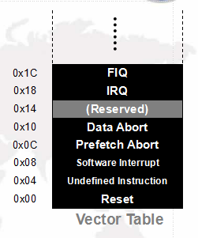

ARM汇编（一）基础知识

[TOC]
##基础
###1.二种指令集
CISC复杂指令集 
RISC精简指令集

>CISC指令集有Intel和AT&T两种。苹果模拟器上是AT&T。举个例子，Intel上是mov,AT&T是movl,movq这种。

###2.二种架构
冯诺依曼结构：程序和数据都放在内存中， 且不彼此分离。
哈佛结构：程序和数据分开独立放在不同的内存块中，彼此完全分离。
###3.ARM 约定:
Byte ： 8 bits
Halfword ： 16 bits (2 byte)
Word : 32 bits (4 byte)
###4.ARM 处理器工作模式：
User : 非特权模式， 大部分任务执行在这种模式
FIQ : 当一个高优先级（fast) 中断产生时将会进入这种模式
IRQ : 当一个低优先级（normal) 中断产生时将会进入这种模式
Supervisor :当复位或软中断指令执行时将会进入这种模式
Abort : 当存取异常时将会进入这种模式
Undef : 当执行未定义指令时会进入这种模式
System : 使用和 User 模式相同寄存器集的特权模式


###5.ARM寄存器
ARM 总共有 37 个寄存器， 但是每种模式下最多只能看到 18 个寄存器。37 个寄存器中 30 个为“通用” 型， 1 个固定用作 PC， 一个固定用作 CPSR， 5 个固定用作 5 种异常模式下的 SPSR。

###6.ARM 的异常处理机制：
(1).当异常产生时, ARM core:
* 拷贝 CPSR 到 SPSR_<mode>
* 设置适当的 CPSR 位：
* 改变处理器状态进入 ARM 态
* 改变处理器模式进入相应的异常模式
* 设置中断禁止位禁止相应中断 (如果需要)
* 保存返回地址到 LR_<mode>
* 设置 PC 为相应的异常向量
(2).返回时, 异常处理需要:
* 从 SPSR_<mode>恢复 CPSR
* 从 LR_<mode>恢复 PC
* Note:这些操作只能在 ARM 态执行.



##两种不同风格的ARM指令

1).ARM官方的ARM汇编风格：指令一般用大写，Windows中的IDE开发环境。

2).GNU风格的ARM汇编：指令一般用小写。

##ARM汇编的特点
###1. LDR/STR架构
1).ARM采用RISC架构，CPU本身不能直接读取内存，而需要先将内存中内容加载入CPU中通用寄存器中才能被CPU处理。
2).ldr（load register）指令将内存内容加载入通用寄存器。
3).str（store register）指令将寄存器内容存入内存空间中。
4).ldr/str组合用来实现 ARM CPU和内存数据交换。
###2. 8种寻址方式
1).寄存器寻址mov r1, r2。
2).立即(立即数)寻址 mov r0, #0xFF00。
3).寄存器移位寻址 mov r0, r1, lsl #3。
4).寄存器间接寻址 ldr r1, [r2] 表示内存，内存地址存在r2这个寄存器中，把内存地址里的值给r1。
5).基址变址寻址ldr r1, [r2, #4]内存地址在r2+4里面。
6).多寄存器寻址,一次访问多个寄存器。
```
LDMIA R0!,{R1-R4}  
;R1<----[R0]
;R2<----[R0+4]
;R3<----[R0+8]
;R4<----[R0+12] 

所有的示例指令执行前：
mem32[0x1000C] = 0x04
mem32[0x10008] = 0x03
mem32[0x10004] = 0x02
mem32[0x10000] = 0x01
r0 = 0x00010000
r1 = 0x00000000
r1 = 0x00000000
r3 = 0x00000000
r4 = 0x00000000
1) ldmia r0!, {r1-r3} 2) ldmib r0!, {r1-r3}
执行后:                      执行后:
r0 = 0x0010000C             r0 = 0x0010000C
r1 = 0x01                   r1 = 0x02
r2 = 0x02                   r2 = 0x03
r3 = 0x03                   r3 = 0x04      
```
该指令的含义是将数据从存储器复制到寄存器中，操作数的地址在r0寄存器中，通过r0确定要复制的数据，传递后地址自增4。
指令后缀：
IA：先传递数据，后地址自增
IB：先地址自增，后传递数据
DA：先传递数据，后地址自减
DB：先地址自减，后传递数据

!的作用:
```
ldmia r0, {r2 - r3}
ldmia r0！, {r2 - r3}
```
感叹号的作用就是r0的值在ldm过程中发生的增加或者减少最后写回到r0去，也就是说ldm时会改变r0的值。

\^的作用:
```
ldmfd sp!, {r0 - r6, pc}
ldmfd sp!, {r0 - r6, pc}^
```
\^的作用：在目标寄存器中有pc时，会同时将spsr写入到cpsr，一般用于从异常模式返回。

7).堆栈寻址 stmfd sp!, {r2-r7, lr}。
存储器生长堆栈可分为：
向上生长：向高地址方向生长，称为递增堆栈
向下生长：向低地址方向生长，称为递减堆栈

满堆栈：堆栈指针指向最后压入的堆栈的有效数据项，称为满堆栈。
空堆栈：堆栈指针指向下一个要放入的空位置，称为空堆栈。

满递增FA堆栈
满递减FD堆栈
空递增EA堆栈
空递减ED堆栈


示例一:
```
STMFD入栈指令，相当于STMDB
STMFD SP!,{R2-R4}                            
;[SP-4]<---R4
;[SP-8]<---R3 
;[SP-12]<---R2   
LDMFD出栈指令，相当于LDMIA
LDMFD SP!,{R6-R8}                
;R6<----[SP]
;R7<----[SP+4]
;R8<----[SP+8]
```
示例二:
```
STMFD入栈指令：相当于STMDB（事前递减DB）

FD含义:满栈降，满栈即SP要停留在最后一个进栈元素，降就是堆栈的方向是从高地址到低地址方向发展。
STMFD SP!,{R2-R4，LR}    

执行后：

10H:     <---压栈前SP指向
0CH:   [SP-4] <---LR  ，先压LR                  
08H:   [SP-8]<---R4
04H:   [SP-12]<---R3 
00H:   [SP-16]<---R2   ，<---压栈后SP指向


LDMFD出栈指令：相当于LDMIA（事后递增IA）
LDMFD SP!,{ R2-R4，LR }     

执行后 ：          

10H:     <---出栈后SP指向
0CH:  LR<-- [SP+12]                  
08H:  R4<-- [SP+8]
04H:  R3<-- [SP+4] 
00H:  R2<--[SP]    <---出栈前SP指向，出栈值先赋给R2

STMFD指令中写在后面的寄存器先入栈，LDMFD写在前面的寄存器先出栈（后入先出）。
```
和多寄存器寻址的区别：
```
;使用数据块传送指令进行堆栈操作
STMDA R0!,{R5-R6}将R5、R6存入相应的R0指向的地址对应的内存
. . .
LDMIB R0!,{R5-R6}将R0指向的地址对应的内存的内容存入R5和R6
;使用堆栈指令进行堆栈操作
STMED R13!,{R5-R6}
. . .
LDMED R13!,{R5-R6}这一段代码的两个都是ED

两段代码的执行结果是一样的，但是使用堆栈指令的压栈和出栈操作编程很简单（只要前后一致即可），而使用数据块指令进行压栈和出栈操作则需要考虑空与满、加与减对应的问题。（相当于堆栈指令做了封装）
```

8).相对寻址,基址变址寻址的变通，由程序计数器PC提供基址，指令中的地址码字段作为偏移量，两者相加后的地址作为操作数的有效地址。 
```  
BL flag
......
flag:
......
```
###3. 指令前后缀
同一指令经常附带不同后缀，变成不同的指令。经常使用的后缀有：
H（half word）功能不变，长度变为16位
S（signed）功能不变，操作数变为有符号
如 ldr ldrb ldrh ldrsb ldrsh
S（S标志）功能不变，影响CPSR标志位
q 操作数为8字节
l 操作数为4字节
w 操作数为2字节
b 操作数为1字节
如 mov和movs movs r0, #0

整型：
W/R 32bit整数
X   64bit整数

加载/存储、符号-0扩展：
B 无符号8bit字节
SB 带符号8bit字节
H 无符号16bit半字
SH 带符号16bit半字
W 无符号32bit字
SW 带符号32bit字
P Pair（一对）

寄存器宽度改变
H 高位（dst gets top half）
N 有限位（dst < src）
L Long （dst > src）
W Wide (dst==src1,src1>src2) ？

其他常用前后缀包括:
U 表示Unsigned
F 表示Float
V 表示Across，即对整个寄存器的操作
N 表示窄化Narrow
L 表示宽化Long
2 一般表示高64位（64-128）的操作

###4. 条件执行后缀
条件后缀是否成立取决于当前代码的前面的代码。
条件后缀只影响当前代码的执行。

```
moveq r0, r1 
```
如果 eq 后缀成立，则直接执行 mov r0, r1；如果 eq不成立则本句代码直接作废， 相当于没有。类似于 C 语言中 if (eq){r0 = r1;}
条件后缀执行注意 2 点：
1.条件后缀是否成立，不是取决于本句代码， 而是取决于这句代码之前的代码运行后的结果（CPSR 标志位）。
2.条件后缀决定了本句代码是否被执行， 而不会影响上一句和下一句代码是否被执行。

###5. 多级指令流水线
为增加处理器指令流的速度，ARM使用多级流水线.（S5PV210使用13级流水线，ARM11为8级）
下图为3级流水线工作原理示意图。

允许多个操作同时处理，而非顺序执行。
PC指向正被取指的指令，而非正在执行的指令

