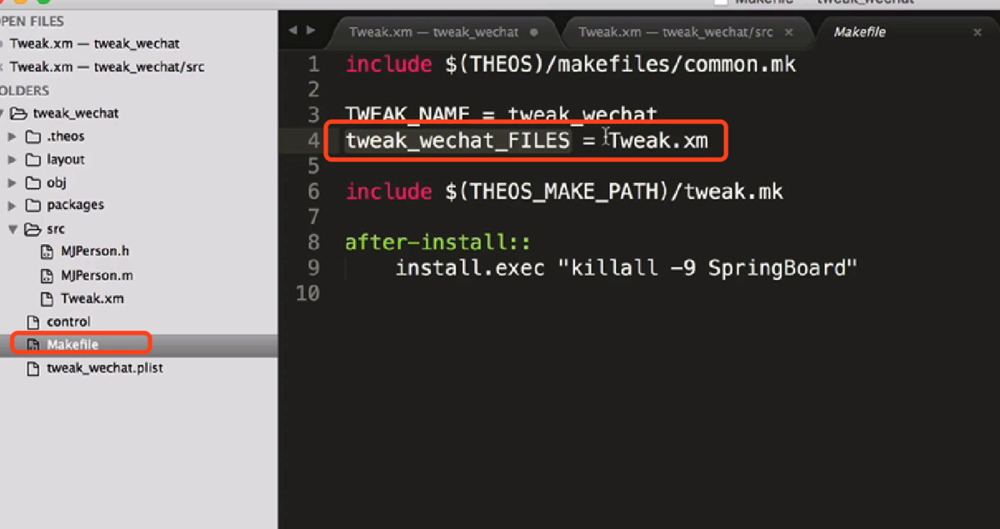

OC反汇编

[TOC]

##OC的反汇编

##多份XM文件
现在的代码都写在Tweak.xm中，如果代码很多就不便于管理了。

xm：oc c++

可以直接新建文件夹，将OC头文件和实现文件拖入

但是路径需要设置一下

如果路径是这样没和Tweak.xm在一个文件夹，则import这样写

编译的问题 ，*代表通用

【iOS逆向】Tweak多文件开发
https://www.jianshu.com/p/6ba6e37e32bc
##恢复符号表

##Block反汇编

