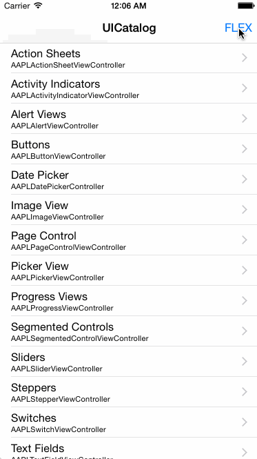
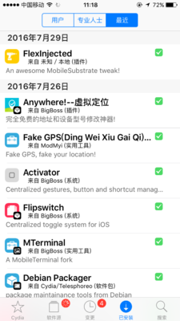
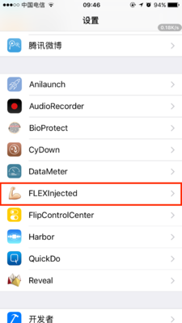

添加FLEX库

[TOC]

##什么是FLEX
FLEX（Flipboard Explorer）是一套用于iOS开发的应用内调试和探索工具。显示时，FLEX显示一个工具栏，该工具栏位于应用程序上方的窗口中。在此工具栏中，您可以查看和修改正在运行的应用程序中的几乎所有状态。
当我们想要在地铁、路上、公交车上、公园等等地方对APP应用进行调试的时候，FLEX便是利器。你不需要Xcode，不需要LLDB。一切都在手机里。

##FLEX能做什么
FLEX可以做什么：

* 检查并修改层次结构中的视图。
* 查看任何对象的属性和ivars。
* 动态修改许多属性和ivars。
* 动态调用实例和类方法。
* 通过计时，标题和完整响应观察详细的网络请求历史记录。
* 添加自己的模拟器键盘快捷键。
* 查看系统日志消息（例如，来自NSLog）。
* 通过扫描堆访问任何活动对象。
* 在应用程序的沙箱中查看文件系统。
* 浏览文件系统中的SQLite / Realm数据库。
* 使用控制键，移位键和命令键在模拟器中触发3D触摸。
* 浏览应用程序和链接系统框架（公共和私有）中的所有类。
* 快速访问有用的对象，例如[UIApplication sharedApplication]应用程序委托，关键窗口上的根视图控制器等。
* 动态查看和修改NSUserDefaults值。

例子：
1.修改字体：


2.查看网络请求



##如何使用
先上下载地址
FLEX项目地址:[FLEX](https://github.com/Flipboard/FLEX)
Tweak版FLEXInjected:[FLEX_injected](https://github.com/dtrukr/FLEX_injected)

第一个FLEX主要是作为正向开发使用，可以使用CocoaPods来集成到你的项目中而用来调试。
第二个是Tweak版的，需要自己编译Deb安装，当然也就只有越狱手机才能使用了，第二个Tweak版装了之后，即使你是做正向开发的，也可以免掉集成第一个FLEX的步骤，因为Tweak版可以直接调试所有App，甚至包括大厂的QQ、支付宝、淘宝等！可见其有多强大.具体有那些功能，大家可以去项目地址下方看介绍，我这里介绍一些简单的操作

###如何使用FLEX
在项目中集成FLEX，然后使用下面的代码：
```
// Objective-C
[[FLEXManager sharedManager] showExplorer];

// Swift
FLEXManager.shared().showExplorer()

#if DEBUG
#import "FLEXManager.h"
#endif

...

- (void)handleSixFingerQuadrupleTap:(UITapGestureRecognizer *)tapRecognizer
{
#if DEBUG
    if (tapRecognizer.state == UIGestureRecognizerStateRecognized) {
        // This could also live in a handler for a keyboard shortcut, debug menu item, etc.
        [[FLEXManager sharedManager] showExplorer];
    }
#endif
}
```

###如何使用FLEX_injected
1、如何使用FLEX_injected
安装步骤有2种，一种是在上方的下载地址下载源码自己编译成deb安装,第二种就是去Cydia中下载安装


2、安装完成后
在设置界面，滑到下面，能看到


3、使用方法
点进去后选择你要调试或修改的App，将右边的Switch开关打开，然后再去打开对应的App，你就会发现界面上出现了个工具条


###FLEX之修改界面文字之修改微信余额

这个功能其实还是很实用，其主要的作用呢，就是装逼

直接上图演示


由于看不到我手指操作，我这里简单描述一下操作步骤
1、进设置界面里打开微信的Switch开关，然后回到微信，打开钱包、我的零钱界面，选择工具条上的select按钮,然后点击余额(￥6.00)那里，然后就会变色，然后再选择工具条上的Views，这时候会自动跳到对应的Label上，然后点击右边的感叹号，就可以看到其属性，其中有个text属性，点击进去就可以直接修改了，改完后右上角set一下，收工。要注意，不能返回其他界面，或者退出后台，不然重新进来的时候会请求网络，余额就会变成你真正的余额了.

接下来就是截图到朋友圈炫(zhuang)富(bi)的时候了！

##参考
iOS逆向工具篇之FLEX调试工具(FLEX_injected)
https://www.jianshu.com/p/dbcb9b83a89b

八、iOS逆向之《FLEX》介绍与使用
https://www.jianshu.com/p/7f9e10701f40
