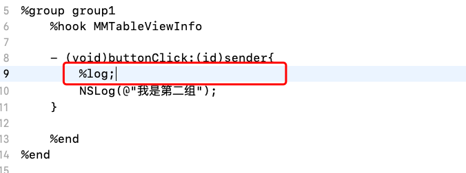

Logos语法

[TOC]

##概述

Logos语法其实是CydiaSubstruct框架提供的一组宏定义。便于开发者使用宏进行HOOK操作。语法简单，功能强大且稳定。
http://iphonedevwiki.net/index.php/Logos

##语法分类
Logos语法分为三大类：
* Top level
* Block level
* Function level

###Top level

这个TopLevel指令不放在BlockLevel中。
%config、%hookf、%ctor、%dtor

###Block level

这一类型的指令会开辟一个代码块，以%end结束。
%group、%hook、% subclass 、 %end

###Function level

这一块的指令就放在方法中。
%init、%class、 %c、 %orig、%log

##常用语法
%hook
hook某个类里面的方法

%new
在%hook中为某个类添加新方法

%group
用来将代码分组。开发中hook代码会很多，这样方便管理Logos代码。

%ctor(constructor)
构造函数，用于确定加载那个组。和%init结合用

%init
用来初始化某个组。

%log
能够输出日志!! 输出方法调用的详细信息

%orig(original)
调用原有的方法实现，如果原来的方法有返回值，那么%orig 就有返回值的。

%c
类似getClass函数，获得一个类对象。一般用于调用类方法。

##参考
七、iOS逆向之《Logos语法》
https://www.jianshu.com/p/cdccebd69927