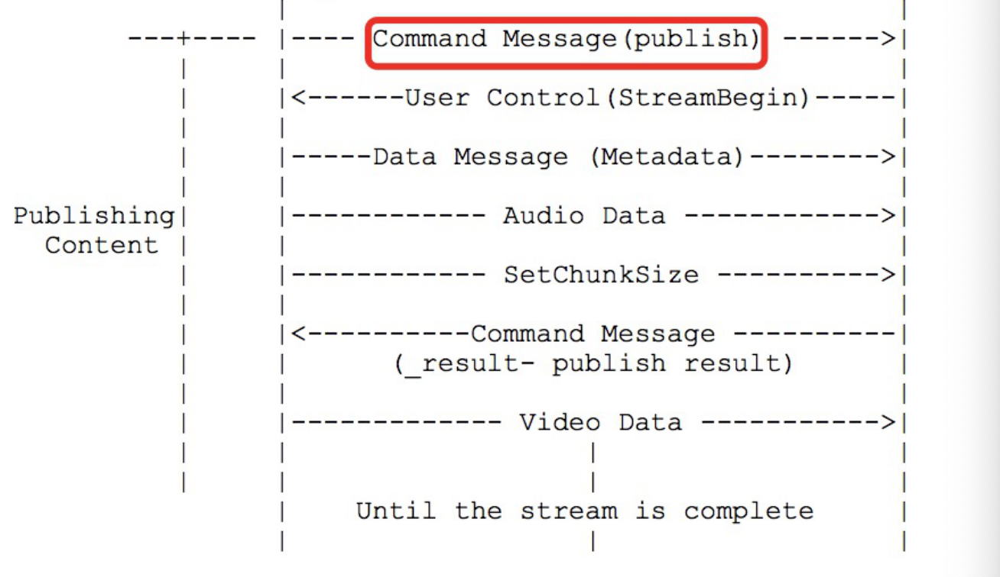

视频传输协议详解（RTMP、RTSP、HLS）

[TOC]

这两年网络直播特别火，国内很多网络直播平台都做的风生水起，特别是熊猫直播、斗鱼、花椒等。投资人为了把平台做大做强，大把大把烧钱，搞的很多小伙伴们都很心动想跳槽去做直播。作为构建直播平台的基础之一——传输协议，我们该如何选择呢？那么首先我们就要了解这些协议的原理及特点。


##RTMP--Real Time Messaging Protocol（实时消息传输协议）

RTMP是由Adobe公司提出的，在互联网TCP/IP五层体系结构中应用层，RTMP协议是基于TCP协议的，也就是说RTMP实际上是使用TCP作为传输协议。TCP协议在处在传输层，是面向连接的协议，能够为数据的传输提供可靠保障，因此数据在网络上传输不会出现丢包的情况。不过这种可靠的保障也会造成一些问题，也就是说前面的数据包没有交付到目的地，后面的数据也无法进行传输。幸运的是，目前的网络带宽基本上可以满足RTMP协议传输普通质量视频的要求。

RTMP传输的数据的基本单元为Message，但是实际上传输的最小单元是Chunk（消息块），因为RTMP协议为了提升传输速度，在传输数据的时候，会把Message拆分开来，形成更小的块，这些块就是Chunk。

###消息（Message）的结构


Message结构分析

1.Message Type：它是一个消息类型的ID，通过该ID接收方可以判断接收到的数据的类型，从而做相应的处理。Message Type ID在1-7的消息用于协议控制，这些消息一般是RTMP协议自身管理要使用的消息，用户一般情况下无需操作其中的数据。Message Type ID为8，9的消息分别用于传输音频和视频数据。Message Type ID为15-20的消息用于发送AMF编码的命令，负责用户与服务器之间的交互，比如播放，暂停等。

2.Playload Length： 消息负载的长度，即音视频相关信息的的数据长度，4个字节

3.TimeStamp：时间戳，3个字节。

4.Stream ID：消息的唯一标识。拆分消息成Chunk时添加该ID，从而在还原时根据该ID识别Chunk属于哪个消息。

5.Message Body：消息体，承载了音视频等信息。

###消息块（Chunk）


通过上图可以看出，消息块在结构上与HTTP消息类似，有Header和Body。

1.Basic Header：基本的头部信息，在头部信息里面包含了chunk stream ID（流通道Id，用来标识指定的通道）和chunk type（chunk的类型）。

2.Message Header：消息的头部信息，包含了要发送的实际信息（可能是完整的，也可能是一部分）的描述信息。Message Header的格式和长度取决于Basic Header的chunk type。

3.Extended TimeStamp：扩展时间戳。

4.Chunk Data：块数据。

RTMP在传输数据的时候，发送端会把需要传输的媒体数据封装成消息，然后把消息拆分成消息块，再一个一个进行传输。接收端收到消息块后，根据Message Stream ID重新将消息块进行组装、组合成消息，再解除该消息的封装处理就可以还原出媒体数据。由此可以看出，RTMP收发数据是以Chunk为单位，而不是以Message为单位。需要注意的是，RTMP发送Chunk必须是一个一个发送，后面的Chunk必须等前面的Chunk发送完成。

###交互过程
####1.简要介绍
RTMP协议是应用层协议，是要靠底层可靠的传输层协议（通常是TCP）来保证信息传输的可靠性的。在基于传输层协议的链接建立完成后，一个RTMP协议的流媒体推流需要经过以下几个步骤：握手，建立连接，建立流，推流。RTMP连接都是以握手作为开始的。建立连接阶段用于建立客户端与服务器之间的“网络连接”；建立流阶段用于建立客户端与服务器之间的“网络流”；推流阶段用于传输视音频数据。

接下来就简单介绍下这一过程

####2.握手

在rtmp连接建立后,服务端与客户端需要通过3次交换报文完成握手,握手其他的协议不同,是由三个静态大小的块,而不是可变大小的块组成的,客户端与服务器发送相同的三个chunk,客户端发送c0,c1,c2,服务端发送s0,s1,s2。

发送规则

握手开始于客户端发送 C0，C1 块。
客户端在发送C2之前客户端必须等待接收S1 。
客户端在发送任何数据之前客户端必须等待接收S2。

服务端在发送 S0 和 S1 之前必须等待接收 C0，也可以等待接收 C1。
服务端在发送 S2 之前必须等待接收 C1。
服务端在发送任何数据之前必须等待接收 C2。

或者说：
握手开始于客户端发送C0、C1块。服务器收到C0或C1后发送S0和S1。
当客户端收齐S0和S1后，开始发送C2。当服务器收齐C0和C1后，开始发送S2。
当客户端和服务器分别收到S2和C2后，握手完成。


数据格式

C0与S0
C0和S0的长度是一个字节，在 S0 中这个字段表示服务器选择的 RTMP 版本。rtmp1.0规范所定义的版本是 3；0-2 是早期产品所用的，已被丢弃；4-31保留在未来使用；32-255 不允许使用（为了区分其他以某一字符开始的文本协议）。如果服务无法识别客户端请求的版本，应该返回 3 。客户端可以选择减到版本 3 或选择取消握手。

C1与S1
C1 和 S1 有 1536 字节长，由下列字段组成:
时间：4 字节 本字段包含时间戳。该时间戳应该是发送这个数据块的端点的后续块的时间起始点。可以是 0，* 或其他的 任何值。为了同步多个流，端点可能发送其块流的当前值。
零：4 字节 本字段必须是全零。
随机数据：1528 字节。 本字段可以包含任何值。 因为每个端点必须用自己初始化的握手和对端初始化的握 手来区分身份，所以这个数据应有充分的随机性。但是并不需要加密安全的随机值，或者动态值

C2与S2
C2 和 S2 消息有 1536 字节长。只是 S1 和 C1 的回复。本消息由下列字段组成。
时间：4 字节 本字段必须包含对等段发送的时间（对 C2 来说是 S1，对 S2 来说是 C1）。
时间2：4 字节本字段必须包含先前发送的并被对端读取的包的时间戳。
随机回复：1528 字节 本字段必须包含对端发送的随机数据字段（对 C2 来说是 S1，对 S2 来说是 C1）。每个对等端可以用时间和时间 2 字段中的时间戳来快速地估计带宽和延迟。 但这样做可能并不实用。

RTMP握手的这个过程就是完成了两件事：1. 校验客户端和服务器端RTMP协议版本号，2. 是发了一堆数据，猜想应该是测试一下网络状况，看看有没有传错或者不能传的情况。


####3.建立网络连接

客户端发送命令消息中的“连接”(connect)到服务器，请求与一个服务应用实例建立连接。
服务器接收到连接命令消息后，发送确认窗口大小(Window Acknowledgement Size)协议消息到客户端，同时连接到连接命令中提到的应用程序。

服务器发送设置带宽(set peer bandwidth)协议消息到客户端。
客户端处理设置带宽协议消息后，发送确认窗口大小(Window Acknowledgement Size)协议消息到服务器端。

服务器发送用户控制消息中的“流开始”(Stream Begin)消息到客户端。
服务器发送命令消息中的“结果”(_result)，通知客户端连接的状态。

注意：
这里面的connect 命令消息，命令里面包含什么东西，协议中没有说，真实通信中要指定一些编解码的信息，这些信息是以AMF格式发送的, 其中audioCodecs和videoCodecs这两个指定音视频编码信息的不能少的。

Window Acknowledgement Size 是设置接收端消息窗口大小，一般是2500000字节，即告诉客户端你在收到我设置的窗口大小的这么多数据之后给我返回一个ACK消息，告诉我你收到了这么多消息。在实际做推流的时候推流端要接收很少的服务器数据，远远到达不了窗口大小，所以基本不用考虑这点。而对于服务器返回的ACK消息一般也不做处理，我们默认服务器都已经收到了这么多消息。

服务器返回的_result命令类型消息的payload length一般不会大于128字节，但是在最新的nginx-rtmp中返回的消息长度会大于128字节，所以一定要做好收包，组包的工作。


####4.建立网络流

创建完网络连接之后就可以创建网络流了

客户端发送命令消息中releaseStream命令到服务器端
客户端发送命令消息中FCPublish命令到服务器端
客户端发送命令消息中的“创建流”（createStream）命令到服务器端。
服务器端接收到“创建流”命令后，发送命令消息中的“结果”(_result)，通知客户端流的状态。
解析服务器返回的消息会得到一个stream ID, 这个ID也就是以后和服务器通信的 message stream ID, 一般返回的是1，不固定。


####5.推流命令

推流准备工作的最后一步是 Publish Stream，即向服务器发一个publish命令，这个命令的message stream ID 就是上面 create stream 之后服务器返回的stream ID，发完这个命令一般不用等待服务器返回的回应，直接下一步发送音视频数据。有些rtmp库 还会发setMetaData消息，这个消息可以发也可以不发，里面包含了一些音视频编码的信息。

当以上工作都完成的时候，就可以发送音视频了。音视频RTMP消息的Payload(消息体)中都放的是按照FLV-TAG格式封的音视频包，具体可以参照FLV封装的协议文档。格式必须封装正确，否则会造成播放端不能正常拿到音视频数据，无法播放音视频。



####6.播放命令
1. 客户端发送命令消息中的“播放”（play）命令到服务器。
2. 接收到播放命令后，服务器发送设置块大小（ChunkSize）协议消息。
3. 服务器发送用户控制消息中的“streambegin”，告知客户端流ID。
4. 播放命令成功的话，服务器发送命令消息中的“响应状态” NetStream.Play.Start & NetStream.Play.reset，告知客户端“播放”命令执行成功。
5. 在此之后服务器发送客户端要播放的音频和视频数据。


##RTSP--Real Time Streaming Protocol(实时流媒体协议)

RTSP协议，这应该是实时性最好的了，如果要想实时性要求很高，比如0.5s以内，这个是不错的选择。前阵子模仿spydroid写了个建议的rtsp服务器，其实就是options，describe，setup，play，pause，teardown这几步了，这个协议用的最广泛，网上介绍也比较多。要想真正深入了解rtsp协议，c++语言功底好的可以查看live555。

Real Time Streaming Protocol或者RTSP（实时流媒体协议），是由Real network 和 Netscape共同提出的如何有效地在IP网络上传输流媒体数据的应用层协议。RTSP提供一种可扩展的框架，使能够提供可控制的，按需传输实时数据，比如音频和视频文件。源数据可以包括现场数据的反馈和存贮的文件。rtsp对流媒体提供了诸如暂停，快进等控制，而它本身并不传输数据，rtsp作用相当于流媒体服务器的远程控制。传输数据可以通过传输层的tcp、udp协议，rtsp也提供了基于rtp传输机制的一些有效的方法。RTSP在体系结构上位于RTP和[RTCP](https://blog.csdn.net/wu11zhike/article/details/81534276)之上，它使用TCP或者RTP完成数据传输，目前市场上大多数采用RTP来传输媒体数据。

RTSP和RTP/RTCP之间是什么关系呢？下面是一个经典的流媒体传输流程图


###消息格式
RTSP的消息有两大类,一是请求消息(request),一是回应消息(response),两种消息的格式不同.

请求消息:
```
方法 URI RTSP版本 CR LF
消息头 CR LF CR LF
消息体 CR LF
```
其中方法包括OPTION回应中所有的命令,URI是接受方的地址,例如
rtsp://192.168.20.136

RTSP版本一般都是 RTSP/1.0.每行后面的CR LF表示回车换行，需要接受端有相应的解析，最后一个消息头需要有两个CR LF


回应消息:
```
RTSP版本 状态码 解释 CR LF
消息头 CR LF CR LF
消息体 CR LF
```
其中RTSP版本一般都是RTSP/1.0,状态码是一个数值,200表示成功,解释是与状态码对应 的文本解释。

###交互过程
一次基本的RTSP操作过程:

首先，客户端连接到流服务器并发送一个RTSP描述命令（DESCRIBE）。

流服务器通过一个SDP描述来进行反馈，反馈信息包括流数量、媒体类型等信息。

客户端再分析该SDP描述，并为会话中的每一个流发送一个RTSP建立命令(SETUP)，RTSP建立命令告诉服务器客户端用于接收媒体数据的端口。流媒体连接建立完成后，客户端发送一个播放命令(PLAY)，服务器就开始在UDP上传送媒体流（RTP包）到客户端。在播放过程中客户端还可以向服务器发送命令来控制快进、快退和暂停等。

最后，客户端可发送一个终止命令(TERADOWN)来结束流媒体会话。

由上节图中可以看出，RTSP处于应用层，而RTP/RTCP处于传输层。RTSP负责建立以及控制会话，RTP负责多媒体数据的传输。而RTCP是一个实时传输控制协议，配合RTP做控制和流量监控。封装发送端及接收端（主要）的统计报表。这些信息包括丢包率，接收抖动等信息。发送端根据接收端的反馈信息做响应的处理。RTP与RTCP相结合虽然保证了实时数据的传输，但也有自己的缺点。最显著的是当有许多用户一起加入会话进程的时候，由于每个参与者都周期发送RTCP信息包，导致RTCP包泛滥(flooding)。

  RTP不象http和ftp可完整的下载整个影视文件，它是以固定的数据率在网络上发送数据，客户端也是按照这种速度观看影视文件，当影视画面播放过后，就不可以再重复播放，除非重新向服务器端要求数据。

  RTSP与RTP最大的区别在于：RTSP是一种双向实时数据传输协议，它允许客户端向服务器端发送请求，如回放、快进、倒退等操作。当然，RTSP可基于RTP来传送数据，还可以选择TCP、UDP、组播UDP等通道来发送数据，具有很好的扩展性。它时一种类似与http协议的网络应用层协议。

分步骤讨论：
C表示RTSP客户端,S表示RTSP服务端

第一步：查询服务器端可用方法

C->S OPTION request //询问S有哪些方法可用
S->C OPTION response //S回应信息的public头字段中包括提供的所有可用方法
```
目的是得到服务器提供的可用方法:
OPTIONS rtsp://192.168.20.136:5000/xxx666 RTSP/1.0 
CSeq: 1 //每个消息都有序号来标记，第一个包通常是option请求消息 
User-Agent: VLC media player (LIVE555 Streaming Media v2005.11.10) 

服务器的回应信息包括提供的一些方法,例如:
RTSP/1.0 200 OK 
Server: UServer 0.9.7_rc1 
Cseq: 1 //每个回应消息的cseq数值和请求消息的cseq相对应 
Public: OPTIONS, DESCRIBE, SETUP, TEARDOWN, PLAY, PAUSE, SCALE, 
GET_PARAMETER //服务器提供的可用的方法 
```

第二步：得到媒体描述信息

C->S DESCRIBE request //要求得到S提供的媒体描述信息
S->C DESCRIBE response //S回应媒体描述信息，一般是sdp信息
```
C向S发起DESCRIBE请求,为了得到会话描述信息(SDP):
DESCRIBE rtsp://192.168.20.136:5000/xxx666 RTSP/1.0 

CSeq: 2 
token: 
Accept: application/sdp 
User-Agent: VLC media player (LIVE555 Streaming Media v2005.11.10) 

服务器回应一些对此会话的描述信息(sdp):
RTSP/1.0 200 OK 
Server: UServer 0.9.7_rc1 
Cseq: 2 
x-prev-url: rtsp://192.168.20.136:5000 
x-next-url: rtsp://192.168.20.136:5000 
x-Accept-Retransmit: our-retransmit 
x-Accept-Dynamic-Rate: 1 
Cache-Control: must-revalidate 
Last-Modified: Fri, 10 Nov 2006 12:34:38 GMT 
Date: Fri, 10 Nov 2006 12:34:38 GMT 
Expires: Fri, 10 Nov 2006 12:34:38 GMT 
Content-Base: rtsp://192.168.20.136:5000/xxx666/ 
Content-Length: 344 
Content-Type: application/sdp 

v=0 //以下都是sdp信息 
o=OnewaveUServerNG 1451516402 1025358037 IN IP4 192.168.20.136 
s=/xxx666 
u=http:/// 
e=admin@ 
c=IN IP4 0.0.0.0 
t=0 0 
a=isma-compliance:1,1.0,1 

a=range:npt=0- 
m=video 0 RTP/AVP 96 //m表示媒体描述，下面是对会话中视频通道的媒体描述 
a=rtpmap:96 MP4V-ES/90000 
a=fmtp:96 
profile-level-id=245;config=000001B0F5000001B509000001000000012000C888B0E0E0FA62D089028307 

a=control:trackID=0//trackID＝0表示视频流用的是通道0 
```

第三步：建立RTSP会话

C->S SETUP request //通过Transport头字段列出可接受的传输选项，请求S建立会话
S->C SETUP response //S建立会话，通过Transport头字段返回选择的具体转输选项，并返回建立的Session ID;
```
客户端提醒服务器建立会话,并确定传输模式:

SETUP rtsp://192.168.20.136:5000/xxx666/trackID=0 RTSP/1.0 
CSeq: 3 
Transport: RTP/AVP/TCP;unicast;interleaved=0-1 
User-Agent: VLC media player (LIVE555 Streaming Media v2005.11.10) 

uri中带有trackID＝0，表示对该通道进行设置。Transport参数设置了传输模式，包
的结构。接下来的数据包头部第二个字节位置就是interleaved，它的值是每个通道都
不同的，trackID＝0的interleaved值有两个0或1，0表示rtp包，1表示rtcp包，接受端
根据interleaved的值来区别是哪种数据包。

服务器回应信息:

RTSP/1.0 200 OK 
Server: UServer 0.9.7_rc1 
Cseq: 3 
Session: 6310936469860791894 //服务器回应的会话标识符 
Cache-Control: no-cache 
Transport: RTP/AVP/TCP;unicast;interleaved=0-1;ssrc=6B8B4567 
```

第四步：请求开始传送数据

C->S PLAY request //C请求S开始发送数据
S->C PLAY response //S回应该请求的信息
```
客户端发送播放请求:

PLAY rtsp://192.168.20.136:5000/xxx666 RTSP/1.0 
CSeq: 4 
Session: 6310936469860791894 
Range: npt=0.000- //设置播放时间的范围 
User-Agent: VLC media player (LIVE555 Streaming Media v2005.11.10) 

服务器回应信息:

 
RTSP/1.0 200 OK 
Server: UServer 0.9.7_rc1 
Cseq: 4 
Session: 6310936469860791894 
Range: npt=0.000000- 
RTP-Info: url=trackID=0;seq=17040;rtptime=1467265309 
//seq和rtptime都是rtp包中的信息 
```

```
客户端发起暂停请求:

PAUSE rtsp://192.168.20.136:5000/xxx666 RTSP/1.0 
Cseq: 5
Session: 6310936469860791894

服务器回应:

RTSP/1.0 200 OK 
Server: UServer 0.9.7_rc1 
Cseq: 5 
Session: 6310936469860791894
```

第五步： 数据传送播放中

S->C 发送流媒体数据 // 通过RTP协议传送数据

第六步：关闭会话，退出

C->S TEARDOWN request //C请求关闭会话
S->C TEARDOWN response //S回应该请求
```
客户端发起关闭请求:

TEARDOWN rtsp://192.168.20.136:5000/xxx666 RTSP/1.0 
CSeq: 6
Session: 6310936469860791894 
User-Agent: VLC media player (LIVE555 Streaming Media v2005.11.10) 

服务器回应:

RTSP/1.0 200 OK 
Server: UServer 0.9.7_rc1 
Cseq: 6
Session: 6310936469860791894 
Connection: Close 
```

上述的过程只是标准的、友好的rtsp流程，但实际的需求中并不一定按此过程。 其中第三和第四步是必需的！第一步，只要服务器和客户端约定好有哪些方法可用，则option请求可以不要。第二步，如果我们有其他途径得到媒体初始化描述信息（比如http请求等等），则我们也不需要通过rtsp中的describe请求来完成。

其他方法
以上方法都是交互过程中最为常用的,其它还有一些重要的方法如:
get/set_parameter,pause,redirect等等。

###SDP格式
```
v=<version> 
o=<username> <session id> <version> <network type> <address type> <address> 
s=<session name> 
i=<session description> 
u=<URI> 
e=<email address> 
p=<phone number> 
c=<network type> <address type> <connection address> 
b=<modifier>:<bandwidth-value> 
t=<start time> <stop time> 
r=<repeat interval> <active duration> <list of offsets from start-time> 
z=<adjustment time> <offset> <adjustment time> <offset> .... 
k=<method> 
k=<method>:<encryption key> 
a=<attribute> 
a=<attribute>:<value> 
m=<media> <port> <transport> <fmt list> 
v = （协议版本） 
o = （所有者/创建者和会话标识符） 
s = （会话名称） 
i = * （会话信息） 
u = * （URI 描述） 
e = * （Email 地址） 
p = * （电话号码） 
c = * （连接信息） 
b = * （带宽信息） 
z = * （时间区域调整） 
k = * （加密密钥） 
a = * （0 个或多个会话属性行） 
时间描述： 
t = （会话活动时间） 
r = * （0或多次重复次数） 
媒体描述： 
m = （媒体名称和传输地址） 
i = * （媒体标题） 
c = * （连接信息 — 如果包含在会话层则该字段可选） 
b = * （带宽信息） 
k = * （加密密钥） 
a = * （0 个或多个媒体属性行） 
```

###RTSP点播消息流程实例
```
客户端：VLC
RTSP服务器：LIVE555 Media Server

1)C(Client)-> M(Media Server) 
OPTIONS rtsp://192.168.1.109/1.mpg RTSP/1.0 
CSeq: 1 
user-Agent: VLC media player(LIVE555 Streaming Media v2007.02.20) 

1)M -> C 
RTSP/1.0 200 OK 
CSeq: 1 
Date: wed, Feb 20 2008 07:13:24 GMT 
Public: OPTIONS, DESCRIBE, SETUP, TEARDOWN, PLAY, PAUSE 

2)C -> M 
DESCRIBE rtsp://192.168.1.109/1.mpg RTSP/1.0 
CSeq: 2 
Accept: application/sdp 
User-Agent: VLC media player(LIVE555 Streaming Media v2007.02.20) 

2)M -> C 
RTSP/1.0 200 OK 
CSeq: 2 
Date: wed, Feb 20 2008 07:13:25 GMT 
Content-Base: rtsp://192.168.1.109/1.mpg/ 
Content-type: application/sdp 
Content-length: 447 
v=0 
o =- 2284269756 1 IN IP4 192.168.1.109 
s=MPEG-1 or 2 program Stream, streamed by the LIVE555 Media Server 
i=1.mpg 
t=0 0 
a=tool:LIVE555 Streaming Media v2008.02.08 
a=type:broadcast 
a=control:* 
a=range:npt=0-66.181 
a=x-qt-text-nam:MPEG-1 or Program Stream, streamed by the LIVE555 Media Server 
a=x-qt-text-inf:1.mpg 
m=video 0 RTP/AVP 32 
c=IN IP4 0.0.0.0 
a=control:track1 
m=audio 0 RTP/AVP 14 
c=IN IP4 0.0.0.0 
a=control:track2 

3)C -> M 
SETUP rtsp://192.168.1.109/1.mpg/track1 RTSP/1.0 
CSeq: 3 
Transport: RTP/AVP; unicast;client_port=1112-1113 
User-Agent: VLC media player(LIVE555 Streaming Media v2007.02.20) 

3)M -> C 
RTSP/1.0 200 OK 
CSeq: 3 
Date: wed, Feb 20 2008 07:13:25 GMT 
Transport: RTP/AVP;unicast;destination=192.168.1.222;source=192.168.1.109;client_port=1112-1113;server_port=6970-6971 
Session: 3 

4)C -> M 
SETUP rtsp://192.168.1.109/1.mpg/track2 RTSP/1.0 
CSeq: 4 
Transport: RTP/AVP; unicast;client_port=1114-1115 
Session: 3 
User-Agent: VLC media player(LIVE555 Streaming Media v2007.02.20) 

4)M -> C 
RTSP/1.0 200 OK 
CSeq: 4 
Date: wed, Feb 20 2008 07:13:25 GMT 
Transport: RTP/AVP;unicast;destination=192.168.1.222;source=192.168.1.109;client_port=1114-1115;server_port=6972-6973 
Session: 3 

5)C -> M 
PLAY rtsp://192.168.1.109/1.mpg/ RTSP/1.0 
CSeq: 5 
Session: 3 
Range: npt=0.000- 
User-Agent: VLC media player(LIVE555 Streaming Media v2007.02.20) 

5)M -> C 
RTSP/1.0 200 OK 
CSeq: 5 
Range: npt=0.000- 
Session: 3 
RTP-Info: url=rtsp://192.168.1.109/1.mpg/track1;seq=9200;rtptime=214793785,url=rtsp://192.168.1.109/1.mpg/track2;seq=12770;rtptime=31721

(开始传输流媒体…)
```

##HLS--HTTP Live Streaming

HTTP Live Streaming（缩写是HLS）是一个由苹果公司提出的基于Http协议的的流媒体网络传输协议。是苹果公司QuickTime X和iPhone软件系统的一部分。它的工作原理是把整个流分成一个个小的基于HTTP的文件来下载，每次只下载一些。当媒体流正在播放时，客户端可以选择从许多不同的备用源中以不同的速率下载同样的资源，允许流媒体会话适应不同的数据速率。在开始一个流媒体会话时，客户端会下载一个包含元数据的extended M3U (m3u8)playlist文件，用于寻找可用的媒体流。

###HLS协议的优缺点
HLS协议的优点：

1.跨平台性：支持iOS/Android/浏览器，通用性强。

2.穿墙能力强：由于HLS是基于HTTP协议的，因此HTTP数据能够穿透的防火墙或者代理服务器HLS都可以做到，基本不会遇到被防火墙屏蔽的情况。

3.切换码率快（清晰度）：自带多码率自适应，客户端可以选择从许多不同的备用源中以不同的速率下载同样的资源，允许流媒体会话适应不同的数据速率。客户端可以很快的选择和切换码率，以适应不同带宽条件下的播放。

3.负载均衡：HLS基于无状态协议（HTTP），客户端只是按照顺序使用下载存储在服务器的普通TS文件，做负责均衡如同普通的HTTP文件服务器的负载均衡一样简单。

HLS的缺点：

1.实时性差：苹果官方建议是请求到3个片之后才开始播放。所以一般很少用HLS做为互联网直播的传输协议。假设列表里面的包含5个 ts 文件，每个 TS 文件包含5秒的视频内容，那么整体的延迟就是25秒。苹果官方推荐的ts时长时10s，所以这样就会大改有30s（n x 10）的延迟。

2.文件碎片化严重：对于点播服务来说, 由于 TS 切片通常较小, 海量碎片在文件分发, 一致性缓存, 存储等方面都有较大挑战.

###HLS协议的组成
HLS协议由三部分组成：HTTP+M3U8+TS

HTTP：传输协议

M3U8：索引文件

TS：音视频媒体信息,视频的编码格式为H.264，音频格式为AAC。

###HLS的工作原理


服务端：

1、采集视频源和音频源的数据

2、对原始数据进行H264编码和AAC编码

3、视频和音频数据封装为MPEG-TS包

4、HLS分段生成策略及m3u8索引文件'

5、HTTP传输协议


客户端：

1.填入请求m3u8的url，通过http请求。

2.sever返回一个m3u8的播放列表，该列表包含了5段数据的url。

3.客户端解析m3u8播放列表后，按顺序的拿每一段数据的url去获取ts流。


###HLS如何切片问题

Media encoder将视频源中的视频数据转码到目标编码格式（H264）的视频数据，之后，在stream segmenter模块将视频切片。切片的结果就是index file（m3u8）和ts文件，如上图。

##参考
视频传输协议详解（RTMP、RTSP、HLS）
https://www.jianshu.com/p/c04d810b7562

RTSP 与 RTMP 协议
https://www.jianshu.com/p/c2284659452f

RTMP协议与RTSP协议比较
https://blog.csdn.net/ygm_linux/article/details/49977821

RTMP协议详解
http://www.pianshen.com/article/90966424/

直播推流实现RTMP协议的一些注意事项
https://www.jianshu.com/p/00aceabce944

带你吃透RTMP
https://www.jianshu.com/p/b2144f9bbe28

RTMP、HTTP-FLV、HLS，你了解常见的三大直播协议吗
https://www.cnblogs.com/upyun/p/9881865.html