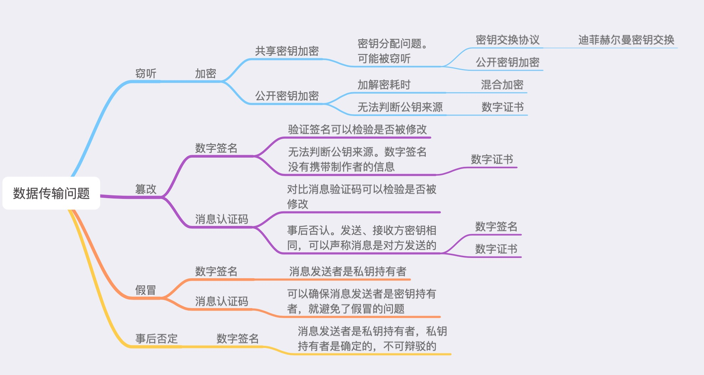

密码学基础

[TOC]

##数据传输问题及解决方案

|问题|解决方法|
|----|----|
|窃听|加密|
|假冒|数字签名或消息认证码|
|篡改|数字签名或消息认证码|
|事后否认|数字签名|

>数字签名存在无法确认公钥制作者的问题，使用数字证书技术解决。

##加密
对称加密：又叫共享密钥加密，加密和解密都使用相同密钥。常见算法有凯撒密码、DES、3DES、AES、Blowfish、IDEA、RC5、RC6等。
非对称加密：又叫公开密钥加密，加密和解密分别使用不同密钥。常见算法有RSA算法、椭圆曲线加密算法等。

###共享密钥加密
过程：
1.A通过某种方式把密钥传给B
2.A用密钥加密数据，并把密文发送给B
3.B用密钥解密收到的加密数据

存在的问题：
共享密钥加密存在密钥分配问题，也就是密钥可能被窃听。解决办法是使用密钥交换协议和公开密钥加密两种办法。

###公开密钥加密
过程:
1.接收方B生成公开密钥P和私有密钥S，把公钥发送给发送方A
2.A使用B发来的公钥加密数据，将加密后的数据发送给B
3.B使用私钥解密接收到的密文

优点：
即使密文被窃听，也无法通过公钥解密。不需要为每个发送者准备相应密钥，需要保密的私钥也仅有接收方保管，安全性更高。

存在的问题：
公开密钥加密存在公开密钥可靠性的问题，即中间人攻击问题，问题的根源是无法判断收到的公钥是否来自合法的发送方。可以通过数字证书解决这个问题。
公开密钥加密另一个问题是加密解密都比较耗时，不适用于持续发送零碎数据。一般使用混合加密代替。

中间人攻击过程：
1.X要窃听A发送给B的数据，准备了公钥PX和私钥SX
2.B发送公钥PB给A时，X把公钥替换成自己的PX
3.A收到公钥PX，由于公钥无法显示自己是谁生成的，所以A不会发现自己收到的公钥已经被替换。
4.A使用公钥PX加密数据，把密文准备发送给B的时候，X接收了这个密文。
5.X用自己的私钥SX对密文解密，再用从B收到的公钥PB加密数据，把密文发给B
6.B用自己的私钥SB解密收到的密文。B也没意识到数据已经被窃听。

###混合加密
在混合加密中，使用处理速度较快的共享密钥加密对数据进行加密。加密时使用的密钥，则使用没有密钥分配问题的公开密钥加密进行处理。

过程:
1.A准备向B发送数据，使用处理速度较快的共享密钥加密数据。A需要把密钥P发送给B。
2.B生成一对公钥PB和私钥SB，并将公钥发送给A
3.A使用PB加密密钥P后发送给B
4.B使用私钥解密得到密钥P
5.A将加密后的密文发送给B
6.B使用密钥P解密收到的密文

优点：
混合加密在安全性和处理速度上都有优势。SSL协议应用了混合加密方法。

##迪菲-赫尔曼密钥交换
迪菲-赫尔曼密钥交换是一种在通信双方之间安全交换密钥的方法。这种方法通过讲双方共有的秘密数值隐藏在公开数值相关的运算中，来实现双方之间密钥的安全交换。

假设有一种方法可以合成两个密钥，使用这个方法合成密钥P和密钥S，就会得到由这两个密钥成分所构成的密钥P-S。该方法有三个特征：
1.即使持有密钥P和合成密钥P-S，也无法单独取出密钥S。
2.不管如何合成获得的密钥，都可以把它作为新的元素，继续和别的密钥进行合成。例如P和P-S还能合成P-P-S。
3.密钥的合成结果与合成顺序无关，只与用了哪些密钥有关。例如A和B-C合成的密钥A-B-C，跟B和A-C合成的密钥B-A-C是一样的。

过程：
1.A生成密钥P，并发送给B
2.A和B各自准备自己的私钥SA和SB。
3.A和B利用密钥P各自合成P-SA和P-SB.
4.A和B将各自合成的密钥发送给对方
5.A和B将各自的私钥和收到的密钥合成为SA-P-SB和SB-P-SA。根据上述假设，这两个密钥是一致的，将作为加密和解密密钥来使用。

验证：
密钥P，P-SA和P-SB需要在网上传输，可能会被X窃听。但根据上面的假设，X无法通过且听到的密钥合成出P-SA-SB，因此这种交换方式是安全的。

一般使用P、G两个整数来表示一开始生成的公钥P。P是一个非常大的素数，而G是素数P对应的生成元中的一个。A和B各自准备一个秘密数字X和Y作为私钥，它们都小于P-2。A和B分别计算G的秘密数字次方mod P。这个计算作为合成（离散对数问题）。然后将计算结果发送给对方，A和B收到对方计算结果后，计算这个值的秘密数字次方，然后再mod P。最后A和B会得到相同结果。

使用迪菲-赫尔曼密钥交换，实际通信双方并没有交换密钥，而是生成了密钥，因此该方法又被叫做迪菲-赫尔曼密钥协议。

##消息认证码MAC
消息认证码可以实现认证和检测篡改两个功能。

场景：
A在B处购买商品，需要将商品编号abc告诉B。假设A使用共享密钥加密对消息进行加密，A通过安全的方法将密钥发送给了B，A把密文发送给了B。
B收到后对密文进行解密，最终得到了原本的商品编号abc。

存在的问题：
A发送给B的密文被X篡改了，B收到密文后没有意识到这个问题，解密后得到数据xyz。于是将商品xyz发送给了B。

消息认证码过程：
1.A生成一个用于制作消息认证码的密钥，然后使用安全的方法将密钥发送给B。
2.A使用密文和密钥生成一个值，就是消息认证码MAC（message authentication code），然后将MAC和密文发送给B。
3.B也使用密文和密钥生成MAC，比较收到的MAC是否一致。一致则解密密文，不一致则说明密文或MAC被篡改。

常见的MAC算法有HMAC、OMAC，CMAC等。因为篡改者没有密钥，因此无法在篡改密文后，让MAC变得合理。但是发送和接收方都有密钥，因此无法确定消息的发送者是A还是B，存在事后否认的问题。

##数字签名
数字签名不仅可以实现消息认证码的认证和检测篡改功能，还可以预防事后否认问题发生。

由于消息认证码使用的是共享密钥加密，所以持有密钥的收信人也有可能是消息的发送者，这样就无法预防事后否认行为。而数字签名只有发信人才能生成，因此使用它就可以确定谁是消息发送者。

数字签名的生成使用的是公开密钥加密，但使用起来却和公开密钥加密相反。

过程：
1.发送者A生成一对公钥PA和私钥SA，A使用私钥PA加密数据，也就是给消息加上数字签名，将公钥和签名数据发送给B。由于公开密钥加密解密数据都比较耗时，一般都是先得到消息的哈希值，然后再对哈希值进行加密，然后将其作为签名使用。
2.B可以验证数字签名的正确性，但无法生成数字签名。B使用公钥对密文(签名)进行解密。B对解密后的消息进行确认，看它是否和接收到的消息一致。

缺陷：
公开密钥加密和数字签名都无法确定公开密钥的制作者是谁，收到的公开密钥上也没有任何制作者的信息，因此公开密钥可能是某个冒充的人生成的。需要使用数字证书解决这个问题。

##数字证书
证书的构成
◆Issuer (证书的发布机构)
指出是什么机构发布的这个证书，也就是指明这个证书是哪个公司创建的(只是创建证书，不是指证书的使用者)。

◆Valid from , Valid to (证书的有效期)
也就是证书的有效时间，或者说证书的使用期限。 过了有效期限，证书就会作废，不能使用了。

◆Public key (公钥)
公钥是用来对消息进行加密的，是很长的一串数字。

◆Subject (主题)
这个证书是发布给谁的，或者说证书的所有者，一般是某个人或者某个公司名称、机构的名称、公司网站的网址等。 

◆Signature algorithm (签名所使用的算法)
就是指的这个数字证书的数字签名所使用的加密算法，这样就可以使用证书发布机构的证书里面的公钥，根据这个算法对指纹进行解密。指纹的加密结果就是数字签名。

◆Thumbprint, Thumbprint algorithm (指纹以及指纹算法)
这个是用来保证证书的完整性的，也就是说确保证书没有被修改过.其原理就是在发布证书时，发布者根据指纹算法(一个hash算法)计算整个证书的hash值(指纹)并和证书放在一起，使用者在打开证书时，自己也根据指纹算法计算一下证书的hash值(指纹)，如果和刚开始的值对得上，就说明证书没有被修改过，因为证书的内容被修改后，根据证书的内容计算的出的hash值(指纹)是会变化的。 

注意，为了保证安全，在证书的发布机构发布证书时，证书的指纹和指纹算法，都会加密后再和证书放到一起发布，以防有人修改指纹后伪造相应的数字证书。这里问题又来了，证书的指纹和指纹算法用什么加密呢？他们是用证书发布机构的私钥进行加密的。可以用证书发布机构的公钥对指纹和指纹算法解密，也就是说证书发布机构除了给别人发布证书外，他自己本身也有自己的证书。证书发布机构的证书是哪里来的呢？？？这个证书发布机构的数字证书(一般由他自己生成)在我们的操作系统刚安装好时(例如windows xp等操作系统)，这些证书发布机构的数字证书就已经被微软(或者其它操作系统的开发机构)安装在操作系统中了，微软等公司会根据一些权威安全机构的评估选取一些信誉很好并且通过一定的安全认证的证书发布机构，把这些证书发布机构的证书默认就安装在操作系统里面了，并且设置为操作系统信任的数字证书。这些证书发布机构自己持有与他自己的数字证书对应的私钥，他会用这个私钥加密所有他发布的证书的指纹作为数字签名。

证书-->指纹算法-->指纹-->签名算法-->签名

数字证书的生成
1.申请者产生一对公钥私钥，将公钥和包含邮箱地址的个人资料发送给CA，申请证书
2.CA也有一对公钥和私钥。CA对A的申请资料进行确认后，用自己的私钥，根据A的资料生成数字签名。CA将生成的数字签名和资料放进同个文件中，也就是数字证书中。

数字证书的验证
1.A将作为公开密钥的数字证书发给B
2.B收到数字证书后，确认证书邮件地址确实是A的地址。B获取认证中心的公钥。B使用公钥对签名进行验证，判断是否是认证中心给出的签名。然后从证书中取出A的公钥。

假设X冒充A，向B发送公钥，B没有必要信任以非证书形式收到的公钥。X为了冒充A，准备去向CA申请证书，由于无法使用A的邮件地址而不能获得A的证书。

##拓展
我的第一本算法书第五章

HMAC的图解
https://blog.csdn.net/chengqiuming/article/details/82822933

HMAC
https://www.liaoxuefeng.com/wiki/1016959663602400/1183198304823296