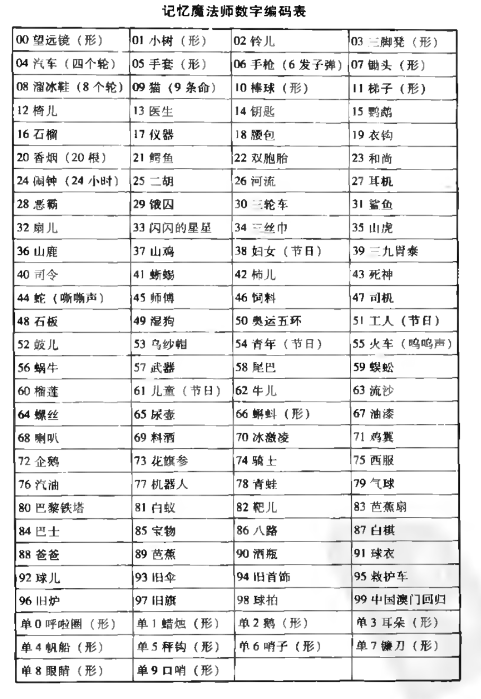

记忆魔法师

[TOC]

##序幕：记忆魔法奇缘
##记忆魔法师的6根神奇魔棒
##记忆魔法基本功之图像力与联想力
###唤醒图像脑
我们的大脑是用图像来记忆的，而且夸张、 离奇、动感的图像更容易长久记住。电影相对于图书来说是多媒体， 有图像，有颜色，有声音，还有动作，让人们在无意识的状态下记忆。

###情景图像再现训练
右脑比左脑记忆潜能强大100万倍，可以通过一些简单的训练来激活我们的图像脑。

情景图像再现训练，是记忆法最基础但也最关键的训练，如果没 有图像就无法启动右脑超强的记忆功能。

我们先从简单的练习开始，请你们找一个安静的环境，闭上眼睛，调整好呼吸的节奏，缓缓地呼气、呼气，让自己的心情平静下来，现 在你们一起倾听我的声音(可以请朋友为你朗读):

“现在你越来越放松，越来越放松，想象你正站在你自己的秘密花 园里，这是你最放松宁静的园地，五颜六色的花朵沉浸在金色的阳光中。从碧蓝的天空中，太阳撒下柔和的光芒，从一朵花到另外一朵花， 你看到许多色彩斑斓的蝴蝶正在晴空中飞舞，它们那彩色的翅膀正闪烁在阳光下。远处的鸟儿开始高歌，空气中充满了花草树木所散发的 自然香气，十分美好，令人放松。你可以听见潺潺的溪流正缓慢地流 过一些小岩石，在你的花园里一切是那么地美好，宁静安详，又那么 有生气和活力，你觉得好像回到了自然的家一样舒服。”

现在我倒数3声，请大家睁开眼睛，3、2、1。 请问大家感觉怎么样?

“很舒服。” “世外桃源啊!” “差点睡着了。” 刚才大家脑海中有没有浮现出图像?
“有 ， 但 是 有 点 模 糊 。”
是的，刚开始的时候图像可能会比较模糊，而且有些人的图像是 黑白的，我们可以努力去想象它的颜色，慢慢地让这些颜色更鲜艳一些 ，亮度更大一些。通过一段时间的训练，我们的图像脑就会被打开。

上面那段文字是马丁的《催眠花园》的节选，催眠是一种很好的 放松大脑、缓解疲劳的方式，也是激活右脑想象力的一种不错的方法。 催眠还有个效果是提高睡眠的效率，成功学大师陈安之因为听催眠音乐每天只休息5个小时，但白天仍精力充沛。

**魔法点睛** 
平时我们也可以随时随地做情景图像再现训练。例如，坐在公交
车上，可以闭着眼睛回忆一些美好的阃面:苒欢的漂亮风景、帅哥美女，登台领奖或受到表扬的场景等。慢慢想象那些画面变得越来越清晰，颜色越来越鲜艳，细节越来越丰富，而你的美好感觉也会倍增。学习累了抽出几分钟来做这种练习，你会觉得特别放松。

**魔法作业**
每天想象一个美好的画面，并用笔记本把画面及你的感受记录下来，这个笔记本可以命名为“美好生活纪念册”，当你不开心的时候 就翻看这个笔记本。如果你能坚持至少100天，相信你的生活一定会 有意想不到的收获。

###人眼照相机内视训练
这项训练需要的素材比较灵 活，可以是生活中的某样东西， 如一盆花、一只狗或者房间、公 园等;也可以是一张图片，照 片、漫画。可从简单的物品开 始，慢慢过渡到比较复杂的图案。首先盯着一张图片看5秒钟，尽量一眼把整个图片都摄人脑海，现在闭上你的眼睛，尝试把它清晰地浮现在内视屏幕上。

可以想得出来吗?现在睁开眼睛和图片比较一下，看看是不是漏掉了一些细节。仔细再观察这些细节，再闭上眼睛浮现出图片，然后再睁眼来对照一下。经过多次重复，你会发现你记住了越来越多的具体细节。

**魔法点睛**
你也可以和你的朋友比赛，如走进一个彼此都陌生的房间，在10秒内看几眼，然后分别写出或画出房间里的物品，谁写得多。

###多感官形象内视训练
刚才的练习是静态的照相，下面我们进入多感官形象内视训练，运用多种感官让我们的图片动起来。现在闭上眼睛跟着我一起来吧( 建议读者找个伙伴慢慢读出这些文字)。 

请先深呼吸一口气，放松身体到最舒服的姿势，准备好了吗?在你脑海中屏幕的上方，想象竖着一把钥匙，就是最常见的扁平的锯齿状的钥匙，想到了吗?现在我要你把钥匙想象成黑色的，黑乎乎的， 像是烤焦了一样，可以想到吗?好的，接下来它要变成玫瑰一样的红色，这种颜色的钥匙很少见，所以你需要努力想象。想到了吗?接下来把它变成天空蓝吧，蓝得透明，给你5秒想象一下。

接下来，把它变成你最喜欢的颜色，以后它就固定是这种颜色了。 现在，请将这把钥匙变大，像孙悟空的金箍棒一样变大，先放大到原来的两倍，感受那种突变给你带来的惊喜，再继续放大两倍，也许你只能看到局部了，好吧，现在像扫描仪一样从上向下扫描一下钥匙，你也许 有盲人摸象一样的感受，那锯齿横过来就像连绵起伏的高山，那握手的 圆孔就像是巨大的摩天轮一样。你可能第一次这么近距离观察钥匙，是不是觉得不习惯?好吧，现在把它缩小，继续缩小，缩到像...根毫毛一样 ，轮廓已经很难再看清楚了，轻4辱像在风中飘一样。好，经过这种放大和缩小的训练，我们把钥匙还原吧，变成你觉得舒服的大小。

接下来，我们来感受一下它的声音，想象钥匙下方是坚硬的水泥 地，钥匙掉到了地上，你会听到“哐当” 或 “叮咚” 一卢响，想象那清脆的声音像铜铃一般，现在它要开始变声了。钥匙再次掉到了地上，发出像打雷一样“轰隆”的声音，然后水泥地面破了一个大洞;钥匙又一次掉到了地上，发出了狮子吼叫的声音。你还可以想象你喜欢的 任何声音，包括自己的尖叫声。

视觉和听觉的刺激过后，我们来闻闻它的味道，想象自己的鼻子凑过去嗅钥匙，你会闻到什么样的味道呢?铜臭味?泥土味?烤翅味? 黑椒味?你自己尽情去想象吧!给你30秒去尝试不同的味道。好了吧?别嘴馋把钥匙吃下去了。

我们接下来感受一下握住它的感觉，用力握拳捏住钥匙的锯齿，感受到掌心的疼了吗?再用点力，想象钥匙被你捏成泥一样，慢慢变成水从你的手上流下来，这可是滚烫的炼钢水，你的手被烫得起了泡。 如果你感觉到疼，那么我们的内视想象就赶紧打住吧。睁开眼睛，看一看周围真实的世界。

**魔法点睛**
平时也可以找一些常见的物品，如杯子、铅笔、橙子、电脑等 来做一番奇幻之旅，通过颜色、大小、听觉、味觉、触觉等进行想象， 你会发现自己的内视能力越来越棒，写起文章来想象力也越来越丰富!

**魔法作业**
翻到书后彩图页数字编码图，每天挑5个做多感官形象内视训练，直到做完所有的图片训练，有些还可以反复训练。

###花瓣发散联想训练
联想是指人们根据事物之间的某种联系由甲事物想到乙事物的一种思维活动。

我制作了特别的花瓣，从中间像太阳光一样向四周发散开去，训练时在花蕊处写上一个 词语，以它为中心进行发散训练，在花瓣上想到什么就写什么，直到 写完为止。如果觉得意犹未尽，可以再用另一朵花继续写下去。如果写出的词能够想出具体的图像来，那就再好不过了，因为“出图”是用好记忆法的基础。要是绘画的功底不错的话，在花瓣上直接画出图像或符号也很好。

例如“美好”，由 “美” 字自然联想可以想到美女、美妙、美丽、美国、美声、美元、美羊羊等;由 “好” 字可以想到三好学生、上好 佳等;这两个字组合可以想到美丽的陈好(女演员)、好莱坞美女; 根据它给人的感觉可以想到爱情、阳光，也可以想到相反的黑暗、丑陋等。

**魔法点睛**
花瓣发散联想训练可以锻炼我们的发散性思维，平时在构思写文章或做创意时，也可以将主题写在中心进行“头脑风暴”，将所有想到的东西都写在花瓣上，可限时在1~2分钟内写出大量的联想，然后进行归纳整合，好的创意也许就从中产生了。

**魔法作业**
我们一起来做以下练习，另有3个空白的花，可以填上你喜欢的词。你可以和朋友一起来做，看一看你们写的词语有什么不一样。你想到的词是大多采用了一种联想方式还是综合了多种?是直接想到的 还是间接想到的?有没有属于你自己独特的联想?

(1) 幸福 (2) 手机 (3) 聪明

###抽象转形象联想训练
从形象的东西想到形象的东西比较容易，但是在我们的学习中却有很多抽象的理论和概念，如果不会转化成形象的东西，那记忆魔法也就成了屠龙之技。记忆髙手能达到这样一种境界—-看到任何抽象词汇都能瞬间转化成图像。**常见的方法有5 种，分别为谐音联想、增减倒字、拆合联想、相关联想、综合联想。**

先拿“抽象”这个词开刀，比较容易想到的就是毕加索的“抽象画”和“抽象函数”的模型，这属于“增减倒字”里的增字，而想到 “大象抽烟”则是用了倒字后又增加了“烟”字;

想到用鞭子抽大象，抽油烟机抽走大象，这是拆合联想;

用谐音可以想到丑象、臭象等; 

相关联想可以想想什么东西比较“抽象”，这个词让你很快就想出的东西，如深奥的理论书，要具体到某一本书并想到它的封面或标题。 

至于综合联想，就是以上几种方法中的2种或3 种一起上阵，如鞭子抽大象，有时看到脑海中的图片会想到“打象”，为了强化是“抽" 而不是“打”，可以想象一个抽烟的人在抽打大象，这样相当于上了双重保险。

这5种转化方式可以这样来记:分别提取关键字“谐字拆关综”，然后谐音成有意义的一句话“鞋子拆观众”，想到你脱下鞋子把电影院的观众席给拆了。

接下来以“福利”和“精神”这两个词为例，我用五角星来进行 联想，五个角代表5种转化方法。

福利：
增字：福利院，福利彩票
拆合：福娃利是包（利是包，就是红包） 福州梨 
相关：人民币
谐音：浮力
综合：我在买福利彩票

**魔法点睛**
抽象转化成形象是记忆法非常重要的基本功，也是广告创意的基础。还记得大一时去广告系蹭课时，老师举了一个让我一生难忘的例子，她问如何来表现下班后“放松” 这个主题，我当时举手起来说可以用两个镜头，一个表现上班埋头工作的辛苦，一个表现开车兜风的快乐。后来老师分享了一个经典案例，就是把人像衣服一样晾在衣架上，随风飘动，这是多么放松惬意的一幕啊!

所以五角星联想训练也送给有志于从事广告、影视、设计、文学等行业的朋友，希望能助你们多创造出比人过目不忘的创意作品。

##记忆魔棒之一：配对联想法
对于一些表面看起来没有关系的东西，我们可以通过红娘从中牵 线搭桥建立联系，使它们像连体婴一样连在一起。

###形象词配对联想

我们先举个简单的例子，如 “扫帚” 和 “插座”，除了我们运用逻辑思维的“找共同点法” 之外，还有哪些思维方式呢?还可以运用"组词造句法"，如 “我用扫帚扫完地后拔掉了插座”，这个小学生都知道，就不展开了。

我们来看看运用形象思维有哪儿种方式?
**第一种方式是"主动出击法"**，也就是直接将两者用动作进行联结，好比帅哥遇到美女直接冲 上前去要电话号码一样。怎么想呢?扫帚把插座当垃圾扫走了，或者 把插座插到扫帚上了。请注意，想的时候脑海中要浮现出这些形象。 形象一出，马上记住!

**第二种方式叫“媒婆牵线法”**。例如，以和插座相关的“电”作 为媒婆，可以想到电动扫帚要插在插座上。你们还能找到其他媒婆吗?
朱琪:插座着火了，用扫帚灭火。
很好，这是以“火” 做媒。 还可以想象得夸张一点，骑着扫帚的哈利•波特变得很小，飞进
插座里了。

**第三种方式叫“另显神通法"**，就是以夸张的方式赋予其中一个物品其他类似物品的特征，并用这种特征和另一个物品发生联系，就好比一个乞丐借了大款的衣服去和美女约会一样。例如，扫帚像大刀一样把插座的电源线切断了，大家说说扫帚还可以像什么。
胡庆文:像一个羽毛球拍把插座拍出去，或者像一个苍蝇拍一下子把插座拍得粉碎。
这个扫帚可真厉害。接下来，我们的插座也要“变身”展开报复了，可以想象插座的孔变成怪物的嘴，然后怎么样?
朱琪:一口吞了扫帚! 很夸张，还可以想象从插座孔里喷出火花，会有什么结果呢? 
袁梦:会把扫帚点燃。 

好的，以前还有学生告诉我，可以想象插座的电源线缠住扫帚，把它勒得奄奄一息，扫帚在拼命挣扎。

除此之外，还可以用组合联想的方法来配对，我把它命名为“双剑合璧法” ，这种方法曾经帮发明家创造了不少新事物，如铅笔加橡皮 就变成了带橡皮的铅笔，汽车加船就变成了水陆两用的气垫船。这双剑合璧有的是两者重新组合成新的亊物，有的则是某一个拥有了另一个的属性。
还是说“扫带”和“插座” 吧，刚才还是欢喜冤家，现在要喜结连理了。怎么想呢?将扫帚扫地产生的电能供给插座，或者插座的孔里插上扫帚的枝，拖着电源线就可以扫地啦，发明家们可以试试看哦。

现在来总结一下，我们主要运用了6 种方法，简 称 “形象词配对 联想六法” :

(1)找共同点法 
(2)组词造句法 
(3)主动出击法 
(4)媒婆牵线法 
(5)另显神通法 
(6)双剑合璧法
我们怎么来记住这六法呢?分享给大家一个魔法歌诀: 
男子暗恋真辛苦，找共同点套近乎; 
组词造句写情书，主动出击怕被拒; 
媒婆牵线退情书，躲在被窝整曰哭; 
另显神通动芳心，双剑合璧真幸福。

接下来启动你们的大脑，发挥你们的创意，一起 疯狂一下，注意要运用“形象同配对联想六法”!

第一组:灯泡和水龙头 
第二组:铅笔和头发

分享时间
杨文华:灯泡一接上水龙头就亮了，或者水龙头里流出的都是灯泡。
罗婷:水龙头是灯泡状的，既可以照明，又可以喷出水来。
朱琪:用灯泡接水龙头流出来的水，这用的是“ 煤婆牵线法”; 灯泡套在水龙头上，这是“主动出击法”;灯泡像锤子一样砸碎了水龙头，这是“另显神通法”。

好的，非常棒，朱琪运用了3种方法，而且区分了分别用的哪种方法，对于初学者来说这样比较好。接下来我们看看“铅笔和头发”怎样配对。

吴秋艳:铅笔上端长了头发，变成一个“铅笔人”。
李凤玲:头发变成了铅笔竖在头上，这是“双剑合璧法”;铅笔变弯了，变成头绳扎头发，或者铅笔变成音乐家的指挥棒，指挥头发跳舞，这是“ 另显神通法” ;头发绕在正在写字的铅笔上，把它绕得不能动了，这是“主动出击法”。
朱琪:铅笔芯与头发都是黑的，是”找共同点法”;头发绑住铅笔当撞钟的木头，这算是“双剑合璧法" ;用铅笔画美女的头发，这是“主动出击法 ”。

很不错的联想，就想象的夸张性和形象性而言，李凤玲这次的配 对联想略胜一筹，不愧是学文学专业的!朱琪想到“头发绑住铅笔当 撞钟的木头” ，将铅笔夸张地想成了木头来撞钟，也值得大家学习。

**魔法点睛** 
形象词配对联想六法的前面两种方法是逻辑思维，通过训练可以提高我们的观察力和归纳能力。后面四种方法是形象思维，对联想力、想象力和创造力有很大的提升，在想象图像时可以加人颜色、动感、 感官、夸张等元素，记忆效果更好。

###抽象词配对联想
我们平时学习中抽象同居多，很多知识点的记忆都是两个抽象 词的配对。例如，语文课中会学到“《史记> 的作者是司马迁”，我们 需 要 将 "《史记》”和“司马迁” 两个信息记住，它们对我们而言只是 陌生的词汇，通过死记硬背我们也可以硬把它们联系在一起。但是强 扭的瓜不甜，我们需要通过一些方法让它们能够加强联系，贴在一起 想分都分不开，这就需要借助一些配对联想的手段。虽然前面已经介 绍了抽象同转化成具体形象的五大法宝，但搞定一个容易，要把两个 信息成功配对还要多加训练。

首先来看一组词:结合和辉煌。 
怎么来联想呢?先来看看我示范的“抽象词配对联想三例”: 
(1) 一对新婚夫妇结合(结婚)以后创造了辉煌的生活。
(2 )打着蝴蝶结的盒子(拆合+谐音)是她在事业辉煌的时候买的;一对新婚夫妇结合(结婚)时身上出现黄色的光辉(倒字+谐音）
(3 )穿黄金圣衣的一辉(倒字+谐音)住在打着蝴蝶结的盒子里。

这3种想法有没有区别?有!左脑的逻辑思维比较倾向于第1种，它主要是通过组词造句法将两个词串起来，脑海中不需要图像也可以记得住。而第3 种则是以右脑形象思维为主，将两个词都先转化成图像，然后再配对。第2种则是将其中一个词转化成了图像。就我多年实践证明，第3种刚开始虽然有些麻烦，但大量训练后只要看到词汇就能反映出图像，只要想到图像就能还原出词汇，是效果比较好的一种方式。

对于抽象词的配对联想，如果想要运
用“形象词配对联想六法”，最好是提前把两个词都转化成具体形象，再进行配对联想，这样记忆更深刻。

**分享时间**
我们来看看四川省首位“世界记忆大师”周强的联想，借鉴一下他的想象力。
(1) 事实和想象 
一头死狮(事实)是怎么死的?想吃大象没吃到饿死的。 
誓死 (事实)保护香香(想象)公主是大内高手的职责。 

(2) 经济和和谐
经纪人与明星要和谐相处。 
一条鲸(经)鱼从嘴巴里挤(济)出了和谐的歌声。

(3) 美妙和机灵 

一只美(美)丽的喵喵(妙)爱上了精灵(机灵)。 孙悟空每秒(美妙)钟都很机灵。

(4) 显示和要求
显示屏上显示你的无理要求被拒绝了。 我可以比你先死(显示)，但我有个要求。
诗仙(显示〉喝酒太多伤肝了，要求减少应酬。

(5) 力量和暧昧
充满力量的健身教练总和女学员搞得很暧昧。

(6) 感恩和创造
是谁创作了《感恩的心》这首温暖人心的曲子? 

其实各门科目里简单的填空题、单选题都可以用这一招来搞定，还有《开心辞典》、《百科知识》 以及公务员的知识考试，都可以轻松地用配对联想法来记忆。

**阿尔卑斯山脉**的最高峰是**勃朗峰**。
这个题目的记忆难点在于“勃朗峰” ，其中“勃 朗”如何转化是关键。现在来听听你们的想法。 

谭秋凡:阿尔卑斯糖是波浪形的;
王勃朗读一首诗后得到了阿尔卑斯糖。 

朱琪:我的勃朗宁手枪射出来很多阿尔卑斯糖。
罗婷:阿尔卑斯山是座波澜起伏的山峰

对于“勃朗” 大家想法各不一样，谭秋凡想到了 “波浪” 和“王勃朗读” 两种，一种是谐音，一种是拆合加谐音。朱琪则运用增减倒字法想到了 “勃朗宁手枪”，罗婷用谐音想到了“波澜”，都是非常不错的想法。

129.下列对人物及其贡献，不正确的是( )
A.凯恩斯撰写了《国富论》,使经济学成为一门独立科学 
B.孟德尔发现遗传学定律，为遗传因子理论奠定了框架
基础
C. 冯•诺依曼开创了现代计算机理论，其体系结构沿用至今
D.法拉第发现电磁感应定律，并据此发明了早期的发电机

A .亚当•斯密撰写了《国富论》
B. 孟德尔发现遗传学定律
C .冯•诺依曼开创了现代计算机理论
D. 法拉第发现电磁感应定律

参考联想
(1)亚当•斯密—《国富论》
李凤玲:亚当和夏娃秘密约会，讨论国家富强问题。
谭秋凡:迷死郭富域的人当了亚洲选美冠军。 

(2)孟德尔— 遗传学定律
吴秋艳:做梦得到一个儿子，遗传了自己一定的规律。
朱琪:孟子把他的贤德遗传给了他的儿子! 

(3)冯•诺依曼— 现代计算机理论
吴秋艳:缝了衣艰发现很慢，所以发明了现代计算机。
朱琪:计算机的风扇一馒下来就黑屛了。 

(4)法拉第一电磁感应定律
谭秋凡:用带有电磁的头发拉住弟弟。 
朱琪:法拉利赛车用电磁(池)驱动!

**魔法作业**
限时1个小时，迅速熟悉彩页的数字编码图，记住每一个图代表的图像。下面附一张数字编码表，帮助大家理解数字编码的原理，—般而言都是通过谐音产生的，部分采用形状或者逻辑联想，在下表中均已注明。争取1小时后做到在3秒内看到数字就想到编码图像。没有完成作业的读者请不要进入下—章。

##记忆魔棒之二：定桩联想法
定桩联想法要做 的，就是将我们要记的信息分别与熟知的桩子配对，并且在回忆时可以通过桩子回忆起我们要记的信息。

我们的身体部位是已知的桩子，我们把每个部位和对应要记的信息进行了配对联想，这种方法叫“身体定桩法”。

###身体定桩法

###数字定桩法

###熟语定桩法

###地点定桩法

##记忆魔棒之三：串烧故事法
###图像锁链串烧法

###情景故事串烧法

###逻辑链串烧法
##记忆魔法基本功之想象力与创造力
###想象力常规训练
###抽象图形想象训练

###汉字的视觉化呈现

##记忆进阶课程导入
前面所学的3 根记忆魔棒都是通过联想、运用内视觉来记忆，而接下来的3根魔棒则要运用我们的三种感官，它们分别是视觉、听觉和动觉。其实这对应着三种不同的学习类型，每个学生都有自己最匹配的 学习类型，找到这种类型以后，学习的效果才会更好。

###视觉学习型
###听觉学习型
###动觉学习型

##记忆魔棒之四：歌诀记忆法
###字头歌诀法

###归纳歌诀法

###要点歌诀法

###顺口溜歌诀法

##记忆魔棒之五：绘图记忆法
###单一图示法

###分解图示法

###组合图示法

###两大体系图
####鱼骨图
####思维导图

##记忆魔棒之六：动作记忆法
##记忆魔法师的4把飞天扫帚
##飞天扫帚之一：出口成章
##飞天扫帚之二：秒杀单词