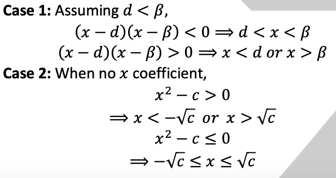
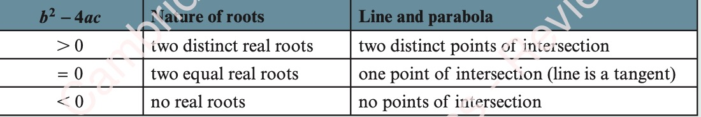

1.Quadratics二次方程

[TOC]

## 1.1 Solving quadratic equations by factorization 使用因式分解解决二次等式

## 1.2 Completing the square 完全平方公式【考点】
(x+d)^2 = x^2 +2dx+d^2 
(x−d)^2 = x^2 −2dx+d^2

> **KEY POINT 1.1**
x^2 +2dx = (x+d)^2 −d^2 
x^2 −2dx = (x−d)^2 −d^2

## 1.3 The quadratic formula 二次根公式
> **KEY POINT 1.2**
$x=\frac{−b± \sqrt[2]{b^2−4ac}}{2a}$

## 1.4 Solving simultaneous equations (one linear and one quadratic) 求解联立方程（一个线性方程和一个二次方程）

## 1.5 Solving more complex quadratic equations

## 1.6 Maximum and minimum values of a quadratic function 二次函数的最大最小值

>KEY POINT 1.3
If f(x) = ax2 + bx + c is written in the form f(x) = a(x − h)^2 + k, then:
● the line of symmetry is $x = h = - \frac{b}{2a}$
● if a > 0, there is a minimum point at (h, k)
● if a < 0, there is a maximum point at (h, k).

## 1.7 Solving quadratic inequalities 解二次不等式

KEY POINT 1.4
If we multiply or divide both sides of an inequality by a negative number, then the inequality sign must be reversed.

## 1.8 The number of roots of a quadratic equation 二次方程根的数量
KEY POINT 1.5
The discriminant of ax^2 + bx + c = 0 is b^2 − 4ac.

## 1.9 Intersection of a line and a quadratic curve 直线和二次曲线的交点

