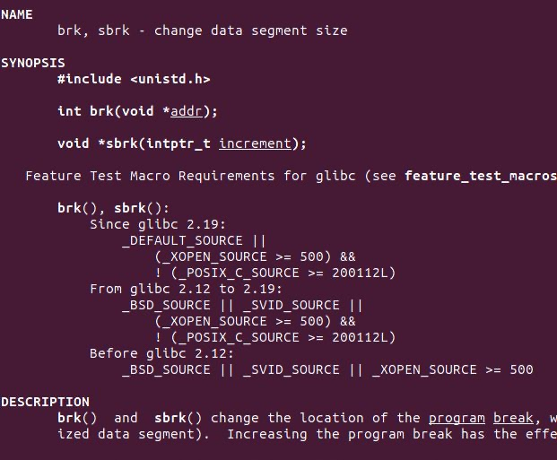

Linux的brk和sbrk函数，堆内存的分配起点

在C语言里，一般来说，分配内存使用的函数是malloc()，calloc()，realloc()，然后使用free()释放内存。

如果是C++，还可以使用new和delete关键字。

更高级的语言，则不需要手动申请和释放内存。它们自带内存管理。

这里说的内存，是堆内存。

栈内存本来就是自动管理的，会随着函数调用链的变化而变化。

如上图，黑色的是栈（stack），蓝色的是堆（heap）。上面是进程的高地址，下面是低地址。

代码段位于地址最低的地方，然后是数据段。

如果有只读数据段（rodata）的话，放在代码段和数据段之间。它与代码段一样是只读的，但它不能执行。

数据段的末尾，也就是堆内存的开始，叫做brk。它是program break的简称。也就是程序代码和数据从这里就结束了，剩下的内存部分只在运行时使用。

在可执行文件（例如elf文件）里，只保存代码段到数据段的内容。

Linux系统在创建进程时，每个进程都有一个brk。它是从文件里加载数据的终点，也是堆内存的起点。

堆和栈的增长方向是反的，它们中间就是没有被进程使用的内存空间。

C语言的标准库里，分配内存使用的函数是malloc，calloc，realloc。它们并不是Linux系统分配内存的API。

Linux系统分配用户内存的API是brk()。它的作用就是改变数据段的末尾位置，也就是改变进程的brk的位置。

进程的brk之前的内存，就是可以使用的堆内存。移动brk的位置，就可以分配内存。操作系统的API就是这么简单直接。

brk()函数，是Linux的一个系统调用。在x86_64平台上，它的调用号是12。

sbrk()函数，是C库在brk()基础上实现的一个库函数。

用一个全局变量记录上一次的brk位置，然后把brk设置到更高的地址，那么上一次的brk值就是新分配内存的首地址。

如果要释放内存，把brk的位置再移动回上一次的位置就行。

如果先后分配了两块内存p1和p2，p2还在使用，但是想把p1释放了，这是不可以的。因为数据段只有一个brk位置，没法跳着移动。

这块内存p1只能暂时留着，万一再次分配内存时还可以继续用它。

这个管理p1的算法，就是malloc()和free()负责的。为了减少内存碎片，一般使用伙伴算法。

假设有4个内存p1，p2，p3，p4，其中p1按16字节对齐，p2按8字节对齐，p3和p4都是4字节对齐，它们的地址也是连续的。

那么在p3和p4都释放之后，要把它们合并成按8字节对齐的一个整块。

当p2和p3和p4都释放之后，要把它们合并成按16字节对齐的整块。

当p1也释放之后，就可以合并成32字节对齐的整块了。

总之，尽量减少小块内存的数量，让内存保持大块的连续。

当从某个位置开始的内存全都空闲之后，就可以把brk移动回去，把内存还给Linux系统了。

当现有内存不够了时，malloc就可以把brk往高地址移动，以获得更多的内存。

Linux内核的brk()系统调用，原型是这样的：

void* sys_brk(void* addr);

把当前进程的数据段末尾brk设置成地址addr。

如果设置成功了，就会返回与addr一样的brk值。

如果设置失败了，就返回进程当前的brk值。

所以在C库里要记录上一次的brk值，来判断是否设置成功，以给用户返回0或者-1。

C库把它包装了一下，就变成了下图的sbrk()和brk()。

其中sbrk()用于分配内存，brk()用于释放内存。

实际上Linux只有一个brk()系统调用，sbrk()并不是系统调用，而是基于brk系统调用的扩展实现。

brk()是肯定不能设置的比原始数据段还低的，数据段是各种全局变量、静态变量的位置。如果把数据段覆盖了，程序也就没法正常运行了。这点有Linux内核保证。

也可以直接使用brk系统调用，而越过C库的函数：

mov $12, %rax

mov $brk, %rdi

syscall

以上三行汇编码就可以使用brk()系统调用。把调用号12放在rax，把要设置的brk值放在rdi，使用syscall指令进入内核，就可以启动brk系统调用。

返回值在rax里，它是进程（经过brk()系统调用之后的）当前brk值。

怎么不用C库申请内存，就是用这三行汇编申请。这是Linux用户程序的最底层了。

即使移动了brk位置，在实际使用之前，Linux也不会给进程分配内存的。

必须要等到实际写内存的时候，产生了缺页中断后，Linux系统才会申请一个物理内存页给进程。内核申请物理内存页的函数是get_free_pages()。