Python3 基础

[TOC]

# Python语法
## 标识符
标识符用作变量名、函数名、类名、方法名等。

在 Python 里，标识符由字母、数字、下划线组成，字母可以是Unicode，但不能以数字开头。Python 中的标识符是区分大小写的。

以下划线开头的标识符是有特殊意义的。以单下划线开头_foo 的代表不能直接访问的类属性，需通过类提供的接口进行访问，不能用 from xxx import * 而导入。

以双下划线开头的`__foo` 代表类的私有成员，以双下划线开头和结尾的 `__foo__` 代表 Python 里特殊方法专用的标识，如 `__init__()` 代表类的构造函数。

Python 可以同一行显示多条语句，方法是用分号 ; 分开。

## 保留字符
 保留字即关键字，我们不能把它们用作任何标识符名称。Python 的标准库提供了一个 keyword 模块，可以输出当前版本的所有关键字：
```
>>> import keyword
>>> keyword.kwlist
['False', 'None', 'True', 'and', 'as', 'assert', 'break', 'class', 'continue', 'def', 'del', 'elif', 'else', 'except', 'finally', 'for', 'from', 'global', 'if', 'import', 'in', 'is', 'lambda', 'nonlocal', 'not', 'or', 'pass', 'raise', 'return', 'try', 'while', 'with', 'yield']
```

## 行和缩进
Python 的代码块不使用大括号 {} 来控制类，函数以及其他逻辑判断。python 最具特色的就是用缩进来写模块。

缩进的空白数量是可变的，但是所有代码块语句必须包含相同的缩进空白数量，这个必须严格执行。

## 多行语句
Python语句中一般以新行作为语句的结束符。

但是我们可以使用斜杠（ \）将一行的语句分为多行显示
```
total = item_one + \
        item_two + \
        item_three
```
语句中包含 [], {} 或 () 括号就不需要使用多行连接符。

## 同行多语句
Python可以在同一行中使用多条语句，语句之间使用分号(;)分割

## 空行

函数之间或类的方法之间用空行分隔，表示一段新的代码的开始。类和函数入口之间也用一行空行分隔，以突出函数入口的开始。

空行与代码缩进不同，空行并不是Python语法的一部分。书写时不插入空行，Python解释器运行也不会出错。但是空行的作用在于分隔两段不同功能或含义的代码，便于日后代码的维护或重构。

记住：空行也是程序代码的一部分。

## 注释
python中单行注释采用 # 开头。


# 变量和数据类型
## 变量和常量
变量:变量名必须是大小写英文、数字和_的组合，且不能用数字开头。变量本身类型不固定的语言称之为动态语言，与之对应的是静态语言。静态语言在定义变量时必须指定变量类型，如果赋值的时候类型不匹配，就会报错

常量:所谓常量就是不能变的变量，比如常用的数学常数π就是一个常量。在Python中，通常用全部大写的变量名表示常量。但事实上PI仍然是一个变量，Python根本没有任何机制保证PI不会被改变，所以，用全部大写的变量名表示常量只是一个习惯上的用法，如果你一定要改变变量PI的值，也没人能拦住你。

## 变量作用域
变量的作用域即为变量可以被访问到的代码区域。

Python变量的作用域一共有4种，分别是：
L （Local） 局部作用域
E （Enclosing） 闭包函数外的函数中
G （Global） 全局作用域
B （Built-in） 内建作用域 以 L –> E –> G –>B 的规则查找，即：在局部找不到，便会去局部外的局部找（例如闭包），再找不到就会去全局找，再者去内建中找。

### 全局变量与局部变量
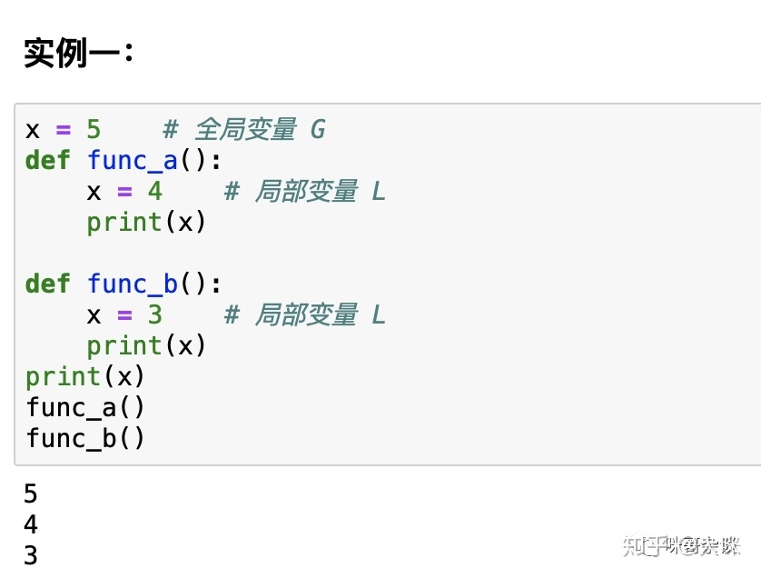

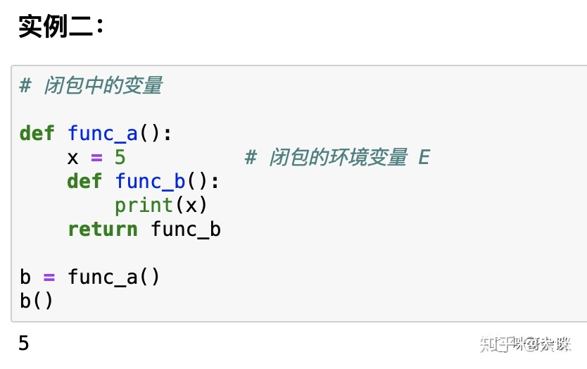

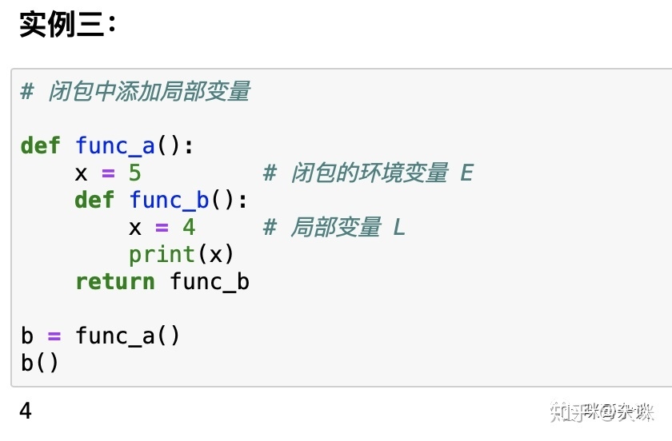

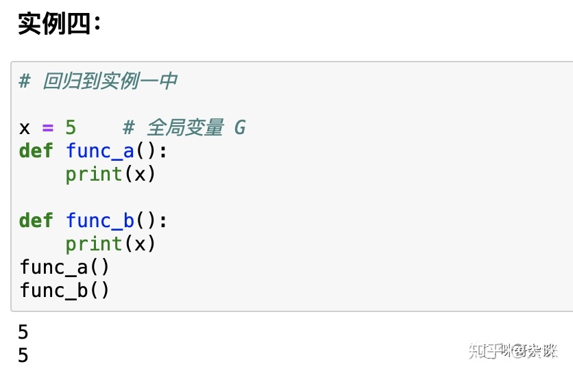

结论：
实例一： 即使变量同名，优先引用的是局部变量。
实例二 & 实例三： 闭包的情况，如果内部函数没有局部变量，则会优先引用闭包的环境变量。
实例四： 引用全局变量。

### global关键字

实例四让多个函数共享并且在函数内引用同一个全局变量。
现在在重新声明一个 func_c 函数，并且对这个 x 进行加 1 的操作。你觉得会打印什么结果？
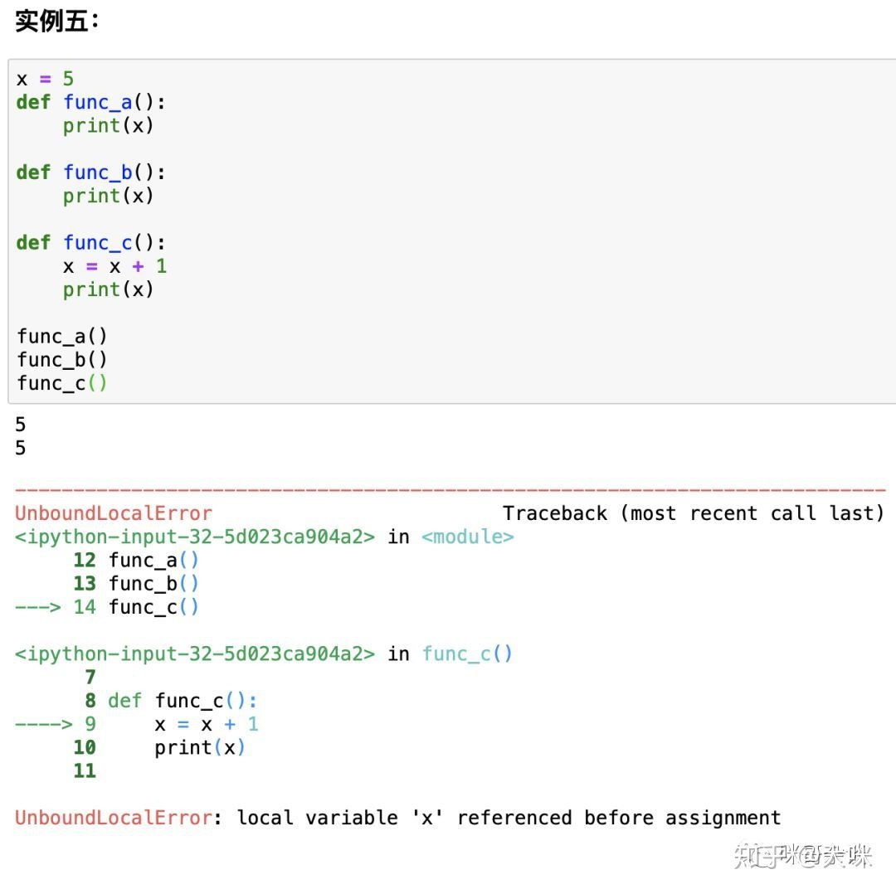

可以看到已经报错了 ，UnboundLocalError，错误代码第 9 行 x = x+1。

在这个例子中设置的 x=5 属于全局变量,而在函数内部中没有对 x 的定义。

根据 Python 访问局部变量和全局变量的规则：当搜索一个变量的时候，Python 先从局部作用域开始搜索，如果在局部作用域没有找到那个变量，那样 Python 就会像上面的案例中介绍的作用域范围逐层寻找。

最终在全局变量中找这个变量，如果找不到则抛出 UnboundLocalError 异常。

但你会想，明明已经在全局变量中找到同名变量了，怎么还是报错？

因为内部函数有引用外部函数的同名变量或者全局变量，并且对这个变量有修改的时候，此时 Python 会认为它是一个局部变量，而函数中并没有 x 的定义和赋值，所以报错。

global 关键字为解决此问题而生，在函数 func_c中，显示地告诉解释器 x 为全局变量，然后会在函数外面寻找 x 的定义，执行完 x = x + 1 后，x 依然是全局变量。

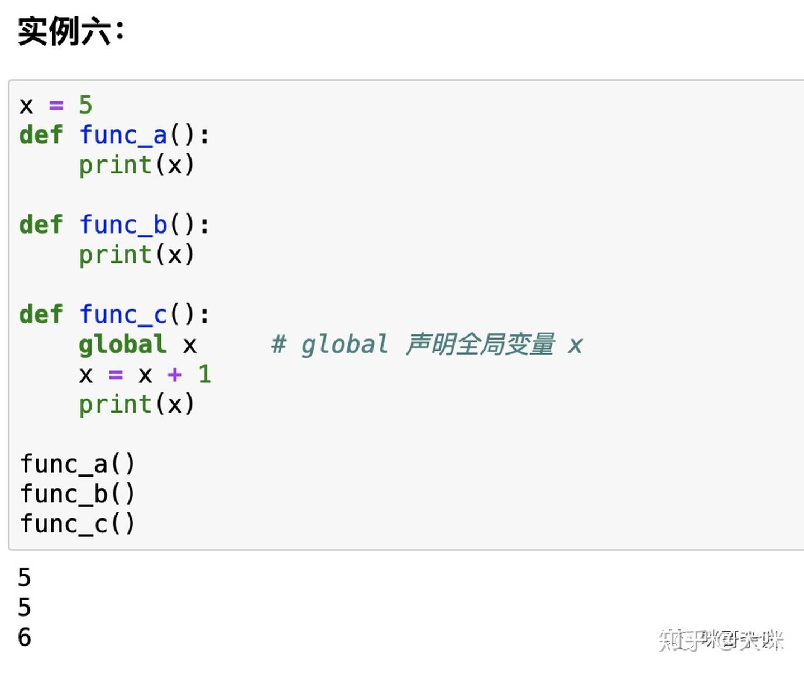


参考资料：https://zhuanlan.zhihu.com/p/111284408

### nonlocal关键字
这个一般是用在闭包函数里. 但是一定要认识到, nonlocal声明的变量在上级局部作用域内，而不是全局定义, 如果在它声明的变量在上级局部中不存在，则会报错. 实例如下：
```
x = 123
def outer():
    x = 100
    def inter():
        x = 200
    inter()
    print(x)
    
func()
```
运行的结果为100, 那如果要求inter中对x的修改是有效的，必须加上关键字nonlocal
```
x = 123
def outer():
    x = 100
    def inter():
        nonlocal x
        x = 200
    inter()
    print(x)
    
func()
```
运行的结果为200， 符合预期.
现将inter的上级局部变量x去掉，则会报错。
```
x = 123
def outer():
    # x = 100
    def inter():
        nonlocal x
        x = 200
    inter()
    print(x)
    
func()
```

## 赋值与变量的本质
赋值会将一个简单的数值转为对象存在内存里，并将其地址存储在变量中。可以将变量看成值的一个标签，别名等，内存中的值不能使用，需要有这个么名字代替它进行访问。

### 多重赋值
形如a,b = 1,3
### 连续赋值
形如a=b=c=3
### 解包赋值
python 的解包赋值可以用在任何可迭代对象上面，而不仅仅是列表或者元组。 包括字符串，文件对象，迭代器和生成器。
解包序列(或者任何可迭代对象)赋值给多个变量，唯一的前提就是，变量的数量必须跟序列元素的数量一样。
```
s='cxk'
a,b,c=s
 
a: 'c'
b: 'x'
c: 'k'
```
python 的星号表达式可以将若干个变量解压赋给一个变量值
```
record = ('Dave', 'dave@example.com', '773-555-1212', '847-555-1212')
 
name, email, *phone_numbers = record
 
phone_numbers: ['773-555-1212', '847-555-1212']
```
注意：带星号变量一定为列表类型

可以与占位符一起使用，丢弃掉不需要的变量
```
record = ('ACME', 50, 123.45, (12, 18, 2012))
 
name, *_, (*_, year) = record
 
name: 'ACME'
year: 2012
```

参考：https://www.cnblogs.com/mafu/p/13208494.html

#### 自动解包
*运算符把一个可迭代对象拆开作为函数的位置参数；\*\*运算符把字典对象拆开作为函数的关键字参数。
```
arr=[1,2,3,4,2]
print(max(*arr))

def fun(**args):
    print(args)

dic = {'a':1,'b':2}
fun(**dic)
```

## 标准数据类型
Python3 中有六个标准的数据类型：
Number（数字）
String（字符串）
List（列表）
Tuple（元组）
Set（集合）
Dictionary（字典）

Python3 的六个标准数据类型中：
不可变数据（3 个）：Number（数字）、String（字符串）、Tuple（元组）；
可变数据（3 个）：List（列表）、Dictionary（字典）、Set（集合）。 
    
## 数值类型Numeric Types — int, float, bool, complex
Python3 支持 int、float、bool、complex（复数）。

在Python 3里，只有一种整数类型 int，表示为长整型，没有 python2 中的 Long。

像大多数语言一样，数值类型的赋值和计算都是很直观的。

内置的 type() 函数可以用来查询变量所指的对象类型。

### 整数
二进制(0b开头)，八进制(0o开头)，十进制,十六进制(0x开头)，位数多的也可下划线分隔

### 浮点
例如科学记数法（5e-1）

### 复数
形如3+2j

### 布尔型
1.True,False
2.False value
constants defined to be false: None and False.
zero of any numeric type: 0, 0.0, 0j, Decimal(0), Fraction(0, 1)
empty sequences and collections: '', (), [], {}, set(), range(0)
3.布尔运算符： and,or,not

>注意：Python3 中，bool 是 int 的子类，True 和 False 可以和数字相加， True\=\=1、False==0 会返回 True，但可以通过 is 来判断类型。

### 数值对应的对象类型
Python里一切都是对象，数值在内存中是对应的对象类型，函数也是对象。数值类型int，float，bool，complex在内存都都是以对应类的对象形式存在的。

### Python math 模块、cmath 模块

Python 中数学运算常用的函数基本都在 math 模块、cmath 模块中。

Python math 模块提供了许多对浮点数的数学运算函数。Python cmath 模块包含了一些用于复数运算的函数。cmath 模块的函数跟 math 模块函数基本一致，区别是 cmath 模块运算的是复数，math 模块运算的是数学运算。

要使用 math 或 cmath 函数必须先导入。
1.Python数学函数
2.Python随机数函数
3.Python三角函数
4.Python数学常量

参考：https://www.runoob.com/python/python-numbers.html

## 空值-None
在 Python 中，有一个特殊的常量 None（N 必须大写）。和 False 不同，它不表示 0，也不表示空字符串，而表示没有值，也就是空值。

## 枚举器类型Iterator Types
### 生成器类型Generator Types

## 序列类型Sequence Types — list, tuple, range
### 常见序列操作Common Sequence Operations
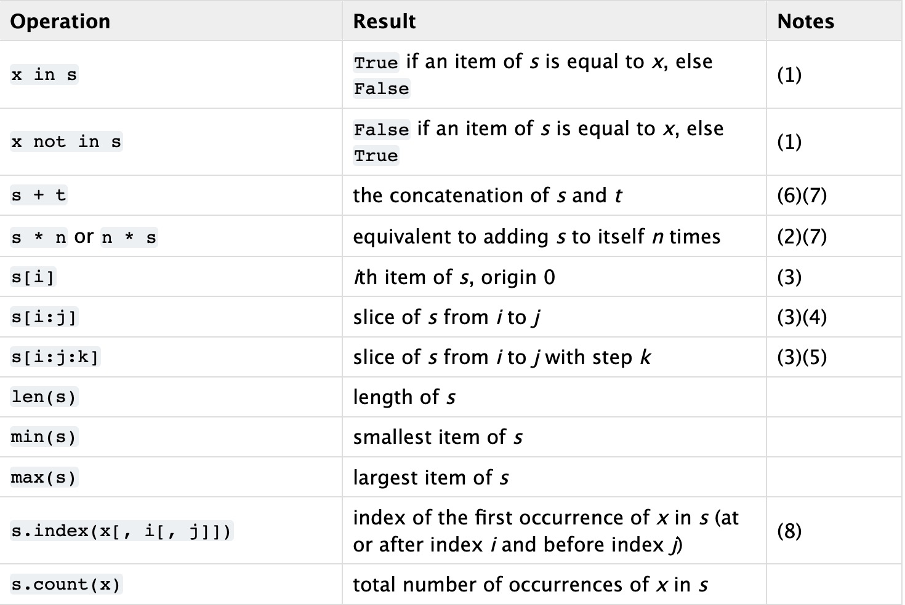


## 文本序列类型Text Sequence Type-str字符串
## 二进制序列类型Binary Sequence Types — bytes,bytearray, memoryview
## 集合类型Set Types — set, frozenset
## 映射类型Mapping Types-Dict

# 运算符与表达式
## 运算符分类
算术运算符：+、-，*，/,//,\*\*，%
比较（关系）运算符：==，!=，>,<,<=,>=
赋值运算符:=,+=,-=,\*=,/=,//=,\*\*=,%=
逻辑运算符：and, or, not
位运算符:&,|,\^,~,<<,>>
成员运算符:in, not in
身份运算符：is, not is
身份运算符用于比较两个对象的存储单元, id() 函数用于获取对象内存地址。对于不可变类型的数据，如果字面值相同，就会复用这个对象：
```
i = 0
a = (i,2)
b = (i,2)
c = (1,2)
d = (1,2)

print(id(a))
print(id(b))
print(id(c))
print(id(d))

140324313963392
140324313963648
140324314088576
140324314088576 
```
上面这个例子，c,d的字面量相同，所以id相同；而a,b包含变量，不是字面量，所以id不同。

## 运算符优先级
所谓优先级，就是当多个运算符同时出现在一个表达式中时，先执行哪个运算符。

例如对于表达式a + b * c，Python 会先计算乘法再计算加法；b * c的结果为 8，a + 8的结果为 24，所以 d 最终的值也是 24。先计算\*再计算+，说明*的优先级高于+。

Python 支持几十种运算符，被划分成将近二十个优先级，有的运算符优先级不同，有的运算符优先级相同

## 运算符结合性
所谓结合性，就是当一个表达式中出现多个优先级相同的运算符时，先执行哪个运算符：先执行左边的叫左结合性，先执行右边的叫右结合性。

例如对于表达式对于100 / 25 * 16，/和\*的优先级相同，应该先执行哪一个呢？这个时候就不能只依赖运算符优先级决定了，还要参考运算符的结合性。/和*都具有左结合性，因此先执行左边的除法，再执行右边的乘法，最终结果是 64。

Python 中大部分运算符都具有左结合性，也就是从左到右执行；只有 ** 乘方运算符、单目运算符（例如 not 逻辑非运算符）、赋值运算符和三目运算符例外，它们具有右结合性，也就是从右向左执行。表 1 中列出了所有 Python 运算符的结合性。 

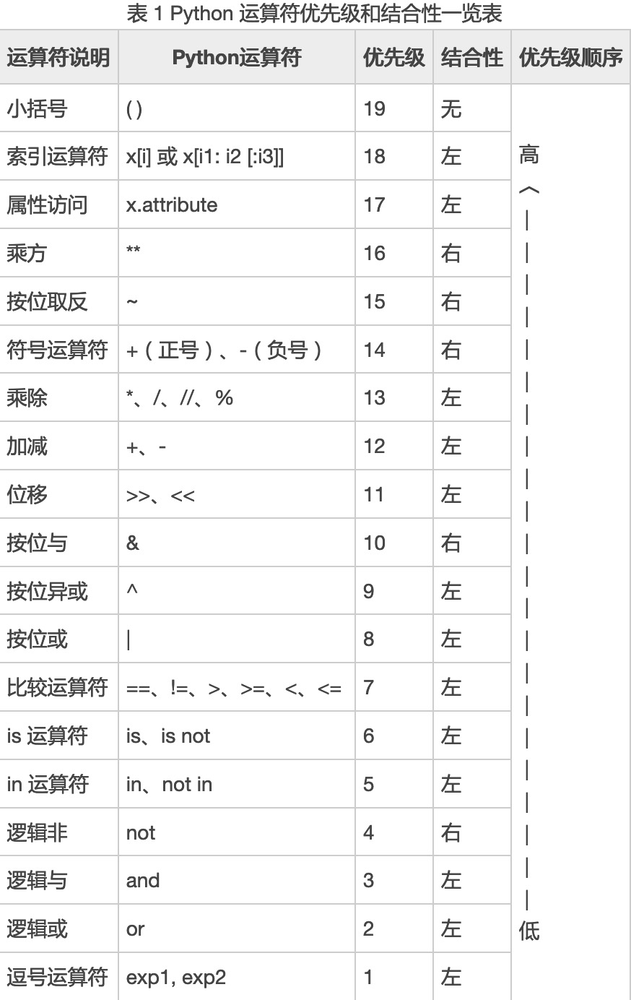

# 复杂数据
## 字符串
### 字符串的表示
字符串是 Python 中最常用的数据类型。可以使用引号( ' )、双引号( " )、三引号( ''' 或 """ ) 来表示字符串，引号的开始与结束必须是相同类型的。

可以按字面意义级联字符串，如"this " "is " "string"会被自动转换为this is string。
Python中的字符串不能改变。
Python 没有单独的字符类型，一个字符就是长度为 1 的字符串。

创建字符串很简单，只要为变量分配一个值即可。

**三引号**

Python 三引号允许一个字符串跨多行，字符串中可以包含换行符、制表符以及其他特殊字符。编写多行文本的快捷语法，常用于文档字符串，在文件的特定地点，被当做注释。

三引号的语法是一对连续的单引号或者双引号（通常都是成对的用）。

```
word = 'word'
sentence = "这是一个句子。"
paragraph = """这是一个段落。
包含了多个语句"""word = 'word'
sentence = "这是一个句子。"
paragraph = """这是一个段落。
包含了多个语句"""
```

**Unicode 字符串**
在Python2中，普通字符串是以8位ASCII码进行存储的，而Unicode字符串则存储为16位unicode字符串，这样能够表示更多的字符集。使用的语法是在字符串前面加上前缀 u。

在Python3中，所有的字符串都是Unicode字符串。 


**raw 字符串**
如果一个字符串包含很多需要转义的字符，对每一个字符都进行转义会很麻烦。为了避免这种情况，我们可以在字符串前面加个前缀r ，表示这是一个 raw 字符串，里面的字符就不需要转义了。例如：
```
r'\(~_~)/ \(~_~)/'
```
但是r'...'表示法不能表示多行字符串，也不能表示包含'和 "的字符串（为什么？）

如果要表示多行字符串，可以用'''...'''表示：

'''Line 1
Line 2
Line 3'''

上面这个字符串的表示方法和下面的是完全一样的：

'Line 1\nLine 2\nLine 3'

还可以在多行字符串前面添加 r ，把这个多行字符串也变成一个raw字符串：

r'''Python is created by "Guido".
It is free and easy to learn.
Let's start learn Python in imooc!'''

### 转义字符
ASCII码字符分为可打印字符和不可打印字符，可打印字符是可见的，有具体的字符。不可打印字符是有特殊用途，不可见的，或者为了避免冲突，使用转义字符表示。例如，在“”表示的字符串中，“和\是有特殊用途的字符，因此要使用转义后的形式。

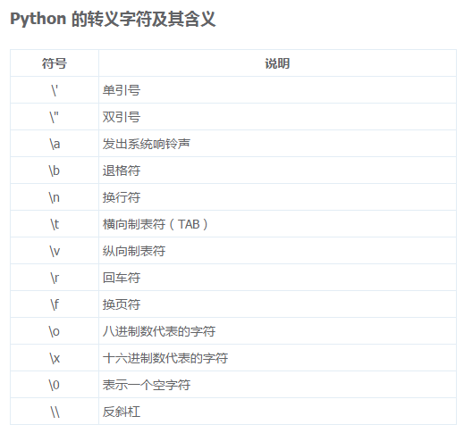

另外，r"\nabc"可以使所有的转义字符\都失效

### 字符串运算符
所有序列相关操作

### 字符串格式化
1. Python 支持格式化字符串的输出 。尽管这样可能会用到非常复杂的表达式，但最基本的用法是将一个值插入到一个有字符串格式符 %s 的字符串中。

在 Python 中，字符串格式化使用与 C 中 sprintf 函数一样的语法。
实例(Python 3.0+)
```
#!/usr/bin/python3
 
print ("我叫 %s 今年 %d 岁!" % ('小明', 10))
```
以上实例输出结果：
```
我叫 小明 今年 10 岁!
```

python字符串格式化符号:
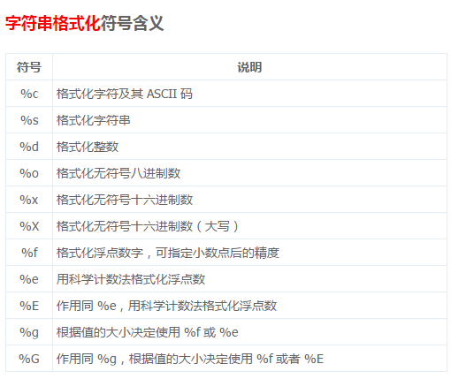


格式化操作符辅助指令:
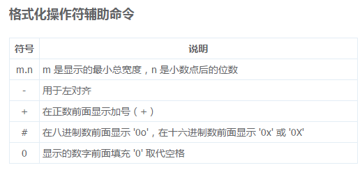


2. Python2.6 开始，新增了一种格式化字符串的函数 str.format()，它增强了字符串格式化的功能。

3. f-string 是 python3.6 之后版本添加的，称之为字面量格式化字符串，是新的格式化字符串的语法。f-string 格式化字符串以 f 开头，后面跟着字符串，字符串中的表达式用大括号 {} 包起来，它会将变量或表达式计算后的值替换进去，实例如下：

```
>>> name = 'Runoob'
>>> f'Hello {name}'  # 替换变量
'Hello Runoob'
>>> f'{1+2}'         # 使用表达式
'3'

>>> w = {'name': 'Runoob', 'url': 'www.runoob.com'}
>>> f'{w["name"]}: {w["url"]}'
'Runoob: www.runoob.com'
```

用了这种方式明显更简单了，不用再去判断使用 %s，还是 %d。

在 Python 3.8 的版本中可以使用 = 符号来拼接运算表达式与结果：
实例
```
>>> x = 1
>>> print(f'{x+1}')   # Python 3.6
2

>>> x = 1
>>> print(f'{x+1=}')   # Python 3.8
x+1=2
```

[python 占位符](https://www.cnblogs.com/czqq/p/6108557.html)
[Python format()格式化输出方法详解](http://c.biancheng.net/view/4301.html)

### 字符串内建函数
[内建函数](https://www.runoob.com/python3/python3-string.html)

## Bytes
Python bytes 类型用来表示一个字节串。“字节串“不是编程术语，是我自己“捏造”的一个词，用来和字符串相呼应。

bytes 是 Python 3.x 新增的类型，在 Python 2.x 中是不存在的。
字节串（bytes）和字符串（string）的对比：
* 字符串由若干个字符组成，以字符为单位进行操作；字节串由若干个字节组成，以字节为单位进行操作。
* 字节串和字符串除了操作的数据单元不同之外，它们支持的所有方法都基本相同。
* 字节串和字符串都是不可变序列，不能随意增加和删除数据。


bytes 只负责以字节序列的形式（二进制形式）来存储数据，至于这些数据到底表示什么内容（字符串、数字、图片、音频等），完全由程序的解析方式决定。如果采用合适的字符编码方式（字符集），字节串可以恢复成字符串；反之亦然，字符串也可以转换成字节串。

说白了，bytes 只是简单地记录内存中的原始数据，至于如何使用这些数据，bytes 并不在意，你想怎么使用就怎么使用，bytes 并不约束你的行为。

bytes 类型的数据非常适合在互联网上传输，可以用于网络通信编程；bytes 也可以用来存储图片、音频、视频等二进制格式的文件。

字符串和 bytes 存在着千丝万缕的联系，我们可以通过字符串来创建 bytes 对象，或者说将字符串转换成 bytes 对象。有以下三种方法可以达到这个目的：
    如果字符串的内容都是 ASCII 字符，那么直接在字符串前面添加b前缀就可以转换成 bytes。
    bytes 是一个类，调用它的构造方法，也就是 bytes()，可以将字符串按照指定的字符集转换成 bytes；如果不指定字符集，那么默认采用 UTF-8。
    字符串本身有一个 encode() 方法，该方法专门用来将字符串按照指定的字符集转换成对应的字节串；如果不指定字符集，那么默认采用 UTF-8。


【实例】使用不同方式创建 bytes 对象：
```
    #通过构造函数创建空 bytes
    b1 = bytes()
    #通过空字符串创建空 bytes
    b2 = b''
    #通过b前缀将字符串转换成 bytes
    b3 = b'http://c.biancheng.net/python/'
    print("b3: ", b3)
    print(b3[3])
    print(b3[7:22])
    #为 bytes() 方法指定字符集
    b4 = bytes('C语言中文网8岁了', encoding='UTF-8')
    print("b4: ", b4)
    #通过 encode() 方法将字符串转换成 bytes
    b5 = "C语言中文网8岁了".encode('UTF-8')
    print("b5: ", b5)
```
运行结果：
```
b3:  b'http://c.biancheng.net/python/'
112
b'c.biancheng.net'
b4:  b'C\xe8\xaf\xad\xe8\xa8\x80\xe4\xb8\xad\xe6\x96\x87\xe7\xbd\x918\xe5\xb2\x81\xe4\xba\x86'
b5:  b'C\xe8\xaf\xad\xe8\xa8\x80\xe4\xb8\xad\xe6\x96\x87\xe7\xbd\x918\xe5\xb2\x81\xe4\xba\x86'
```
从运行结果可以发现，对于非 ASCII 字符，print 输出的是它的字符编码值（十六进制形式），而不是字符本身。非 ASCII 字符一般占用两个字节以上的内存，而 bytes 是按照单个字节来处理数据的，所以不能一次处理多个字节。

如果你对进制不了解，请猛击：
进制详解：二进制、八进制和十六进制
进制转换：二进制、八进制、十六进制、十进制之间的转换


如果你对字符集（字符编码）不了解，请猛击：
ASCII编码，将英文存储到计算机
GB2312编码和GBK编码，将中文存储到计算机
Unicode字符集，将全世界的文字存储到计算机


bytes 类也有一个 decode() 方法，通过该方法可以将 bytes 对象转换为字符串。紧接上面的程序，添加以下代码：
```
    #通过 decode() 方法将 bytes 转换成字符串
    str1 = b5.decode('UTF-8')
    print("str1: ", str1)
```
输出结果：
```
str1:  C语言中文网8岁了
```
[参考](http://c.biancheng.net/view/2175.html)

## Sequence Types
Immutable Sequence Types: tuple, range
Mutable Sequence Types: list

## 元组tuple
Python 的元组与列表类似，不同之处在于元组的元素不能修改。

元组使用小括号 ( )，列表使用方括号 [ ]。

元组创建很简单，只需要在括号中添加元素，并使用逗号隔开即可。元组中只包含一个元素时，需要在元素后面添加逗号"," ，否则括号会被当作运算符使用。

### 访问元组
元组可以使用下标索引来访问元组中的值。

### 修改元组
元组中的元素值是不允许修改的，但我们可以对元组进行连接组合。

### 删除元组
元组中的元素值是不允许删除的，但我们可以使用del语句来删除整个元组。

### 元组运算符
与字符串一样，元组之间可以使用 + 号和 * 号进行运算。这就意味着他们可以组合和复制，运算后会生成一个新的元组。
len，+，*，in，for x in

### 元组索引，截取
因为元组也是一个序列，所以我们可以访问元组中的指定位置的元素，也可以截取索引中的一段元素。

考一考：下面的切片操作表示什么意思？ 
```
tup[1]
tup[-2]
tup[1:]
tup[1:4]
tup[:]
tup[1:4:2]
tup[::-1]
```

### 元组内置函数
len(tuple)，max(tuple)，min(tuple)，tuple(iterable)

### 关于元组是不可变的
所谓元组的不可变指的是元组所指向的内存中的内容不可变。

## 列表list
序列中的每个值都有对应的位置值，称之为索引，第一个索引是 0，第二个索引是 1，依此类推。

Python 有 6 个序列的内置类型，但最常见的是列表和元组。

列表都可以进行的操作包括索引，切片，加，乘，检查成员。

此外，Python 已经内置确定序列的长度以及确定最大和最小的元素的方法。

列表是最常用的 Python 数据类型，它可以作为一个方括号内的逗号分隔值出现。

列表的数据项不需要具有相同的类型

创建一个列表，只要把逗号分隔的不同的数据项使用方括号括起来即可。

### 访问列表中的值
与字符串的索引一样，列表索引从 0 开始，第二个索引是 1，依此类推。

通过索引列表可以进行截取、组合等操作。
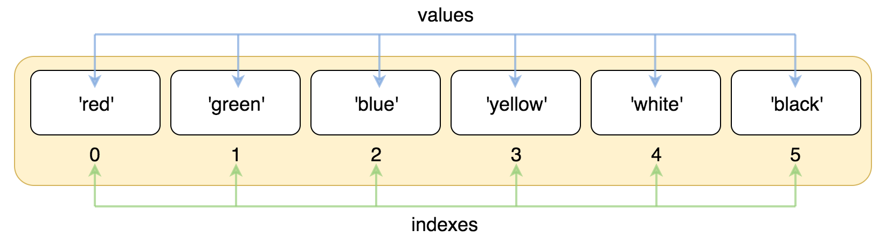


索引也可以从尾部开始，最后一个元素的索引为 -1，往前一位为 -2，以此类推。
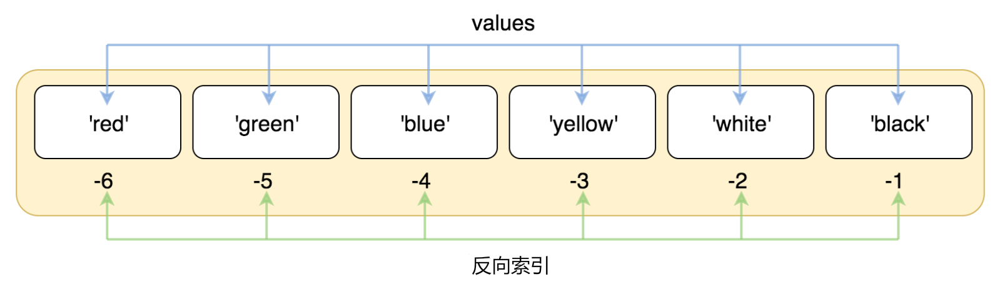

使用下标索引来访问列表中的值，同样你也可以使用方括号 [] 的形式截取字符:
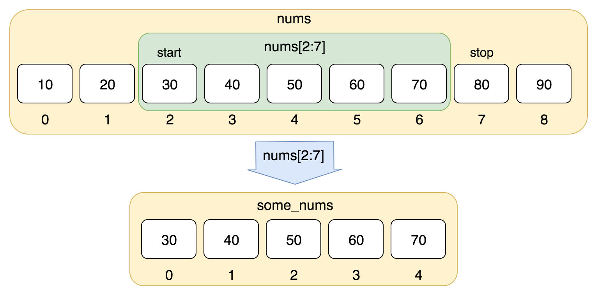

### 更新列表
你可以对列表的数据项进行修改或更新，你也可以使用 append() 方法来添加列表项。
```

#!/usr/bin/python3
 
list = ['Google', 'Runoob', 1997, 2000]
print ("第三个元素为 : ", list[2])
list[2] = 2001
print ("更新后的第三个元素为 : ", list[2])
 
list1 = ['Google', 'Runoob', 'Taobao']
list1.append('Baidu')
print ("更新后的列表 : ", list1)


第三个元素为 :  1997
更新后的第三个元素为 :  2001
更新后的列表 :  ['Google', 'Runoob', 'Taobao', 'Baidu']
```
按切片进行更新：
```
list = ['Google', 'Runoob', 1997, 2000]
list[0:2]=["ok"]
print(list)

['ok', 1997, 2000]
```
### 删除列表元素
可以使用 del 语句来删除列表的的元素:
del list[2]

### Python列表脚本操作符
列表对 + 和 * 的操作符与字符串相似。+ 号用于组合列表，* 号用于重复列表。其他：len,+,*,in, for in。

### Python列表截取与拼接
类似tuple。

### 嵌套列表
使用嵌套列表即在列表里创建其它列表。

### Python列表函数&方法
len,min,max,list

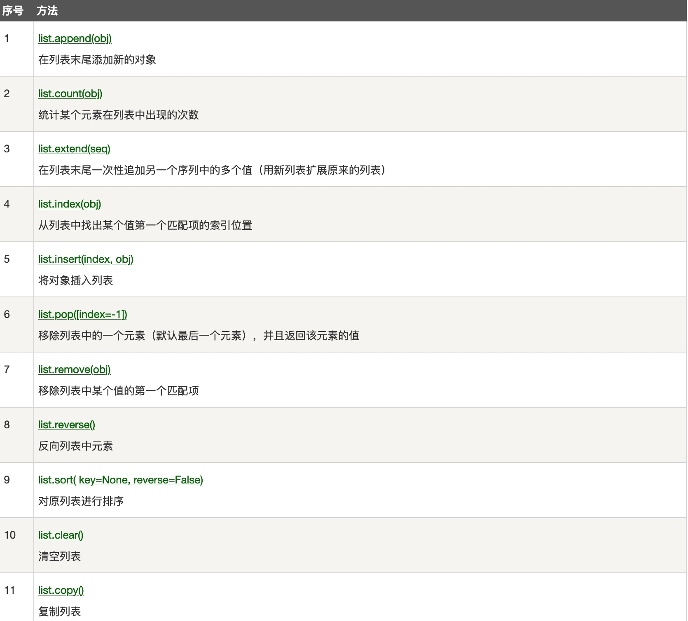


## 范围range

Python3 range() 函数返回的是一个可迭代对象（类型是对象），而不是列表类型， 所以打印的时候不会打印列表。

Python3 list() 函数是对象迭代器，可以把range()返回的可迭代对象转为一个列表，返回的变量类型为列表。

函数语法
```
range(stop)
range(start, stop[, step])
```
参数说明：
* start: 计数从 start 开始。默认是从 0 开始。例如range（5）等价于range（0， 5）;
* stop: 计数到 stop 结束，但不包括 stop。例如：range（0， 5） 是[0, 1, 2, 3, 4]没有5
* step：步长，默认为1。例如：range（0， 5） 等价于 range(0, 5, 1)

实例
```
>>>range(5)
range(0, 5)
>>> for i in range(5):
...     print(i)
... 
0
1
2
3
4
>>> list(range(5))
[0, 1, 2, 3, 4]
>>> list(range(0))
[]
>>>
```
有两个参数或三个参数的情况（第二种构造方法）：:
```
>>>list(range(0, 30, 5))
[0, 5, 10, 15, 20, 25]
>>> list(range(0, 10, 2))
[0, 2, 4, 6, 8]
>>> list(range(0, -10, -1))
[0, -1, -2, -3, -4, -5, -6, -7, -8, -9]
>>> list(range(1, 0))
[]
>>>
>>>
```
（1）它表示的是左闭右开区间；
（2）它接收的参数必须是整数，可以是负数，但不能是浮点数等其它类型；
（3）它是不可变的序列类型，可以进行判断元素、查找元素、切片等操作，但不能修改元素；
（4）它是可迭代对象，却不是迭代器。 

## 字典dict
字典是另一种可变容器模型，且可存储任意类型对象。

字典的每个键值 key=>value 对用冒号 : 分割，每个对之间用逗号(,)分割，整个字典包括在花括号 {} 中 ,格式如下所示：

d = {key1 : value1, key2 : value2, key3 : value3 }

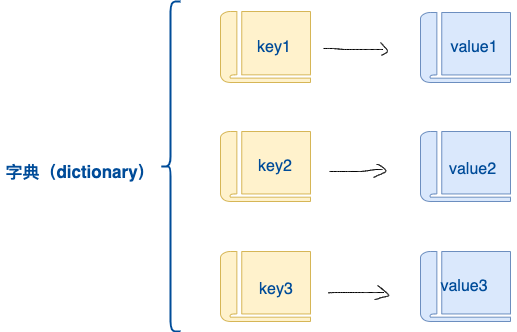

键必须是唯一的，但值则不必。

值可以取任何数据类型，但键必须是不可变的，如字符串，数字。

### 访问字典里的值
把相应的键放入到方括号中。如果用字典里没有的键访问数据，会输出错误。

### 修改字典
向字典添加新内容的方法是增加新的键/值对，修改或删除已有键/值对如

### 删除字典元素
能删单一的元素也能清空字典，清空只需一项操作。
显示删除一个字典用del命令。

### 字典键的特性

字典值可以是任何的 python 对象，既可以是标准的对象，也可以是用户定义的，但键不行。

两个重要的点需要记住：
1）不允许同一个键出现两次。创建时如果同一个键被赋值两次，后一个值会被记住。
2）键必须不可变，所以可以用数字，字符串或元组充当，而用列表就不行。

### 字典内置函数&方法
1.len(dict)
计算字典元素个数，即键的总数。

2.str(dict)
输出字典，可以打印的字符串表示。

3.type(variable)
返回输入的变量类型，如果变量是字典就返回字典类型。

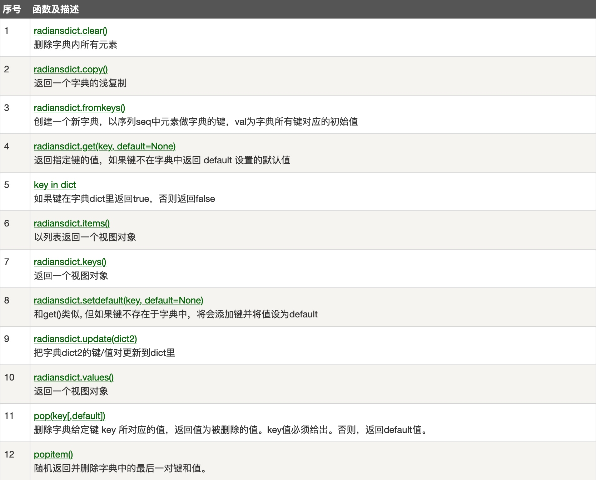

https://www.runoob.com/python3/python3-dictionary.html

###字典的赋值与拷贝
```

#!/usr/bin/python
# -*- coding: UTF-8 -*-
 
dict1 =  {'user':'runoob','num':[1,2,3]}
 
dict2 = dict1          # 浅拷贝: 引用对象
dict3 = dict1.copy()   # 浅拷贝：深拷贝父对象（一级目录），子对象（二级目录）不拷贝，还是引用
 
# 修改 data 数据
dict1['user']='root'
dict1['num'].remove(1)
 
# 输出结果
print(dict1)
print(dict2)
print(dict3)
```
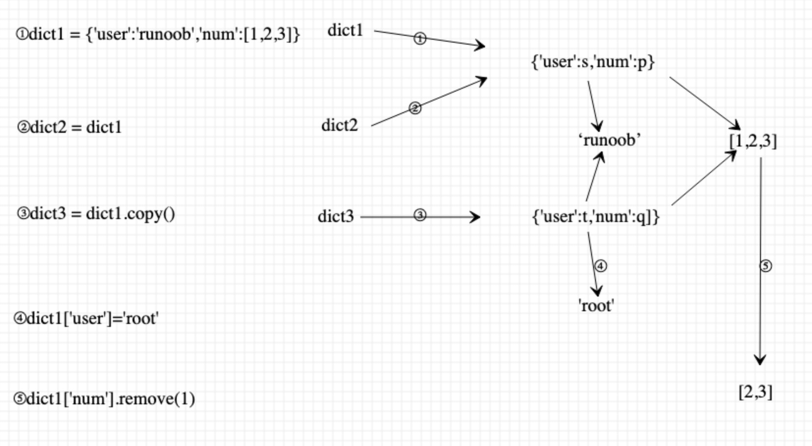

p,q表示存放列表地址的存储单元

## 集合set, frozenset
集合（set）是一个无序的不重复元素序列。

可以使用大括号 { } 或者 set() 函数创建集合，注意：创建一个空集合必须用 set() 而不是 { }，因为 { } 是用来创建一个空字典。 
```
basket = {'apple', 'orange', 'apple', 'pear', 'orange', 'banana'}

b = set('alacazam')
c = set([1, 2, 3])
```

### 添加元素
s.add( x )

### 移除元素
s.remove( x )
将元素 x 从集合 s 中移除，如果元素不存在，则会发生错误。

### 计算集合元素个数
len(s)

### 清空集合
s.clear()

### 判断元素是否在集合中存在
x in s

### 集合内置函数&方法
1.len，in,for in，del
3.集合运算符
a + b # 集合a和集合b中包含的元素
a - b # 集合a中包含而集合b中不包含的元素
a | b # 集合a或b中包含的所有元素
a & b # 集合a和b中都包含了的元素
a ^ b # 不同时包含于a和b的元素

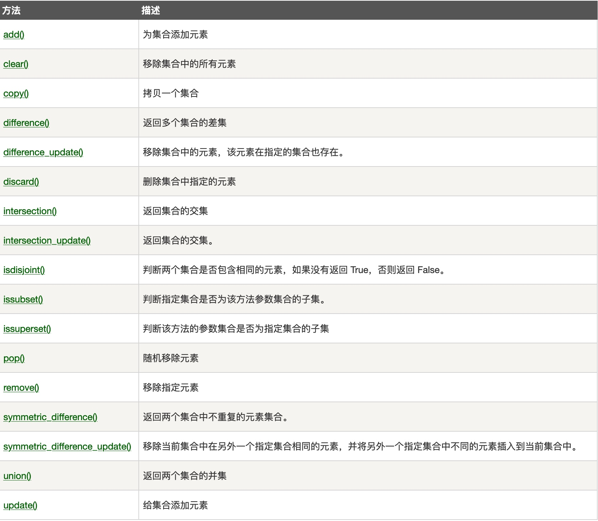

该方法不同于 discard() 方法，因为 remove() 方法在移除一个不存在的元素时会发生错误，而 discard() 方法不会。

### frozenset
frozenset() 返回一个冻结的集合，冻结后集合不能再添加或删除任何元素。

语法
frozenset() 函数语法：
```
class frozenset([iterable])
```
参数
iterable -- 可迭代的对象，比如列表、字典、元组等等。

返回值
返回新的 frozenset 对象，如果不提供任何参数，默认会生成空集合。


# 流程控制
## 条件语句
if,if-else,if-elif,if-elif-else

三目运算符
```
if a:
    b
else:
    c
    
b if a else c
((a and b) or c)
```

## 循环语句
Python的循环有两种，一种是for...in循环，依次把list或tuple中的每个元素迭代出来
第二种循环是while循环，只要条件满足，就不断循环，条件不满足时退出循环。

### 循环嵌套
### 循环流程控制
break，continue，pass

# 函数
## 定义函数
## 调用函数
## 函数的参数
## 函数的返回值
## 递归函数


# Python内置函数
https://www.runoob.com/python/python-built-in-functions.html

1.数值处理：
int()，float()，bool()，complex()
bin()，oct()，hex()
min()，max()，abs()，divmod()，pow()，sum()，round()       
2.输入输出：input() print()
3.文件：open()
4.列表：tuple()，list() set()   frozenset() range()，dict() bytearray() memoryview() slice()
len(),sorted(),reverse() zip() map() reduce() filter() all() any()   
iter() next() enumerate()
5.字符串:str() ord() chr() ascii() format() repr()
6.自省：object() 
isinstance() issubclass() 	
getattr() setattr() delattr() hasattr() 
globals() locals() property() vars() id() hash() type() callable()
7.其他：staticmethod() classmethod() super()
eval() exec(),compile()  \_\_import__() help() dir()
	
# 高级特性
## 切片
## 迭代
## 列表生成式

## 迭代器
### 可迭代对象
### 迭代器
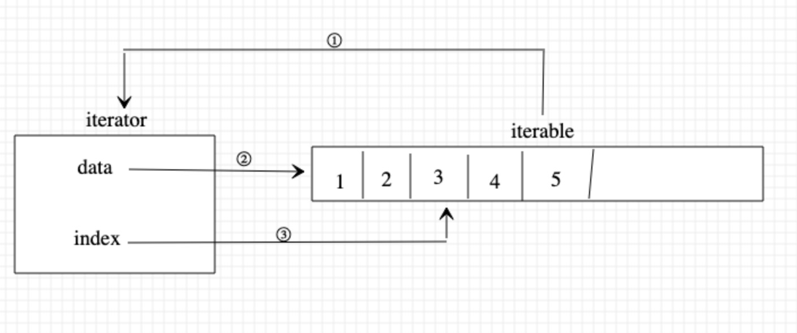

### itertools库
创建和使用迭代器的工具。
所有函数大致分为了3类:
* Infinite itertools无限迭代器
* Iterators terminating on the shortest input sequence会终止的迭代器
* Combinatoric generators组合生成器

#### Infinite itertools􏸲􏷇􏲡􏲢􏲥无限迭代器
```
itertools.count(start=0, step=1)
```
默认返回一个从0开始，依次+1的自然数迭代器，如果你不停止，它会一直运行下去。
可以用start指定开始的位置，step是每次迭代时的间隔。

```
itertools.cycle(iterable)
```
传入一个可迭代对象，然后无限循环迭代。
用例：

```
import itertools

# itertools.count()
l = [1,2,3,4,5]
c = itertools.cycle(l)

for i in c:
    print(i)
```
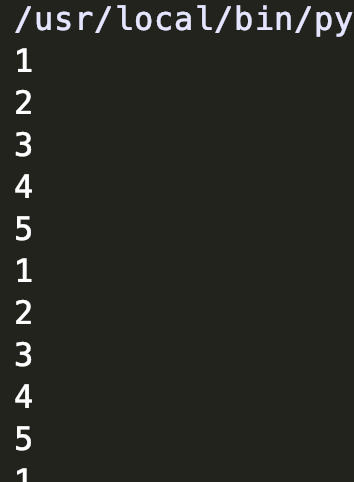

```
itertools.repeat(p_object, times=None)
```
重复迭代一个对象p_object，如果不指定times，则会迭代无数次，也可以通过times参数指定迭代的次数。
```
import itertools

# itertools.count()
l = [1,2,3,4,5]
c = itertools.repeat(l, 5)

for i in c:
    print(i)
```

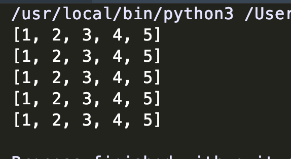

#### Iterators terminating on the shortest input sequence会终止的迭代器
```
accumulate(p[, func]) --> p0, p0+p1, p0+p1+p2
```
Accumulate迭代器会返回累积后的结果或是你传递给acuumulate的函数计算后的累积结果。Acuumulate的默认操作就是加法

```
chain(p, q, ...) --> p0, p1, ... plast, q0, q1, ... 

chain.from_iterable([p, q, ...]) --> p0, p1, ... plast, q0, q1, ... 
```

```
compress(data, selectors) --> (d[0] if s[0]), (d[1] if s[1]), ...

compress('ABCD', [1, 1, 1, 0])  # 根据[1, 1, 1, 0]的真假值情况，选择第一个参数'ABCD'中的元素。A, B, C
```

```
dropwhile(pred, seq) --> seq[n], seq[n+1], starting when pred fails
只要过滤条件是正确的，它就会删除相应的元素，只有当前置条件变为False时你才能看到输出的结果。

dropwhile(lambda x: x < 5, [1, 3, 6, 7, 1])
当函数返回False时，跳过元素。一旦函数返回True，则开始收集剩下的所有元素到循环器。6, 7, 1
```

```
groupby(iterable[, keyfunc]) --> sub-iterators grouped by value of keyfunc(v)

将key函数作用于原循环器的各个元素。根据key函数结果，将拥有相同函数结果的元素分到一个新的循环器。每个新的循环器以函数返回结果为标签。

这就好像一群人的身高作为循环器。我们可以使用这样一个key函数: 如果身高大于180，返回"tall"；如果身高底于160，返回"short";中间的返回"middle"。最终，所有身高将分为三个循环器，即"tall", "short", "middle"。

def height_class(h):
    if h > 180:
        return "tall"
    elif h < 160:
        return "short"
    else:
        return "middle"

friends = [191, 158, 159, 165, 170, 177, 181, 182, 190]

friends = sorted(friends, key = height_class)
for m, n in groupby(friends, key = height_class):
    print(m)
    print(list(n))
```

```
filterfalse(pred, seq) --> elements of seq where pred(elem) is False

Itertools中的Filterfalse函数跟dropwhile很相似。但是filterfalse不再是删掉那些返回True的元素，而是仅返回那些计算结果为False的元素。

filterfalse(lambda x: x > 5, [2, 3, 5, 6, 7])

收集返回False的元素。2, 3, 5
```

```
islice(seq, [start,] stop [, step]) --> elements from seq[start:stop:step]
islice是从可迭代对象中返回选定好元素的函数，适用于不想迭代所有的元素的情况
```


```       
starmap(fun, seq) --> fun(*seq[0]), fun(*seq[1]), ...

starmap(pow, [(1, 1), (2, 2), (3, 3)])
pow将依次作用于表的每个tuple。
```

tee(it, n=2) --> (it1, it2 , ... itn) splits one iterator into n
Tee工具会从单个可迭代对象中复制n份。即是说你可以从一个可迭代对象生成多个，tee中n的默认值为2


```
takewhile(pred, seq) --> seq[0], seq[1], until pred fails
```
Takewhile模块基本上是dropwhile的对立面，该模块只会从迭代对象中选择那些满足前置前置条件的数据。
```
takewhile(lambda x: x < 5, [1, 3, 6, 7, 1])
当函数返回True时，收集元素到循环器。一旦函数返回False，则停止。1, 3
```

```
zip_longest(p, q, ...) --> (p[0], q[0]), (p[1], q[1]), ... 

类似于zip()函数，只是返回的是一个循环器。分别从每个可迭代对象里获得一个值组成一个元组，最短的序列后续使用None代替，也可以指定填充值。
```

#### Combinatoric generators组合生成器
product(p, q, ... [repeat=1]) --> cartesian product
根据输入迭代对象创建笛卡尔积的函数。组合的元素来自不同的来源。

permutations(p[, r])
Permutations会根据提供的迭代对象创建长度为r的排列。跟combinations函数很像，排序也是以字典序排序输出的。取出排列r个元素进行排列，当r=p的个数时为全排列。

combinations(p, r)
组合函数是按词典排序进行组合操作的，如果你的迭代对象是排序过的，那么返回的组合元组也是排序的。另外一个值得注意的问题就是combinations并不会产生重复的值，元组中每个输入元素都是唯一的。相当于是拿出不放回的组合。


combinations_with_replacement(p, r)
combinations_with_replacement和combinations很相似，唯一的不同在于前者元组中的数据是可以重复的。相当于是拿出后放回的组合。

[Itertools简介（上）](https://python.freelycode.com/contribution/detail/163)
[Itertools简介（中](https://python.freelycode.com/contribution/detail/164)
[Itertools简介（下）](https://python.freelycode.com/contribution/detail/165)

## 生成器
在 Python 中，使用了 yield 的函数被称为生成器（generator）。

跟普通函数不同的是，生成器是一个返回迭代器的函数，只能用于迭代操作，更简单点理解生成器就是一个迭代器。

在调用生成器运行的过程中，每次遇到 yield 时函数会暂停并保存当前所有的运行信息，返回 yield 的值, 并在下一次执行 next() 方法时从当前位置继续运行。

调用一个生成器函数，返回的是一个迭代器对象。

通过列表生成式，我们可以直接创建一个列表。但是，受到内存限制，列表容量肯定是有限的。而且，创建一个包含100万个元素的列表，不仅占用很大的存储空间，如果我们仅仅需要访问前面几个元素，那后面绝大多数元素占用的空间都白白浪费了。

所以，如果列表元素可以按照某种算法推算出来，那我们是否可以在循环的过程中不断推算出后续的元素呢？这样就不必创建完整的list，从而节省大量的空间。generator可以实现这个机制。

要创建一个generator，有很多种方法。第一种方法很简单，只要把一个列表生成式的[]改成()，就创建了一个generator：
```
>>> L = [x * x for x in range(10)]
>>> L
[0, 1, 4, 9, 16, 25, 36, 49, 64, 81]
>>> g = (x * x for x in range(10))
>>> g
<generator object <genexpr> at 0x1022ef630>
```
如果要一个一个打印出来，可以通过next()函数获得generator的下一个返回值。

generator保存的是算法，每次调用next(g)，就计算出g的下一个元素的值，直到计算到最后一个元素，没有更多的元素时，抛出StopIteration的错误。

generator也可以使用for循环，因为generator也是可迭代对象：
```
>>> g = (x * x for x in range(10))
>>> for n in g:
...     print(n)
... 
0
1
4
9
16
25
36
49
64
81
```

如果推算的算法比较复杂，用类似列表生成式的for循环无法实现的时候，还可以用函数来实现。

斐波拉契数列用列表生成式写不出来，但是，用函数把它打印出来却很容易：
```
def fib(max):
    n, a, b = 0, 0, 1
    while n < max:
        print(b)
        a, b = b, a + b
        n = n + 1
    return 'done'
```
要把fib函数变成generator函数，只需要把print(b)改为yield b就可以了：
```
def fib(max):
    n, a, b = 0, 0, 1
    while n < max:
        yield b
        a, b = b, a + b
        n = n + 1
    return 'done'
```
这就是定义generator的另一种方法。如果一个函数定义中包含yield关键字，那么这个函数就不再是一个普通函数，而是一个generator函数，调用一个generator函数将返回一个generator：
```
>>> f = fib(6)
>>> f
<generator object fib at 0x104feaaa0>
```
最难理解的就是generator函数和普通函数的执行流程不一样。普通函数是顺序执行，遇到return语句或者最后一行函数语句就返回。而变成generator的函数，在每次调用next()的时候执行，遇到yield语句返回，再次执行时从上次返回的yield语句处继续执行。

举个简单的例子，定义一个generator函数，依次返回数字1，3，5：
```
def odd():
    print('step 1')
    yield 1
    print('step 2')
    yield(3)
    print('step 3')
    yield(5)
```
调用该generator函数时，首先要生成一个generator对象，然后用next()函数不断获得下一个返回值：
```
>>> o = odd()
>>> next(o)
step 1
1
>>> next(o)
step 2
3
>>> next(o)
step 3
5
>>> next(o)
Traceback (most recent call last):
  File "<stdin>", line 1, in <module>
StopIteration
```
但是用for循环调用generator时，发现拿不到generator的return语句的返回值。如果想要拿到返回值，必须捕获StopIteration错误，返回值包含在StopIteration的value中：
```
>>> g = fib(6)
>>> while True:
...     try:
...         x = next(g)
...         print('g:', x)
...     except StopIteration as e:
...         print('Generator return value:', e.value)
...         break
...
g: 1
g: 1
g: 2
g: 3
g: 5
g: 8
Generator return value: done
```

# 函数式编程
## 高阶函数
## 返回函数
## 闭包
## 匿名函数lambda
lambda 表达式，又称匿名函数，常用来表示内部仅包含 1 行表达式的函数。如果一个函数的函数体仅有 1 行表达式，则该函数就可以用 lambda 表达式来代替。

lambda 表达式的语法格式如下：

name = lambda [list] : 表达式
其中，定义 lambda 表达式，必须使用 lambda 关键字；[list] 作为可选参数，等同于定义函数是指定的参数列表；value 为该表达式的名称。

可以这样理解 lambda 表达式，其就是简单函数（函数体仅是单行的表达式）的简写版本。相比函数，lamba 表达式具有以下  2 个优势：
* 对于单行函数，使用 lambda 表达式可以省去定义函数的过程，让代码更加简洁；
* 对于不需要多次复用的函数，使用 lambda 表达式可以在用完之后立即释放，提高程序执行的性能。

## 装饰器
假设我们有一些函数，我们想在它们执行前后打印一些消息，那么简单的做法就是找到这些函数调用的地方，然后在它们前后插入打印代码，但是这样改动太大，且容易漏下。那么改进的办法是我们重新写一个函数来包裹原来的函数，然后把调用原函数的地方全改成调用它的。为了通用起见，我们把原函数作为参数传入：
```
def wrapTheFunction(a_func):
    print("I am doing some boring work before executing a_func()")
 
    a_func()
 
    print("I am doing some boring work after executing a_func()")
```
这里还是有个缺点，需要改动源代码。考虑到函数名只是一个变量，那么一个简单的修正就是把包裹后的函数赋值给原函数。但是直接```a_func = wrapTheFunction```显然不行，我们需要一个返回函数的函数：
```
def a_new_decorator(a_func):
 
    def wrapTheFunction():
        print("I am doing some boring work before executing a_func()")
 
        a_func()
 
        print("I am doing some boring work after executing a_func()")
 
    return wrapTheFunction
```
那么我们现在可以写成
```
a_func = a_new_decorator(a_func)
```
但是每次都这样写很麻烦，有没有简便的语法呢？这时候装饰器就登场了。
```
@a_new_decorator
def a_function_requiring_decoration():
    """Hey you! Decorate me!"""
    print("I am the function which needs some decoration to "
          "remove my foul smell")
```
a_new_decorator是我们的装饰函数，a_function_requiring_decoration则是被装饰的函数。但是这里有个缺陷，我们打印a_function_requiring_decoration的名字，会发现是我们装饰函数返回的函数名：
```
print(a_function_requiring_decoration.__name__)
# Output: wrapTheFunction
```
幸运的是Python提供给我们一个简单的函数来解决这个问题，那就是functools.wraps。我们修改上一个例子来使用functools.wraps：
```

from functools import wraps
 
def a_new_decorator(a_func):
    @wraps(a_func)
    def wrapTheFunction():
        print("I am doing some boring work before executing a_func()")
        a_func()
        print("I am doing some boring work after executing a_func()")
    return wrapTheFunction
 
@a_new_decorator
def a_function_requiring_decoration():
    """Hey yo! Decorate me!"""
    print("I am the function which needs some decoration to "
          "remove my foul smell")
 
print(a_function_requiring_decoration.__name__)
# Output: a_function_requiring_decoration
```

[参考1](http://c.biancheng.net/view/2270.html)
[参考2](https://www.runoob.com/w3cnote/python-func-decorators.html)
## 偏函数partial

# 模块
模块就是 Python 程序。将 Python 代码写到一个文件中，随着程序功能的复杂，程序体积会不断变大，为了便于维护，通常会将其分为多个文件（模块），这样不仅可以提高代码的可维护性，还可以提高代码的可重用性。

代码的可重用性体现在，当编写好一个模块后，只要编程过程中需要用到该模块中的某个功能（由变量、函数、类实现），无需做重复性的编写工作，直接在程序中导入该模块即可使用该功能。

当调用模块中的 say() 函数时，使用的语法格式为“模块名.函数”，这是因为，相对于 say.py 文件，hello.py 文件中的代码自成一个命名空间，因此在调用其他模块中的函数时，需要明确指明函数的出处，否则 Python 解释器将会报错。

## 引入模块
### 引入模块的语法
主要有以下两种：
1. import 模块名1 [as 别名1], 模块名2 [as 别名2]，…：使用这种语法格式的 import 语句，会导入指定模块中的所有成员（包括变量、函数、类等）。不仅如此，当需要使用模块中的成员时，需用该模块名（或别名）作为前缀，否则 Python 解释器会报错。
2. from 模块名 import 成员名1 [as 别名1]，成员名2 [as 别名2]，…： 使用这种语法格式的 import 语句，只会导入模块中指定的成员，而不是全部成员。同时，当程序中使用该成员时，无需附加任何前缀，直接使用成员名（或别名）即可。

注意，用 [] 括起来的部分，可以使用，也可以省略。

其中，第二种 import 语句也可以导入指定模块中的所有成员，即使用 form 模块名 import ＊，但此方式不推荐使用，因为当模块内有相同方法时候，调用哪个不确定。

模块就是一个代码文件，因此要求其文件名要符合操作系统的命名规则。

这可能会遇到一个问题，即操作系统中允许文件名中包含空格，也就是说，模块文件可以起名为类似“a b”的形式，就无法再使用 import 引入。不仅如此，如果模块名称以数字开头，也无法使用 import 语句正常导入。

针对以上这两种情况，如果模块中包含空格或者以数字开头，就需要使用 Python 提供的`` __import__()`` 内置函数引入模块。例如，当模块名为"demo text" 时，引入方法如下： 
```
__import__("demo text")
```

   要让 Python 解释器知道，当前要运行的程度代码，是模块文件本身，还是导入模块的其它程序。为了实现这一点，就需要使用 Python 内置的系统变量 ``__name__``，它用于标识所在模块的模块名。当前运行的程序，其 ``__name__`` 的值为 ``__main__``，而导入到当前程序中的模块，其 ``__name__`` 值为自己的模块名。

因此，``if __name__ == '__main__'``: 的作用是确保只有单独运行该模块时，此表达式才成立，才可以进入此判断语法，执行其中的测试代码；反之，如果只是作为模块导入到其他程序文件中，则此表达式将不成立，运行其它程序时，也就不会执行该判断语句中的测试代码。

### 模块__all__变量
当我们向文件导入某个模块时，导入的是该模块中那些名称不以下划线（单下划线“_”或者双下划线“__”）开头的变量、函数和类。因此，如果我们不想模块文件中的某个成员被引入到其它文件中使用，可以在其名称前添加下划线。

除此之外，还可以借助模块提供的 ``__all__`` 变量，该变量的值是一个列表，存储的是当前模块中一些成员（变量、函数或者类）的名称。通过在模块文件中设置 ``__all__`` 变量，当其它文件以“from 模块名 import *”的形式导入该模块时，该文件中只能使用 ``__all__`` 列表中指定的成员。
>也就是说，只有以“from 模块名 import *”形式导入的模块，当该模块设有 ``__all__`` 变量时，只能导入该变量指定的成员，未指定的成员是无法导入的。

如果使用以下 2 种方式引入模块，则 ``__all__`` 变量的设置是无效的。

1) 以“import 模块名”的形式导入模块。通过该方式导入模块后，总可以通过模块名前缀（如果为模块指定了别名，则可以使用模快的别名作为前缀）来调用模块内的所有成员（除了以下划线开头命名的成员）。

2) 以“from 模块名 import 成员”的形式直接导入指定成员。使用此方式导入的模块，__all__ 变量即便设置，也形同虚设。

### 引入模块的本质
对于 import module，该模块中的全部代码加载到内存并执行，然后将整个模块内容赋值给与模块同名的变量，该变量的类型是 module，而在该模块中定义的所有程序单元都相当于该 module 对象的成员。

对于“from module import name, hello”导入模块中成员的本质就是将 module.py 中的全部代码加载到内存并执行，然后只导入指定变量、函数等成员单元，并不会将整个模块导入。

在导入模块后，可以在模块文件所在目录下看到一个名为“pycache”的文件夹，打开该文件夹，可以看到 Python 为每个模块都生成一个 *.cpython-36.pyc 文件，该文件其实是 Python 为模块编译生成的字节码，用于提升该模块的运行效率。

另外，导入同一个模块多次，Python只执行一次。

原文链接：https://blog.csdn.net/weixin_43147153/article/details/113762188


   
## 导入模块
### 搜索路径
通常情况下，当使用 import 语句导入模块后，Python 会按照以下顺序查找指定的模块文件：
* 在当前目录，即当前执行的程序文件所在目录下查找；
* 到 PYTHONPATH（环境变量）下的每个目录中查找；
* 到 Python 默认的安装目录下查找。

以上所有涉及到的目录，都保存在标准模块 sys 的 sys.path 变量中，通过此变量我们可以看到指定程序文件支持查找的所有目录。换句话说，如果要导入的模块没有存储在 sys.path 显示的目录中，那么导入该模块并运行程序时，Python 解释器就会抛出 ModuleNotFoundError（未找到模块）异常。

### 导入模块的3种方式
解决“Python找不到指定模块”的方法有 3 种，分别是：
* 向 sys.path 中临时添加模块文件存储位置的完整路径；
* 将模块放在 sys.path 变量中已包含的模块加载路径中；
* 设置 path 系统环境变量。

[导入模块的3种方式](http://c.biancheng.net/view/4645.html)


## 包（存放多个模块的文件夹）
实际开发中，一个大型的项目往往需要使用成百上千的 Python 模块，如果将这些模块都堆放在一起，势必不好管理。而且，使用模块可以有效避免变量名或函数名重名引发的冲突，但是如果模块名重复怎么办呢？因此，Python提出了包（Package）的概念。

什么是包呢？简单理解，包就是文件夹，只不过在该文件夹下必须存在一个名为“__init__.py” 的文件。  Python 2.x中是必要的，3.x不是必要的。

注意，``__init__.py`` 不同于其他模块文件，此模块的模块名不是 ``__init__``，而是它所在的包名。例如，在 settings 包中的 ``__init__.py`` 文件，其模块名就是 settings。

包的本质依然是模块，包可以包含包。
Python 库：相比模块和包，库是一个更大的概念，例如在 Python 标准库中的每个库都有好多个包，而每个包中都有若干个模块。

### 创建包
手动创建一个包，只需进行以下 2 步操作：
* 新建一个文件夹，文件夹的名称就是新建包的包名；
* 在该文件夹中，创建一个 ``__init__.py`` 文件（前后各有 2 个下划线‘_’），该文件中可以不编写任何代码。当然，也可以编写一些 Python 初始化代码，则当有其它程序文件导入包时，会自动执行该文件中的代码。

### 导入包
包其实本质上还是模块，因此导入模块的语法同样也适用于导入包。无论导入我们自定义的包，还是导入从他处下载的第三方包，导入方法可归结为以下 3 种：
1. import 包名[.模块名 [as 别名]]
    通过此语法格式导入包中的指定模块后，在使用该模块中的成员（变量、函数、类）时，需添加“包名.模块名”为前缀。当然，如果使用 as 给包名.模块名”起一个别名的话，就使用直接使用这个别名作为前缀使用该模块中的方法了。
2. from 包名 import 模块名 [as 别名]
   使用此语法格式导入包中模块后，在使用其成员时不需要带包名前缀，但需要带模块名前缀。
3. from 包名.模块名 import 成员名 [as 别名]
    此语法格式用于向程序中导入“包.模块”中的指定成员（变量、函数或类）。通过该方式导入的变量（函数、类），在使用时可以直接使用变量名（函数名、类名）调用
    
用 [] 括起来的部分，是可选部分，即可以使用，也可以直接忽略。
> 注意，导入包的同时，会在包目录下生成一个含有``__init__.cpython-36.pyc`` 文件的 ``__pycache__`` 文件夹。


### \_\_init\_\_.py的作用

init.py 文件的作用是将文件夹变为一个Python模块,Python 中的每个模块的包中，都有``__init__.py`` 文件。

通常``__init__.py`` 文件为空，但是我们还可以为它增加其他的功能。我们在导入一个包时，实际上是导入了它的``__init__.py``文件。这样我们可以在``__init__.py``文件中批量导入我们所需要的模块，而不再需要一个一个的导入。

init.py中还有一个重要的变量，all, 它用来将模块全部导入。
```
# __init__.py
__all__ = ['os', 'sys', 're', 'urllib']

# a.py
from package import *
```
这时就会把注册在__init__.py文件中__all__列表中的模块和包导入到当前文件中来。

可以了解到，init.py主要控制包的导入行为。要想清楚理解__init__.py文件的作用，还需要详细了解一下import语句引用机制：

可以被import语句导入的对象是以下类型：
1. 模块文件（.py文件）
2. C或C++扩展（已编译为共享库或DLL文件）
3. 包（包含多个模块）
4. 内建模块（使用C编写并已链接到Python解释器中）
    当导入模块时，解释器按照sys.path列表中的目录顺序来查找导入文件。

```
import sys
>>> print(sys.path)

# Linux:
['', '/usr/local/lib/python3.4',
 '/usr/local/lib/python3.4/plat-sunos5',
 '/usr/local/lib/python3.4/lib-tk',
 '/usr/local/lib/python3.4/lib-dynload',
 '/usr/local/lib/python3.4/site-packages']

# Windows:
['', 'C:\\WINDOWS\\system32\\python34.zip', 'C:\\Documents and Settings\\weizhong', 'C:\\Python34\\DLLs', 'C:\\Python34\\lib', 'C:\\Python34\\lib\\plat-win', 'C:\\Python34\\lib\\lib-tk', 'C:\\Python34\\Lib\\site-packages\\pythonwin', 'C:\\Python34', 'C:\\Python34\\lib\\site-packages', 'C:\\Python34\\lib\\site-packages\\win32', 'C:\\Python34\\lib\\site-packages\\win32\\lib', 'C:\\Python34\\lib\\site-packages\\wx-2.6-msw-unicode']
```
其中list第一个元素空字符串代表当前目录。

## 查看模块(包)信息
### dir()函数：查看模块成员
通过 dir() 函数，我们可以查看某指定模块包含的全部成员（包括变量、函数和类）。注意这里所指的全部成员，不仅包含可供我们调用的模块成员，还包含所有名称以双下划线“__”开头和结尾的成员，而这些“特殊”命名的成员，是为了在本模块中使用的，并不希望被其它文件调用。

这里以导入 string 模块为例，string 模块包含操作字符串相关的大量方法，下面通过 dir() 函数查看该模块中包含哪些成员：
```
import string
print(dir(string))
```
程序执行结果为：
```
['Formatter', 'Template', '_ChainMap', '_TemplateMetaclass', '__all__', '__builtins__', '__cached__', '__doc__', '__file__', '__loader__', '__name__', '__package__', '__spec__', '_re', '_string', 'ascii_letters', 'ascii_lowercase', 'ascii_uppercase', 'capwords', 'digits', 'hexdigits', 'octdigits', 'printable', 'punctuation', 'whitespace']
```
可以看到，通过 dir() 函数获取到的模块成员，不仅包含供外部文件使用的成员，还包含很多“特殊”（名称以 2 个下划线开头和结束）的成员，列出这些成员，对我们并没有实际意义。

因此，这里给读者推荐一种可以忽略显示 dir() 函数输出的特殊成员的方法。仍以 string 模块为例：
```
import string
print([e for e in dir(string) if not e.startswith('_')])
```
程序执行结果为：
```
['Formatter', 'Template', 'ascii_letters', 'ascii_lowercase', 'ascii_uppercase', 'capwords', 'digits', 'hexdigits', 'octdigits', 'printable', 'punctuation', 'whitespace']
```
显然通过列表推导式，可在 dir() 函数输出结果的基础上，筛选出对我们有用的成员并显示出来。

### \_\_all\_\_变量: 查看模块成员
除了使用 dir() 函数之外，还可以使用 ``__all__`` 变量，借助该变量也可以查看模块（包）内包含的所有成员。

仍以 string 模块为例，举个例子：
```
import string
print(string.__all__)
```
程序执行结果为：
```
['ascii_letters', 'ascii_lowercase', 'ascii_uppercase', 'capwords', 'digits', 'hexdigits', 'octdigits', 'printable', 'punctuation', 'whitespace', 'Formatter', 'Template']
```
显然，和 dir() 函数相比，__all__ 变量在查看指定模块成员时，它不会显示模块中的特殊成员，同时还会根据成员的名称进行排序显示。

不过需要注意的是，并非所有的模块都支持使用``__all__`` 变量，因此对于获取有些模块的成员，就只能使用 dir() 函数。

### \_\_doc\_\_属性：查看文档
我们先借助 dir() 函数，查看 my_package 包中有多少可供我们调用的成员：
```
import my_package
print([e for e in dir(my_package) if not e.startswith('_')])
```  
接下来，我们使用 help() 函数来查看这些成员的具体含义。

之所以我们可以使用 help() 函数查看具体成员的信息，是因为该成员本身就包含表示自身身份的说明文档（本质是字符串，位于该成员内部开头的位置）。前面讲过，无论是函数还是类，都可以使用 ``__doc__`` 属性获取它们的说明文档，模块也不例外。

那么，如果使用 help() 函数或者 __doc__ 属性，仍然无法满足我们的需求，还可以使用以下 2 种方法：
1. 调用 ``__file__`` 属性，查看该模块或者包文件的具体存储位置，直接查看其源代码（后续章节或详细介绍）；
2. 对于非自定义的模块或者包，可以查阅 Python 库的参考文档 https://docs.python.org/3/library/index.html。

### \_\_file\_\_属性：查看模块的源文件路径
我们可以通过 ``__file__`` 属性查找该模块（或包）文件所在的具体存储位置，直接查看其源代码。

仍以前面章节创建的 my_package 包为例，下面代码尝试使用 ``__file__`` 属性获取该包的存储路径：
```
import my_package
print(my_package.__file__)
```
程序输出结果为：
```
C:\Users\mengma\Desktop\my_package\__init__.py
```
注意，因为当引入 my_package 包时，其实际上执行的是 ``__init__.py`` 文件，因此这里查看 my_package 包的存储路径，输出的 ``__init__.py`` 文件的存储路径。

再以 string 模块为例：
```
import string
print(string.__file__)
```
程序输出结果为：
```
D:\python3.6\lib\string.py
```

由此，通过调用 ``__file__`` 属性输出的绝对路径，我们可以很轻易地找到该模块（或包）的源文件。

>注意，并不是所有模块都提供 ``__file__`` 属性，因为并不是所有模块的实现都采用 Python 语言，有些模块采用的是其它编程语言（如 C 语言）。

## 标准模块

Python 本身带着一些标准的模块库，在 Python 库参考文档中将会介绍到（就是后面的"库参考文档"）。

有些模块直接被构建在解析器里，这些虽然不是一些语言内置的功能，但是他却能很高效的使用，甚至是系统级调用也没问题。

这些组件会根据不同的操作系统进行不同形式的配置，比如 winreg 这个模块就只会提供给 Windows 系统。

应该注意到这有一个特别的模块 sys ，它内置在每一个 Python 解析器中。

[Python3 标准库概览](https://www.runoob.com/python3/python3-stdlib.html)

### 操作系统接口(√)
### 文件通配符
### 命令行参数(√)
### 错误输出重定向和程序终止
### 字符串正则匹配(√)
### 数学 (√)
### 访问互联网(√)
### 日期和时间(√)
### 数据压缩
### 性能度量
### 测试模块

# 文件与IO
## 打印到屏幕
print(*objects, sep=' ', end='\n', file=sys.stdout)

>str = "the length of (%s) is %d" %('runoob',len('runoob'))
>print(str)

https://www.runoob.com/w3cnote/python3-print-func-b.html
https://blog.csdn.net/sinat_28576553/article/details/81154912
## 读取键盘输入
Python 提供了 input() 内置函数从标准输入读入一行文本，默认的标准输入是键盘。
```
#!/usr/bin/python3

str = input("请输入：");
print ("你输入的内容是: ", str
```

## 文件系统与路径
什么是文件路径，Python中如何书写文件路径？
什么是当前工作目录
Python绝对路径和相对路径详解
Python处理绝对路径和相对路径

http://c.biancheng.net/view/5693.html

## 打开和关闭文件
open() 将会返回一个 file 对象，基本语法格式如下: 
```
file = open(filename, mode)
```
* filename：包含了你要访问的文件名称的字符串值。
* mode：决定了打开文件的模式：只读，写入，追加等。所有可取值见如下的完全列表。这个参数是非强制的，默认文件访问模式为只读(r)。

完整的语法格式为：
open(file, mode='r', buffering=-1, encoding=None, errors=None, newline=None, closefd=True, opener=None)

参数说明:
file: 必需，文件路径（相对或者绝对路径）。
mode: 可选，文件打开模式
buffering: 设置缓冲
encoding: 一般使用utf8
errors: 报错级别
newline: 区分换行符
closefd: 传入的file参数类型
opener: 设置自定义开启器，开启器的返回值必须是一个打开的文件描述符。


不同模式打开文件的完全列表：
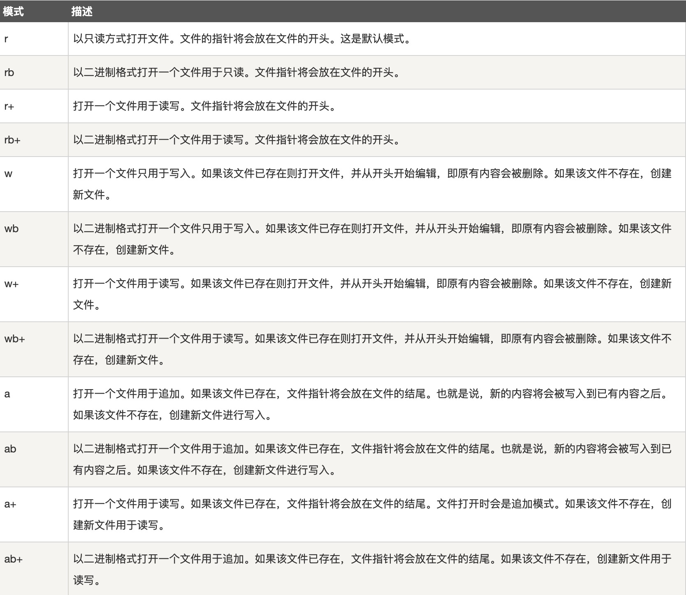
下图很好的总结了这几种模式：
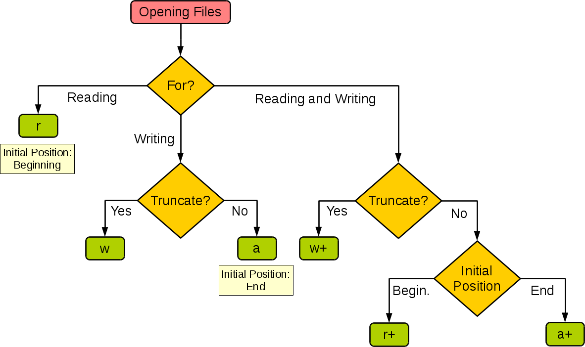
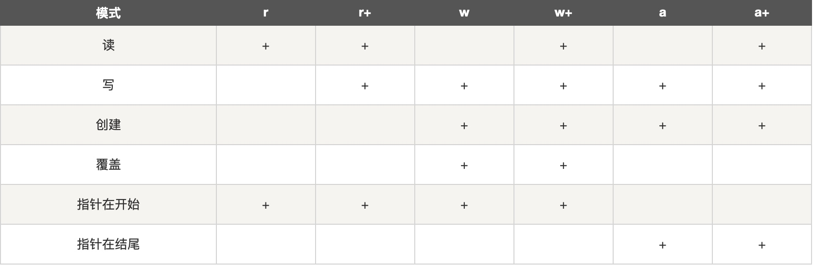

文件打开后就获得了文件对象，可对其进行读写等操作。由于文件读写时都有可能产生IOError，一旦出错，后面的f.close()就不会调用。所以，为了保证无论是否出错都能正确地关闭文件，我们可以使用try ... finally来实现：
```
try:
    f = open('/path/to/file', 'r')
    print(f.read())
finally:
    if f:
        f.close()
```
但是每次都这么写实在太繁琐，所以，Python引入了with语句来自动帮我们调用close()方法：
```
with open('/path/to/file', 'r') as f:
    print(f.read())
```
这和前面的try ... finally是一样的，但是代码更佳简洁，并且不必调用f.close()方法。

文件使用完毕后必须关闭，因为文件对象会占用操作系统的资源，并且操作系统同一时间能打开的文件数量也是有限的，调用文件对象的close方法关闭文件：
```
file.close()
```

### 以文本格式和二进制格式打开文件
http://c.biancheng.net/view/4723.html

### file-like Object

像open()函数返回的这种有个read()方法的对象，在Python中统称为file-like Object。除了file外，还可以是内存的字节流，网络流，自定义流等等。file-like Object不要求从特定类继承，只要写个read()方法就行。

StringIO就是在内存中创建的file-like Object，常用作临时缓冲。

### StringIO和BytesIO

## 文件对象操作

**f.read()**

为了读取一个文件的内容，调用 f.read(size), 这将读取一定数目的数据, 然后作为字符串或字节对象返回。

size 是一个可选的数字类型的参数。 当 size 被忽略了或者为负, 那么该文件的所有内容都将被读取并且返回。

**f.readline()**

f.readline() 会从文件中读取单独的一行。换行符为 '\n'。f.readline() 如果返回一个空字符串, 说明已经已经读取到最后一行。

**f.readlines()**

f.readlines() 将返回该文件中包含的所有行。

如果设置可选参数 sizehint, 则读取指定长度的字节, 并且将这些字节按行分割。 

**f.write()**

f.write(string) 将 string 写入到文件中, 然后返回写入的字符数。

**file.writelines()**

file.writelines(sequence)向文件写入一个序列字符串列表，如果需要换行则要自己加入每行的换行符。 

**f.tell()**

f.tell() 返回文件对象当前所处的位置, 它是从文件开头开始算起的字节数。

**file.truncate()**

file.truncate([size])从文件的首行首字符开始截断，截断文件为 size 个字符，无 size 表示从当前位置截断；截断之后后面的所有字符被删除，其中 windows 系统下的换行代表2个字符大小。

**file.flush()**
刷新文件内部缓冲，直接把内部缓冲区的数据立刻写入文件, 而不是被动的等待输出缓冲区写入。 

**f.seek()**

如果要改变文件当前的位置, 可以使用 f.seek(offset, from_what) 函数。

from_what 的值, 如果是 0 表示开头, 如果是 1 表示当前位置, 2 表示文件的结尾，例如：

seek(x,0) ： 从起始位置即文件首行首字符开始移动 x 个字符
seek(x,1) ： 表示从当前位置往后移动x个字符
seek(-x,2)：表示从文件的结尾往前移动x个字符 

from_what 值为默认为0，即文件开头。

**f.close()**

在文本文件中 (那些打开文件的模式下没有 b 的), 只会相对于文件起始位置进行定位。

当你处理完一个文件后, 调用 f.close() 来关闭文件并释放系统的资源，如果尝试再调用该文件，则会抛出异常。

## Python fileinput模块：逐行读取多个文件
http://c.biancheng.net/view/2547.html

## Python linecache模块用法：随机读取文件指定行
http://c.biancheng.net/view/2553.html

## 数据序列和反序列化
### pickle
 python的pickle模块实现了基本的数据序列和反序列化。

通过pickle模块的序列化操作我们能够将程序中运行的对象信息保存到文件中去，永久存储。

通过pickle模块的反序列化操作，我们能够从文件中创建上一次程序保存的对象。

基本接口：
```
pickle.dump(obj, file, [,protocol])
```
有了 pickle 这个对象, 就能对 file 以读取的形式打开:
```
x = pickle.load(file)
```
注解：从 file 中读取一个字符串，并将它重构为原来的python对象。

https://www.runoob.com/python3/python3-inputoutput.html

### JSON
如果我们要在不同的编程语言之间传递对象，就必须把对象序列化为标准格式，比如XML，但更好的方法是序列化为JSON，因为JSON表示出来就是一个字符串，可以被所有语言读取，也可以方便地存储到磁盘或者通过网络传输。JSON不仅是标准格式，并且比XML更快，而且可以直接在Web页面中读取，非常方便。

JSON表示的对象就是标准的JavaScript语言的对象，JSON和Python内置的数据类型对应如下：
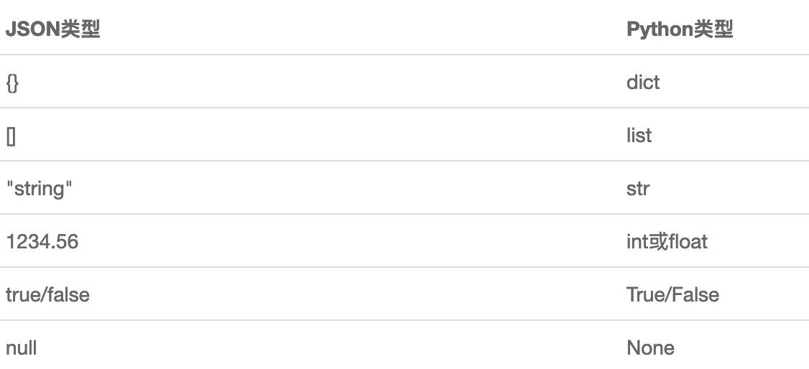
Python内置的json模块提供了非常完善的Python对象到JSON格式的转换。我们先看看如何把Python对象变成一个JSON：
```
>>> import json
>>> d = dict(name='Bob', age=20, score=88)
>>> json.dumps(d)
'{"age": 20, "score": 88, "name": "Bob"}'
```
dumps()方法返回一个str，内容就是标准的JSON。类似的，dump()方法可以直接把JSON写入一个file-like Object。

要把JSON反序列化为Python对象，用loads()或者对应的load()方法，前者把JSON的字符串反序列化，后者从file-like Object中读取字符串并反序列化：
```
>>> json_str = '{"age": 20, "score": 88, "name": "Bob"}'
>>> json.loads(json_str)
{'age': 20, 'score': 88, 'name': 'Bob'}
```
由于JSON标准规定JSON编码是UTF-8，所以我们总是能正确地在Python的str与JSON的字符串之间转换。

#### 自定义类的序列化和反序列化
Python的dict对象可以直接序列化为JSON的{}，不过，很多时候，我们更喜欢用class表示对象，比如定义Student类，然后序列化。但是自定义类的对象不是一个可序列化为JSON的对象。

dumps()方法的参数列表，可以发现，除了第一个必须的obj参数外，dumps()方法还提供了一大堆的可选参数：

https://docs.python.org/3/library/json.html#json.dumps

这些可选参数就是让我们来定制JSON序列化。默认情况下，dumps()方法不知道如何将类实例变为一个JSON的{}对象。

可选参数default就是把任意一个对象变成一个可序列为JSON的对象，我们只需要为类专门写一个转换函数，再把函数传进去即可：
```
def student2dict(std):
    return {
        'name': std.name,
        'age': std.age,
        'score': std.score
    }
```
这样，Student实例首先被student2dict()函数转换成dict，然后再被顺利序列化为JSON：
```
>>> print(json.dumps(s, default=student2dict))
{"age": 20, "name": "Bob", "score": 88}
```
不过，下次如果遇到一个Teacher类的实例，照样无法序列化为JSON。我们可以偷个懒，把任意class的实例变为dict：
```
print(json.dumps(s, default=lambda obj: obj.__dict__))
```
因为通常class的实例都有一个__dict__属性，它就是一个dict，用来存储实例变量。也有少数例外，比如定义了__slots__的class。

同样的道理，如果我们要把JSON反序列化为一个Student对象实例，loads()方法首先转换出一个dict对象，然后，我们传入的object_hook函数负责把dict转换为Student实例：
```
def dict2student(d):
    return Student(d['name'], d['age'], d['score'])
```
运行结果如下：
```
>>> json_str = '{"age": 20, "score": 88, "name": "Bob"}'
>>> print(json.loads(json_str, object_hook=dict2student))
<__main__.Student object at 0x10cd3c190>
```
打印出的是反序列化的Student实例对象。

## 操作文件和目录
如果我们要操作文件、目录，可以在命令行下面输入操作系统提供的各种命令来完成。比如dir、cp等命令。

如果要在Python程序中执行这些目录和文件的操作怎么办？其实操作系统提供的命令只是简单地调用了操作系统提供的接口函数，Python内置的os模块也可以直接调用操作系统提供的接口函数。

**查看操作系统**
```
>>> import os
>>> os.name # 操作系统类型
'posix'
```
要获取详细的系统信息，可以调用uname()函数：os.uname()。注意uname()函数在Windows上不提供，也就是说，os模块的某些函数是跟操作系统相关的。

**环境变量**

在操作系统中定义的环境变量，全部保存在os.environ这个变量中，可以直接查看。

**操作文件和目录**

操作文件和目录的函数一部分放在os模块中，一部分放在os.path模块中，这一点要注意一下。查看、创建和删除目录可以这么调用：
```
# 查看当前目录的绝对路径:
>>> os.path.abspath('.')
'/Users/michael'
# 在某个目录下创建一个新目录，首先把新目录的完整路径表示出来:
>>> os.path.join('/Users/michael', 'testdir')
'/Users/michael/testdir'
# 然后创建一个目录:
>>> os.mkdir('/Users/michael/testdir')
# 删掉一个目录:
>>> os.rmdir('/Users/michael/testdir')
```
把两个路径合成一个时，不要直接拼字符串，而要通过os.path.join()函数，这样可以正确处理不同操作系统的路径分隔符。在Linux/Unix/Mac下，os.path.join()返回这样的字符串：
```
part-1/part-2
```
而Windows下会返回这样的字符串：
```
part-1\part-2
```
同样的道理，要拆分路径时，也不要直接去拆字符串，而要通过os.path.split()函数，这样可以把一个路径拆分为两部分，后一部分总是最后级别的目录或文件名：
```
>>> os.path.split('/Users/michael/testdir/file.txt')
('/Users/michael/testdir', 'file.txt')
```
os.path.splitext()可以直接让你得到文件扩展名，很多时候非常方便：
```
>>> os.path.splitext('/path/to/file.txt')
('/path/to/file', '.txt')
```
这些合并、拆分路径的函数并不要求目录和文件要真实存在，它们只对字符串进行操作。

文件操作使用下面的函数。假定当前目录下有一个test.txt文件：
```
# 对文件重命名:
>>> os.rename('test.txt', 'test.py')
# 删掉文件:
>>> os.remove('test.py')
```
但是复制文件的函数居然在os模块中不存在！原因是复制文件并非由操作系统提供的系统调用。理论上讲，我们通过上一节的读写文件可以完成文件复制，只不过要多写很多代码。

幸运的是shutil模块提供了copyfile()的函数，你还可以在shutil模块中找到很多实用函数，它们可以看做是os模块的补充。

最后看看如何利用Python的特性来过滤文件。比如我们要列出当前目录下的所有目录，只需要一行代码：
```
>>> [x for x in os.listdir('.') if os.path.isdir(x)]
['.lein', '.local', '.m2', '.npm', '.ssh', '.Trash', '.vim', 'Applications', 'Desktop', ...]
```
要列出所有的.py文件，也只需一行代码：
```
>>> [x for x in os.listdir('.') if os.path.isfile(x) and os.path.splitext(x)[1]=='.py']
['apis.py', 'config.py', 'models.py', 'pymonitor.py', 'test_db.py', 'urls.py', 'wsgiapp.py']
```
更多方法：
https://www.runoob.com/python3/python3-os-file-methods.html

[Python pathlib模块用法详解](http://c.biancheng.net/view/2541.html)

[Python os.path模块常见函数用法](http://c.biancheng.net/view/2542.html)

[Python fnmatch模块：用于文件名的匹配](http://c.biancheng.net/view/2543.html)

# 异常与处理
Python 有两种错误很容易辨认：语法错误和异常。

## 语法错误
## 异常

即便 Python 程序的语法是正确的，在运行它的时候，也有可能发生错误。运行期检测到的错误被称为异常。

大多数的异常都不会被程序处理，都以错误信息的形式展。异常以不同的类型出现，这些类型都作为信息的一部分打印出来: 常见类型有 ZeroDivisionError，NameError 和 TypeError。

错误信息的前面部分显示了异常发生的上下文，并以调用栈的形式显示具体信息。 


## 抛出异常
### assert（断言）
Python assert（断言）用于判断一个表达式，在表达式条件为 false 的时候触发异常。

### raise Exception
Python 使用 raise 语句抛出一个指定的异常。
raise语法格式如下：
raise [Exception [, args [, traceback]]]
```
以下实例如果 x 大于 5 就触发异常:
x = 10
if x > 5:
    raise Exception('x 不能大于 5。x 的值为: {}'.format(x))
```
执行以上代码会触发异常：
```
Traceback (most recent call last):
  File "test.py", line 3, in <module>
    raise Exception('x 不能大于 5。x 的值为: {}'.format(x))
Exception: x 不能大于 5。x 的值为: 10
```
raise 唯一的一个参数指定了要被抛出的异常。它必须是一个异常的实例或者是异常的类（也就是 Exception 的子类）。

如果你只想知道这是否抛出了一个异常，并不想去处理它，那么一个简单的 raise 语句就可以再次把它抛出。
```
>>> try:
        raise NameError('HiThere')
    except NameError:
        print('An exception flew by!')
        raise
   
An exception flew by!
Traceback (most recent call last):
  File "<stdin>", line 2, in ?
NameError: HiThere
```

### 用户自定义异常

你可以通过创建一个新的异常类来拥有自己的异常。异常类继承自 Exception 类，可以直接继承，或者间接继承。
```
class MyError(Exception):
    def __init__(self, value):
        self.value = value
    def __str__(self):
        return repr(self.value)
```
当创建一个模块有可能抛出多种不同的异常时，一种通常的做法是为这个包建立一个基础异常类，然后基于这个基础类为不同的错误情况创建不同的子类。

大多数的异常的名字都以"Error"结尾，就跟标准的异常命名一样。

https://www.runoob.com/python3/python3-errors-execptions.html
## 异常处理
### try/except
异常捕捉可以使用 try/except 语句。
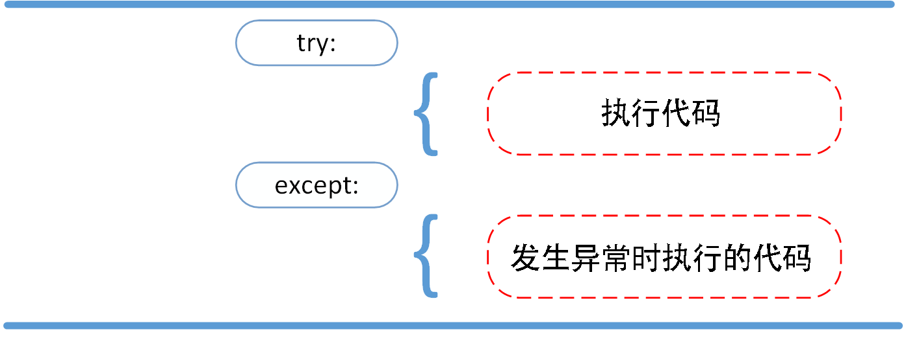


```
 try:
        code
    except xxxError:
        print("xxxError")
```
try 语句按照如下方式工作；
1. 首先，执行 try 子句（在关键字 try 和关键字 except 之间的语句）。

2. 如果没有异常发生，忽略 except 子句，try 子句执行后结束。

3. 如果在执行 try 子句的过程中发生了异常，那么 try 子句余下的部分将被忽略。如果异常的类型和 except 之后的名称相符，那么对应的 except 子句将被执行。

4. 如果一个异常没有与任何的 except 匹配，那么这个异常将会传递给上层的 try 中。

一个 try 语句可能包含多个except子句，分别来处理不同的特定的异常。最多只有一个分支会被执行。

处理程序将只针对对应的 try 子句中的异常进行处理，而不是其他的 try 的处理程序中的异常。

一个except子句可以同时处理多个异常，这些异常将被放在一个括号里成为一个元组，例如:
```
except (RuntimeError, TypeError, NameError):
    pass
```
最后一个except子句可以忽略异常的名称，它将被当作通配符使用。你可以使用这种方法打印一个错误信息，然后再次把异常抛出。
```
import sys

try:
    f = open('myfile.txt')
    s = f.readline()
    i = int(s.strip())
except OSError as err:
    print("OS error: {0}".format(err))
except ValueError:
    print("Could not convert data to an integer.")
except:
    print("Unexpected error:", sys.exc_info()[0])
    raise
```

### try/except...else
try/except 语句还有一个可选的 else 子句，如果使用这个子句，那么必须放在所有的 except 子句之后。

else 子句将在 try 子句没有发生任何异常的时候执行。
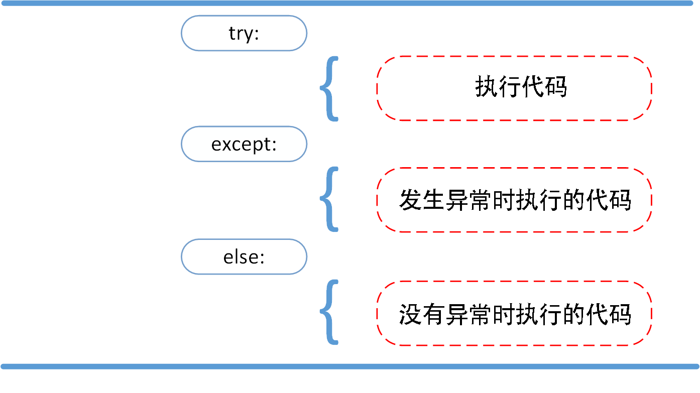

使用 else 子句比把所有的语句都放在 try 子句里面要好，这样可以避免一些意想不到，而 except 又无法捕获的异常。

异常处理并不仅仅处理那些直接发生在 try 子句中的异常，而且还能处理子句中调用的函数（甚至间接调用的函数）里抛出的异常。

### try-finally 语句

try-finally 语句无论是否发生异常都将执行最后的代码。
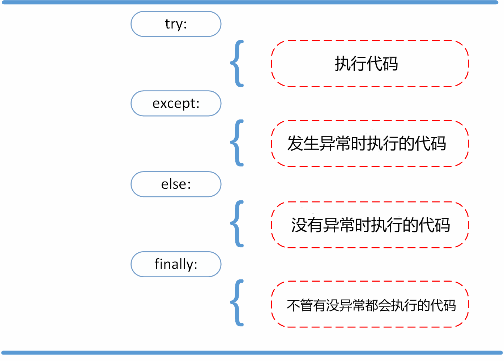
如果一个异常在 try 子句里（或者在 except 和 else 子句里）被抛出，而又没有任何的 except 把它截住，那么这个异常会在 finally 子句执行后被抛出。

finally 语句定义了无论在任何情况下都会执行的清理行为。一些对象定义了标准的清理行为，无论系统是否成功的使用了它，一旦不需要它了，那么这个标准的清理行为就会执行。关键词 with 语句就可以保证诸如文件之类的对象在使用完之后一定会正确的执行他的清理方法：
```
with open("myfile.txt") as f:
    for line in f:
        print(line, end="")
```
以上这段代码执行完毕后，就算在处理过程中出问题了，文件 f 总是会关闭。 

[浅谈Python的with语句](https://www.jianshu.com/p/ddcfffb78163)
[Python 中 with用法及原理](https://blog.csdn.net/u012609509/article/details/72911564)

#类和面向对象
## 面向对象
面向对象编程（Object-oriented Programming，简称 OOP），是一种封装代码的方法。比如说，将乱七八糟的数据扔进列表中，这就是一种简单的封装，是数据层面的封装；把常用的代码块打包成一个函数，这也是一种封装，是语句层面的封装。

在 Python 中，所有的变量其实也都是对象，包括整形（int）、浮点型（float）、字符串（str）、列表(list)、元组(tuple)、字典（dict）和集合（set）。

**面向对象相关术语**
面向对象中，常用术语包括：

类：可以理解是一个模板，通过它可以创建出无数个具体实例。这一过程又称为类的实例化。

对象：类并不能直接使用，通过类创建出的实例（又称对象）才能使用。这有点像汽车图纸和汽车的关系，图纸本身（类）并不能为人们使用，通过图纸创建出的一辆辆车（对象）才能使用。

属性：类中的所有变量称为属性。

方法：类中的所有函数通常称为方法。不过，和函数所有不同的是，类方法至少要包含一个 self 参数（后续会做详细介绍）。类方法无法单独使用，只能和类的对象一起使用。

## 定义类
Python 中定义一个类使用 class 关键字实现，其基本语法格式如下：
```
class 类名：
    多个（≥0）类属性...
    多个（≥0）类方法...
```
无论是类属性还是类方法，对于类来说，它们都不是必需的，可以有也可以没有。另外，Python 类中属性和方法所在的位置是任意的，即它们之间并没有固定的前后次序。

和变量名一样，类名本质上就是一个标识符。如果由单词构成类名，建议每个单词的首字母大写，其它字母小写。

给类起好名字之后，其后要跟有冒号（：），表示告诉 Python 解释器，下面要开始设计类的内部功能了，也就是编写类属性和类方法。

类属性和类方法其实分别是包含类中的变量和函数的别称。需要注意的一点是，同属一个类的所有类属性和类方法，要保持统一的缩进格式，通常统一缩进 4 个空格。

和函数一样，我们也可以为类定义说明文档，其要放到类头之后，类体之前的位置。

Python 允许创建空类，例如：
```
class Empty:
    pass
```
## 构造方法
在创建类时，我们可以手动添加一个 ``__init__()`` 方法，该方法是一个特殊的类实例方法，称为构造方法（或构造函数）。

构造方法用于创建对象时使用，每当创建一个类的实例对象时，Python 解释器都会自动调用它。Python 类中，手动添加构造方法的语法格式如下：
```
def __init__(self,...):
    代码块
```
注意，此方法的方法名中，开头和结尾各有 2 个下划线，且中间不能有空格。Python 中很多这种以双下划线开头、双下划线结尾的方法，都具有特殊的意义。

另外，__init__() 方法可以包含多个参数，但必须包含一个名为 self 的参数，且必须作为第一个参数。也就是说，类的构造方法最少也要有一个 self 参数。
```
class TheFirstDemo:
    '''这是一个学习Python定义的第一个类'''
    #构造方法
    def __init__(self):
        print("调用构造方法")
    # 下面定义了一个类属性
    add = 'http://c.biancheng.net'
    # 下面定义了一个say方法
    def say(self, content):
        print(content)
```
注意，即便不手动为类添加任何构造方法，Python 也会自动为类添加一个仅包含 self 参数的构造方法。

仅包含 self 参数的 ``__init__()`` 构造方法，又称为类的默认构造方法。

在创建对象时，隐式调用了我们手动创建的 ``__init__()`` 构造方法。

不仅如此，在 ``__init__()`` 构造方法中，除了 self 参数外，还可以自定义一些参数，参数之间使用逗号“,”进行分割。
```
class CLanguage:
    '''这是一个学习Python定义的一个类'''
    def __init__(self,name,add):
        print(name,"的网址为:",add)
#创建 add 对象，并传递参数给构造函数
add = CLanguage("C语言中文网","http://c.biancheng.net")
```
由于创建对象时会调用类的构造方法，如果构造函数有多个参数时，需要手动传递参数。

## 类对象的创建和使用
### 类对象的创建
对已定义好的类进行实例化，其语法格式如下：
```
类名(参数)
```
```
class CLanguage :
    # 下面定义了2个类变量
    name = "C语言中文网"
    add = "http://c.biancheng.net"
    def __init__(self,name,add):
        #下面定义 2 个实例变量
        self.name = name
        self.add = add
        print(name,"网址为：",add)
    # 下面定义了一个say实例方法
    def say(self, content):
        print(content)
# 将该CLanguage对象赋给clanguage变量
clanguage = CLanguage("C语言中文网","http://c.biancheng.net")
```
在上面的程序中，由于构造方法除 self 参数外，还包含 2 个参数，且这 2 个参数没有设置默认参数，因此在实例化类对象时，需要传入相应的 name 值和 add 值（self 参数是特殊参数，不需要手动传值，Python 会自动传给它值）。

### 类对象的使用
定义的类只有进行实例化，也就是使用该类创建对象之后，才能得到利用。总的来说，实例化后的类对象可以执行以下操作：

* 访问或修改类对象具有的实例变量，甚至可以添加新的实例变量或者删除已有的实例变量；
* 调用类对象的方法，包括调用现有的方法，以及给类对象动态添加方法。

**类对象访问变量或方法**
使用已创建好的类对象访问类中实例变量的语法格式如下：
```
类对象名.变量名
```
使用类对象调用类中方法的语法格式如下：
```
对象名.方法名(参数)
```
注意，对象名和变量名以及方法名之间用点 "." 连接。
例如，下面代码演示了如何通过 clanguage 对象调用类中的实例变量和方法：
```
    #输出name和add实例变量的值
    print(clanguage.name,clanguage.add)
    #修改实例变量的值
    clanguage.name="Python教程"
    clanguage.add="http://c.biancheng.net/python"
    #调用clanguage的say()方法
    clanguage.say("人生苦短，我用Python")
    #再次输出name和add的值
    print(clanguage.name,clanguage.add)
```
程序运行结果为：
```
C语言中文网 网址为： http://c.biancheng.net
C语言中文网 http://c.biancheng.net
人生苦短，我用Python
Python教程 http://c.biancheng.net/python
```

 **给类对象动态添加/删除变量**
 Python 支持为已创建好的对象动态增加实例变量，方法也很简单，举个例子：
```
    # 为clanguage对象增加一个money实例变量
    clanguage.money= 159.9
    print(clanguage.money)
```
运行结果为：
```
159.9
```

**动态删除变量**
```
#删除新添加的 money 实例变量
del clanguage.money
#再次尝试输出 money，此时会报错
print(clanguage.money)
```
运行程序会发现，结果显示 AttributeError 错误：
```
Traceback (most recent call last):
  File "C:/Users/mengma/Desktop/1.py", line 29, in <module>
    print(clanguage.money)
AttributeError: 'CLanguage' object has no attribute 'money'
```

**给类对象动态添加方法**
Python 也允许为对象动态增加方法。为 clanguage 对象动态增加的方法，Python 不会自动将调用者自动绑定到第一个参数（即使将第一个参数命名为 self 也没用）。
```
    # 先定义一个函数
    def info(self):
        print("---info函数---", self)
    # 使用info对clanguage的foo方法赋值（动态绑定方法）
    clanguage.foo = info
    # Python不会自动将调用者绑定到第一个参数，
    # 因此程序需要手动将调用者绑定为第一个参数
    clanguage.foo(clanguage)  # ①
    # 使用lambda表达式为clanguage对象的bar方法赋值（动态绑定方法）
    clanguage.bar = lambda self: print('--lambda表达式--', self)
    clanguage.bar(clanguage) # ②
```
上面的第 5 行和第 11 行代码分别使用函数、lambda 表达式为 clanguage 对象动态增加了方法，但对于动态增加的方法，Python 不会自动将方法调用者绑定到它们的第一个参数，因此程序必须手动为第一个参数传入参数值，如上面程序中 ① 号、② 号代码所示。

有读者可能会问，有没有不用手动给 self 传值的方法呢？通过借助 types 模块下的 MethodType 可以实现，仍以上面的 info() 函数为例：
```
    def info(self,content):
        print("C语言中文网地址为：%s" % content)
    # 导入MethodType
    from types import MethodType
    clanguage.info = MethodType(info, clanguage)
    # 第一个参数已经绑定了，无需传入
    clanguage.info("http://c.biancheng.net")
```
可以看到，由于使用 MethodType 包装 info() 函数时，已经将该函数的 self 参数绑定为 clanguage，因此后续再使用 info() 函数时，就不用再给 self 参数绑定值了。
 
## self
## 类属性和实例属性
无论是类属性还是类方法，都无法像普通变量或者函数那样，在类的外部直接使用它们。我们可以将类看做一个独立的空间，则类属性其实就是在类体中定义的变量，类方法是在类体中定义的函数。

在类体中，根据变量定义的位置不同，以及定义的方式不同，类属性又可细分为以下 3 种类型：
* 类体中、所有函数之外：此范围定义的变量，称为类属性或类变量；
* 类体中，所有函数内部：以“self.变量名”的方式定义的变量，称为实例属性或实例变量；
* 类体中，所有函数内部：以“变量名=变量值”的方式定义的变量，称为局部变量。

### 类属性（类变量）
**类属性的声明**
```
class CLanguage :
    # 下面定义了2个类变量
    name = "C语言中文网"
    add = "http://c.biancheng.net"
    # 下面定义了一个say实例方法
    def say(self, content):
        print(content)
```
name 和 add 就属于类变量。

类变量的特点是，所有类的实例化对象都同时共享类变量，也就是说，类变量在所有实例化对象中是作为公用资源存在的。

**类属性的调用**
类方法的调用方式有 2 种，既可以使用类名直接调用，也可以使用类的实例化对象调用。
```
#使用类名直接调用
print(CLanguage.name)
print(CLanguage.add)
#修改类变量的值
CLanguage.name = "Python教程"
CLanguage.add = "http://c.biancheng.net/python"
print(CLanguage.name)
print(CLanguage.add)
```
通过类名修改类变量，会作用到所有的实例化对象。

也可以使用类对象来调用所属类中的类变量（此方式不推荐使用）。通过类对象是无法修改类变量的。通过类对象对类变量赋值，其本质将不再是修改类变量的值，而是在给该对象定义新的实例变量。

因为实例对象可引用类属性以及实例属性，实例对象引用属性时遵循以下规则：
* 总是先到实例对象中查找属性，再到类属性中查找属性；
* 属性绑定语句总是为实例对象创建新属性，属性存在时，更新属性指向的对象。

因为类变量为所有实例化对象共有，通过类名修改类变量的值，会影响所有的实例化对象。

### 实例属性（实例变量）
实例变量指的是在任意类方法内部，以“self.变量名”的方式定义的变量，其特点是只作用于调用方法的对象。另外，实例变量只能通过对象名访问，无法通过类名访问。

和类变量不同，通过某个对象修改实例变量的值，不会影响类的其它实例化对象，更不会影响同名的类变量。Python 只支持为特定的对象添加实例变量


>除了实例变量，类方法中还可以定义局部变量。和前者不同，局部变量直接以“变量名=值”的方式进行定义，通常情况下，定义局部变量是为了所在类方法功能的实现。局部变量只能用于所在函数中，函数执行完成后，局部变量也会被销毁。

## 类实例方法、类方法和静态方法
采用 @classmethod 修饰的方法为类方法；
采用 @staticmethod 修饰的方法为静态方法；不用任何修改的方法为实例方法。

### 类实例方法
通常情况下，在类中定义的方法默认都是实例方法。
实例方法最大的特点就是，它最少也要包含一个 self 参数，用于绑定调用此方法的实例对象（Python 会自动完成绑定）。实例方法通常会用类对象直接调用，例如：
```
clang = CLanguage()
clang.say()
```
Python 也支持使用类名调用实例方法，但此方式需要手动给 self 参数传值:
```
    #类名调用实例方法，需手动给 self 参数传值
    clang = CLanguage()
    CLanguage.say(clang)
```

### 类方法
Python 类方法和实例方法相似，它最少也要包含一个参数，只不过类方法中通常将其命名为 cls，Python 会自动将类本身绑定给 cls 参数（注意，绑定的不是类对象）。也就是说，我们在调用类方法时，无需显式为 cls 参数传参。

和实例方法最大的不同在于，类方法需要使用＠classmethod修饰符进行修饰，例如：
```
class CLanguage:
    #类构造方法，也属于实例方法
    def __init__(self):
        self.name = "C语言中文网"
        self.add = "http://c.biancheng.net"
    #下面定义了一个类方法
    @classmethod
    def info(cls):
        print("正在调用类方法",cls)
```
类方法推荐使用类名直接调用，当然也可以使用实例对象来调用（不推荐）。
```
#使用类名直接调用类方法
CLanguage.info()
#使用类对象调用类方法
clang = CLanguage()
clang.info()
```

### 类静态方法
静态方法，其实就是我们学过的函数，和函数唯一的区别是，静态方法定义在类这个空间（类命名空间）中，而函数则定义在程序所在的空间（全局命名空间）中。

静态方法没有类似 self、cls 这样的特殊参数，因此 Python 解释器不会对它包含的参数做任何类或对象的绑定。也正因为如此，类的静态方法中无法调用任何类属性和类方法。

静态方法需要使用＠staticmethod修饰，例如： 
```
class CLanguage:
    @staticmethod
    def info(name,add):
        print(name,add)
```
静态方法的调用，既可以使用类名，也可以使用类对象，例如： 
```
#使用类名直接调用静态方法
CLanguage.info("C语言中文网","http://c.biancheng.net")
#使用类对象调用静态方法
clang = CLanguage()
clang.info("Python教程","http://c.biancheng.net/python")
```
在实际编程中，几乎不会用到类方法和静态方法，因为我们完全可以使用函数代替它们实现想要的功能，但在一些特殊的场景中（例如工厂模式中），使用类方法和静态方法也是很不错的选择。

## 调用实例方法
类方法大体分为 3 类，分别是类方法、实例方法和静态方法，其中实例方法用的是最多的。我们知道，实例方法的调用方式其实有 2 种，既可以采用类对象调用:
```
class CLanguage:
    def info(self):
        print("我正在学 Python")
#通过对象调用实例方法
clang = CLanguage()
clang.info()
```
也可以直接通过类名调用，但必须手动为该方法的第一个 self 参数传递参数:
```
class CLanguage:
    def info(self):
        print("我正在学 Python")
clang = CLanguage()
#通过类名直接调用实例方法
CLanguage.info(clang)
```
用类的实例对象访问类成员的方式称为绑定方法，而用类名调用类成员的方式称为非绑定方法。

## 描述符

## property()函数和@property装饰器
### property()函数
前面章节中，我们一直在用“类对象.属性”的方式访问类中定义的属性，其实这种做法是欠妥的，因为它破坏了类的封装原则。正常情况下，类包含的属性应该是隐藏的，只允许通过类提供的方法来间接实现对类属性的访问和操作。

Python 中提供了 property() 函数，可以实现在不破坏类封装原则的前提下，让开发者依旧使用“类对象.属性”的方式操作类中的属性。

property() 函数的基本使用格式如下：
```
属性名=property(fget=None, fset=None, fdel=None, doc=None)
```
其中，fget 参数用于指定获取该属性值的类方法，fset 参数用于指定设置该属性值的方法，fdel 参数用于指定删除该属性值的方法，最后的 doc 是一个文档字符串，用于说明此函数的作用。

>注意，在使用 property() 函数时，以上 4 个参数可以仅指定第 1 个、或者前 2 个、或者前 3 个，当前也可以全部指定。也就是说，property() 函数中参数的指定并不是完全随意的。

```
class CLanguage:
    #构造函数
    def __init__(self,n):
        self.__name = n
    #设置 name 属性值的函数
    def setname(self,n):
        self.__name = n
    #访问nema属性值的函数
    def getname(self):
        return self.__name
    #删除name属性值的函数
    def delname(self):
        self.__name="xxx"
    #为name 属性配置 property() 函数
    name = property(getname, setname, delname, '指明出处')
#调取说明文档的 2 种方式
#print(CLanguage.name.__doc__)
help(CLanguage.name)
clang = CLanguage("C语言中文网")
#调用 getname() 方法
print(clang.name)
#调用 setname() 方法
clang.name="Python教程"
print(clang.name)
#调用 delname() 方法
del clang.name
print(clang.name)
```
注意，在此程序中，由于 getname() 方法中需要返回 name 属性，如果使用 self.name 的话，其本身又被调用 getname()，这将会先入无限死循环。为了避免这种情况的出现，程序中的 name 属性必须设置为私有属性，即使用 __name（前面有 2 个下划线）。 

```
name = property(getname)    # name 属性可读，不可写，也不能删除
name = property(getname, setname)  #name 是一个可读写的属性，但不能删除
name = property(getname, setname,delname)    #name属性可读、可写、也可删除，就是没有说明文档
```

### @property装饰器
既要保护类的封装特性，又要让开发者可以使用“对象.属性”的方式操作操作类属性，除了使用 property() 函数，Python 还提供了 @property 装饰器。通过 @property 装饰器，可以直接通过方法名来访问方法，不需要在方法名后添加一对“（）”小括号。
```
class Rect:
    def __init__(self,area):
        self.__area = area
    @property
    def area(self):
        return self.__area
rect = Rect(30)
#直接通过方法名来访问 area 方法
print("矩形的面积是：",rect.area)
```
上面程序中，使用 ＠property 修饰了 area() 方法，这样就使得该方法变成了 area 属性的 getter 方法。需要注意的是，如果类中只包含该方法，那么 area 属性将是一个只读属性。

要想实现修改 area 属性的值，还需要为 area 属性添加 setter 方法，就需要用到 setter 装饰器:
```
@area.setter
def area(self, value):
    self.__area = value
```
 这样，area 属性就有了 getter 和 setter 方法，该属性就变成了具有读写功能的属性。

除此之外，还可以使用 deleter 装饰器来删除指定属性:
```
@area.deleter
def area(self):
    self.__area = 0
```
然后运行如下代码：
```
del rect.area
print("删除后的area值为：",rect.area)

运行结果为：
删除后的area值为： 0
```

## 封装及访问权限
### 封装
简单的理解封装（Encapsulation），即在设计类时，刻意地将一些属性和方法隐藏在类的内部，这样在使用此类时，将无法直接以“类对象.属性名”（或者“类对象.方法名(参数)”）的形式调用这些属性（或方法），而只能用未隐藏的类方法间接操作这些隐藏的属性和方法。

那么，类为什么要进行封装，这样做有什么好处呢？

首先，封装机制保证了类内部数据结构的完整性，因为使用类的用户无法直接看到类中的数据结构，只能使用类允许公开的数据，很好地避免了外部对内部数据的影响，提高了程序的可维护性。

除此之外，对一个类实现良好的封装，用户只能借助暴露出来的类方法来访问数据，我们只需要在这些暴露的方法中加入适当的控制逻辑，即可轻松实现用户对类中属性或方法的不合理操作。

并且，对类进行良好的封装，还可以提高代码的复用性。 

### 访问权限
Python 类中的变量和函数，不是公有的（类似 public 属性），就是私有的（类似 private），这 2 种属性的区别如下：
* public：公有属性的类变量和类函数，在类的外部、类内部以及子类中，都可以正常访问；
* private：私有属性的类变量和类函数，只能在本类内部使用，类的外部以及子类都无法使用。

但是，Python 并没有提供 public、private 这些修饰符。为了实现类的封装，Python 采取了下面的方法：

* 默认情况下，Python 类中的变量和方法都是公有（public）的，它们的名称前都没有下划线（_）；
* 如果类中的变量和函数，其名称以双下划线“__”开头，则该变量（函数）为私有变量（私有函数），其属性等同于 private。

除此之外，还可以定义以单下划线“_”开头的类属性或者类方法（例如 _name、_display(self)），这种类属性和类方法通常被视为私有属性和私有方法，虽然它们也能通过类对象正常访问，但这是一种约定俗称的用法，初学者一定要遵守。

>注意，Python 类中还有以双下划线开头和结尾的类方法（例如类的构造函数__init__(self)），这些都是 Python 内部定义的，用于 Python 内部调用。我们自己定义类属性或者类方法时，不要使用这种格式。

### Python封装底层实现原理
事实上，Python 封装特性的实现纯属“投机取巧”，之所以类对象无法直接调用以双下划线开头命名的类属性和类方法，是因为其底层实现时，Python 偷偷改变了它们的名称。事实上，对于以双下划线开头命名的类属性或类方法，Python 在底层实现时，将它们的名称都偷偷改成了 "_类名__属性（方法）名" 的格式。

不仅如此，那些原本我们认为是私有的类属性（例如 __name 和 __add），其底层的名称也改成了“\_\_类名\_\_属性名”的这种格式。

## 继承机制及其使用
继承机制经常用于创建和现有类功能类似的新类，又或是新类只需要在现有类基础上添加一些成员（属性和方法），但又不想直接将现有类代码复制给新类。也就是说，通过使用继承这种机制，可以轻松实现类的重复使用。

Python 中，实现继承的类称为子类，被继承的类称为父类（也可称为基类、超类）。

子类继承父类时，只需在定义子类时，将父类（可以是多个）放在子类之后的圆括号里即可。语法格式如下：
```
class 类名(父类1, 父类2, ...)：
    #类定义部分
```
    注意，如果该类没有显式指定继承自哪个类，则默认继承 object 类（object 类是 Python 中所有类的父类，即要么是直接父类，要么是间接父类）。另外，Python 的继承是多继承机制（和 C++ 一样），即一个子类可以同时拥有多个直接父类。
    
### Python多继承
使用多继承经常需要面临的问题是，多个父类中包含同名的类方法。对于这种情况，Python 的处置措施是：根据子类继承多个父类时这些父类的前后次序决定，即排在前面父类中的类方法会覆盖排在后面父类中的同名类方法。

```
class People:
    def __init__(self):
        self.name = People
    def say(self):
        print("People类",self.name)
class Animal:
    def __init__(self):
        self.name = Animal
    def say(self):
        print("Animal类",self.name)
#People中的 name 属性和 say() 会遮蔽 Animal 类中的
class Person(People, Animal):
    pass
zhangsan = Person()
zhangsan.name = "张三"
zhangsan.say()

程序运行结果为：

People类 张三
```
虽然 Python 在语法上支持多继承，但逼不得已，建议大家不要使用多继承。

## 子类属性和方法的查找
在子类中，Python到底是如何找到父类的属性和方法的？（深度揭秘）
http://c.biancheng.net/view/5450.html

## 重写
重写，有时又称覆盖，是一个意思，指的是对类中已有方法的内部实现进行修改。

###  如何调用被重写的方法
事实上，如果我们在子类中重写了从父类继承来的类方法，那么当在类的外部通过子类对象调用该方法时，Python 总是会执行子类中重写的方法。

这就产生一个新的问题，即如果想调用父类中被重写的这个方法，该怎么办呢？

很简单，前面讲过，Python 中的类可以看做是一个独立空间，而类方法其实就是出于该空间中的一个函数。而如果想要全局空间中，调用类空间中的函数，只需要在调用该函数是备注类名即可。
```
class Bird:
    #鸟有翅膀
    def isWing(self):
        print("鸟有翅膀")
    #鸟会飞
    def fly(self):
        print("鸟会飞")
class Ostrich(Bird):
    # 重写Bird类的fly()方法
    def fly(self):
        print("鸵鸟不会飞")
# 创建Ostrich对象
ostrich = Ostrich()
#调用 Bird 类中的 fly() 方法
Bird.fly(ostrich)
```

## super
如果在子类中定义构造方法，则必须在该方法中调用父类的构造方法。

在子类中的构造方法中，调用父类构造方法的方式有 2 种，分别是：

* 类可以看做一个独立空间，在类的外部调用其中的实例方法，可以向调用普通函数那样，只不过需要额外备注类名（此方式又称为未绑定方法）；
* 使用 super() 函数。但如果涉及多继承，该函数只能调用第一个直接父类的构造方法。

    也就是说，涉及到多继承时，在子类构造函数中，调用第一个父类构造方法的方式有以上 2 种，而调用其它父类构造方法的方式只能使用未绑定方法。

```
class People:
    def __init__(self,name):
        self.name = name
    def say(self):
        print("我是人，名字为：",self.name)
class Animal:
    def __init__(self,food):
        self.food = food
    def display(self):
        print("我是动物,我吃",self.food)
class Person(People, Animal):
    #自定义构造方法
    def __init__(self,name,food):
        #调用 People 类的构造方法
        super().__init__(name)
        #super(Person,self).__init__(name) #执行效果和上一行相同
        #People.__init__(self,name)#使用未绑定方法调用 People 类构造方法
        #调用其它父类的构造方法，需手动给 self 传值
        Animal.__init__(self,food)    
per = Person("zhangsan","熟食")
per.say()
per.display()
```
运行结果为：
```
我是人，名字为： zhangsan
我是动物,我吃 熟食
```
可以看到，Person 类自定义的构造方法中，调用 People 类构造方法，可以使用 super() 函数，也可以使用未绑定方法。但是调用 Animal 类的构造方法，只能使用未绑定方法。


## 多态

## 运算符重载
http://c.biancheng.net/view/5739.html


